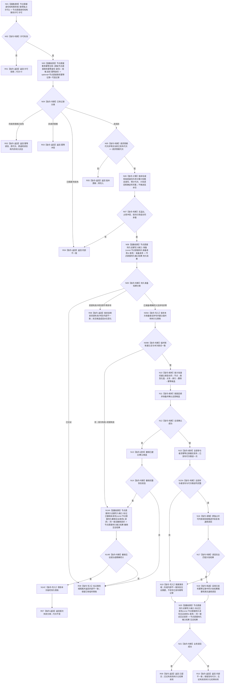

# 执行节点直接类型化结构事务目标函数流程图 v0.1

更新时间：2026-08-02

## 依据

```text
正式规范：4020—4070、4200
函数合同：WORLD-TREE-P1 函数功能确认 2.2
当前事实：节点直接身份结构事务域已有 try-lock 独占许可和通用参与者执行框架；无发布代次、持久准备和原许可内发布后读回
```

## 身份与边界

本图只描述执行器固定事务根函数；它只接受数据操作模块形成的中性规格，不接受服务请求、外部参与者或回调。

## 函数合同

```text
根函数：节点直接身份结构写入执行器::执行节点直接类型化结构事务
归属：海中鱼巣.核心.执行器.节点直接身份结构写入 / 海中鱼巣/核心/执行器.节点直接身份结构写入.ixx / L1；唯一合法调用者为 `节点直接类型化结构数据操作`
待新增：是，模块公开窄入口；调用白名单由 import/调用边静态门禁限制为数据操作模块，不依赖跨模块 friend
完整签名：节点直接类型化结构数据操作结果 执行节点直接类型化结构事务(const 节点直接类型化结构数据操作规格& 规格) const
参数：`规格: const 节点直接类型化结构数据操作规格&`，输入、只读借用；唯一调用者数据操作拥有规格至同步返回，执行器不保存引用
非法值：数据操作规格中的双摘要/编码见证不一致、执行器未用八依赖完整构造、合同/身份/代次/写集/读回规格不完整、计划身份溢出或历史占用
返回：`节点直接类型化结构数据操作结果` 调用方拥有的中性纯值；正常为已提交/幂等读回，逻辑内返回为入口拒绝/冲突/漂移/许可或资源失败，撤销或读回矛盾为内部不一致；异常全部在函数内分类且不得越过 L1
调用者流程图：`20260802_节点直接类型化结构提交服务提交_函数流程图_v0.1.md` 经 `节点直接类型化结构数据操作::提交` 间接到达；本函数无其它合法调用者
```

## 流程图



## 节点合同

| 节点 | 类型 | 参数 / 输入绑定 | 结果 / 输出绑定 | 事实读写与后继 | 验证 |
| --- | --- | --- | --- | --- | --- |
| N01 | 函数调用 | `事务域_` 调用 `节点直接身份结构事务许可 节点直接身份结构事务域::取得独占许可()` | `许可` | 取得许可后到 N02 | 竞争/隔离均返回无效许可 |
| N02 | 本函数内指令 | `许可` | 有效真假 | 否到 R01；是到 N03 | 不阻塞、不重试 |
| R01 | 本函数内指令 | 无效许可 | `许可拒绝, 代次=0` | 返回 | 零写入 |
| N03 | 函数调用 | `规格.请求.幂等身份 -> 身份` 调用 `节点直接事务幂等仓库::读取` | `可选记录` | 只读已发布幂等仓；到 N04 | 不查 SQL |
| N04 | 本函数内指令 | `可选记录` 与请求摘要 | 幂等分类 | 同义到 R02，异义到 R03，异常状态到 R04，未找到到 N05 | 同义不重算执行证据 |
| R02 | 本函数内指令 | 原幂等记录 | 原发布代次、通用读回、持久侧账 | 返回幂等读回 | 不推进代次、不调用持久端口 |
| R03 | 本函数内指令 | 异义摘要 | 幂等冲突 | 返回 | 零写入 |
| R04 | 本函数内指令 | 待发布/隔离记录或合同矛盾 | 内部不一致 | 返回 | 保持隔离事实 |
| N05 | 本函数内指令 | 请求预期代次与当前代次 | 相等真假 | 否到 R05；是到 N06 | 真实提交拒绝代次 0 |
| R05 | 本函数内指令 | 代次不等 | 版本漂移 | 返回 | 不调用持久端口 |
| N06 | 本函数内指令 | 写集、各仓高水位和当前端点 | 计划身份映射、预计代次、计划读回、确定性写集 | 只读计算；到 N07 | 不推进高水位、不建候选 |
| N07 | 本函数内指令 | N06 计算结果 | 完整真假 | 否到 R04；是到 N08 | 覆盖溢出、历史占用、前向引用和合同冲突 |
| N08 | 函数调用 | `准备请求 -> 请求` 调用 `节点直接持久证据写入端口::准备` | `持久结果` | 只写持久准备证据；到 N09 | 尚无内存候选或高水位变化 |
| N09 | 本函数内指令 | `持久结果` | 状态分类 | 已见证到 R08；其它失败到 R06；成功到 N09A | 成功必须有非零尝试序号 |
| R06 | 本函数内指令 | 准备非成功 | 资源失败/冲突/内部不一致 | 返回 | 零内存变化 |
| N09A | 本函数内指令 | 同次非零尝试序号 | 临时侧账建立结果 | 写 `待持久化+尝试序号`；到 N09B | 异序号/已有不可回退状态拒绝 |
| N09B | 本函数内指令 | 临时侧账结果 | 成功真假 | 否以首次失败=资源失败到 N14A；是到 N10 | 失败时不建业务候选 |
| N10 | 本函数内指令 | 计划身份与写集 | 七类候选组 | 固定顺序建立；到 N11 | 每项携带同一事务序号 |
| N11 | 本函数内指令 | 候选组 | 确认结果组 | 固定顺序准备/确认；到 N12 | 任一失败保留首次失败分类 |
| N12 | 本函数内指令 | 确认结果组 | 全部成功真假 | 否到 N13；是到 N15 | 不跳过空参与者的顺序位置 |
| N13 | 本函数内指令 | 已建立/确认候选 | 撤销结果 | 逆序撤销；到 N14 | 覆盖每个故障点 |
| N14 | 本函数内指令 | 撤销结果和前态读回 | 前态完整真假 | 是到 N14A；否到 R08 | 不能证明前态即隔离 |
| N14A | 函数调用 | 同次尝试、双摘要及完整写集 SHA-256 形成撤销请求 | `撤销见证结果` | 调用 `标记已撤销未发布`；到 N14B | 不重编码写集材料 |
| N14B | 本函数内指令 | 撤销见证结果 | 成功/精确同义真假 | 是到 N14C；否到 R08 | 未知、冲突、损坏均隔离 |
| N14C | 本函数内指令 | 同身份同尝试临时侧账 | 清除结果 | 清除成功到 R07；失败到 R08 | 只清待持久化未发布项 |
| R07 | 本函数内指令 | 首次失败分类 | 原失败、代次不变 | 返回 | 已有候选均撤销且持久端明确见证未发布 |
| N15 | 本函数内指令 | 全部已确认候选 | 发布结果与后继代次 | 全参与者最后发布并推进代次；到 N15A | 代次切换唯一线性化点 |
| N15A | 本函数内指令 | 发布结果与事务域代次 | 完整真假 | 否到 N19；是到 N16 | 部分发布不得继续普通服务 |
| N16 | 本函数内指令 | 原独占许可、读回规格 | 真实通用读回 | 只读已发布事实；到 N17 | 许可释放前逐字段读取 |
| N17 | 本函数内指令 | 真实读回与计划读回 | 完全匹配真假 | 是到 N18；否到 N19 | 不用事务后普通快照替代 |
| N18 | 本函数内指令 | 已发布幂等记录 | 计划结果摘要和真实读回 | 构造成功见证材料；到 N20 | 不重算或覆盖幂等事实 |
| N19 | 本函数内指令 | 发布/读回失败材料 | 内部不一致失败摘要 | 写隔离标记；到 N20 | 保留已发布代次，不回滚 |
| N20 | 函数调用 | 同次尝试见证请求调用 `节点直接持久证据写入端口::标记已发布` | `见证结果` | 追写持久见证；到 N21 | 正常和失败读回均调用一次 |
| N21 | 本函数内指令 | N17 的业务读回分类与 N20 见证结果 | 最终返回分类 | 成功到 R09；失败到 R10 | 见证未知不改变内存权威代次 |
| R08 | 本函数内指令 | 内部矛盾或未发布见证非成功 | 内部不一致 | 标记隔离并返回 | 保留已有临时侧账 |
| R09 | 本函数内指令 | 成功读回与见证状态 | 已提交或携带持久化结果未知 | 返回 | 发布代次非零 |
| R10 | 本函数内指令 | 失败读回与见证状态 | 内部不一致及已发布代次 | 返回 | 不宣称回滚或零写入 |

## 关键边界

```text
不得持线程队列锁调用本函数。
持久准备在独占结构许可内执行；调用期间不建立候选但会阻塞同域读写。
准备返回的尝试序号只属于持久证据域；发布见证和撤销未发布见证都必须逐值复用该序号。撤销见证中的写集摘要只对准备时完整写集材料字节做 SHA-256。
空域初始化由恢复服务的非公开安装实例初始化事务先建立 L1 治理代次 1；普通提交始终拒绝预期代次 0。
恢复使用独立非公开恢复入口，不从本函数普通 DTO 指定历史稳定身份。
```
