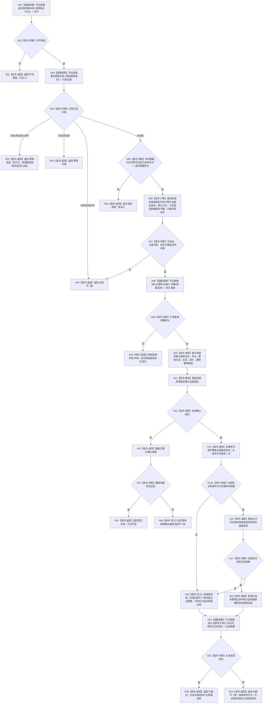

# 执行节点直接类型化结构事务目标函数流程图 v0.1

更新时间：2026-08-02

## 依据

```text
正式规范：4020—4070、4200
函数合同：WORLD-TREE-P1 函数功能确认 2.2
当前事实：节点直接身份结构事务域已有 try-lock 独占许可和通用参与者执行框架；无发布代次、持久准备和原许可内发布后读回
```

## 身份与边界

本图只描述执行器固定事务根函数；它只接受数据操作模块形成的中性规格，不接受服务请求、外部参与者或回调。

## 函数合同

```text
根函数：节点直接身份结构写入执行器::执行节点直接类型化结构事务
归属：海中鱼巣.核心.执行器.节点直接身份结构写入 / 海中鱼巣/核心/执行器.节点直接身份结构写入.ixx / L1；唯一合法调用者为 `节点直接类型化结构数据操作`
待新增：是，模块公开窄入口；调用白名单由 import/调用边静态门禁限制为数据操作模块，不依赖跨模块 friend
完整签名：节点直接类型化结构数据操作结果 执行节点直接类型化结构事务(const 节点直接类型化结构数据操作规格& 规格) const
参数：`规格: const 节点直接类型化结构数据操作规格&`，输入、只读借用；唯一调用者数据操作拥有规格至同步返回，执行器不保存引用
非法值：数据操作规格中的双摘要/编码见证不一致、执行器未用八依赖完整构造、合同/身份/代次/写集/读回规格不完整、计划身份溢出或历史占用
返回：`节点直接类型化结构数据操作结果` 调用方拥有的中性纯值；正常为已提交/幂等读回，逻辑内返回为入口拒绝/冲突/漂移/许可或资源失败，撤销或读回矛盾为内部不一致；异常全部在函数内分类且不得越过 L1
调用者流程图：`20260802_节点直接类型化结构提交服务提交_函数流程图_v0.1.md` 经 `节点直接类型化结构数据操作::提交` 间接到达；本函数无其它合法调用者
```

## 流程图



## 节点合同

| 节点组 | 类型 | 事实读写 | 核心验证 |
| --- | --- | --- | --- |
| N01—N07 | 函数调用 / 本函数内指令 | 只读内存代次、幂等、仓库高水位和当前事实 | 幂等先行、预期代次、确定性映射、溢出 |
| N08—N09 | 函数调用 / 判断 | 只写持久准备证据，不写内存候选 | 资源失败时零内存变化 |
| N10—N15A | 本函数内事务指令 | 候选、确认、撤销、全部参与者最后发布、代次 | 固定顺序和逆序撤销；代次切换是唯一线性化点；部分发布立即隔离并形成失败见证 |
| N16—N19 | 本函数内读取 / 指令 | 原许可内通用读回、结果摘要和隔离标记 | 发布后失败不回滚或二次改写幂等事实；立即隔离事务域 |
| N20—R10 | 函数调用 / 返回 | 追写持久见证；返回纯值结果 | 正常与失败读回均尝试见证 |

## 关键边界

```text
不得持线程队列锁调用本函数。
持久准备在独占结构许可内执行；调用期间不建立候选但会阻塞同域读写。
空域初始化由恢复服务的非公开安装实例初始化事务先建立 L1 治理代次 1；普通提交始终拒绝预期代次 0。
恢复使用独立非公开恢复入口，不从本函数普通 DTO 指定历史稳定身份。
```
