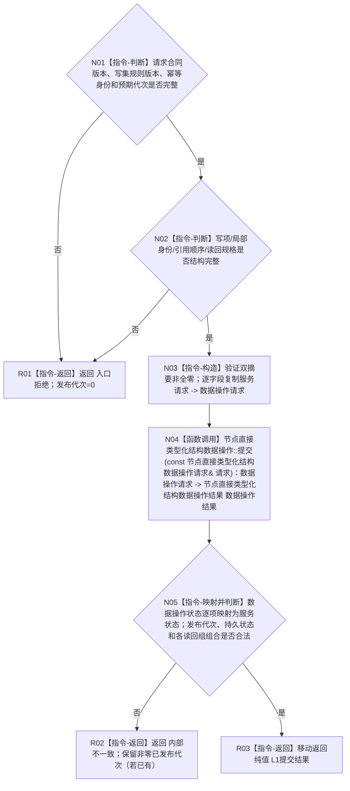

# 节点直接类型化结构提交服务提交目标函数流程图 v0.1

更新时间：2026-08-02

## 依据

```text
正式规范：4020、4030、4040、4070、4200
函数合同：规范/详细设计/20260802_WORLD-TREE-P1_函数功能确认_v0.1.md 2.2
当前代码：012f49eb32709e47b5b7b44d464f57cb70ff9526；现有通用执行入口返回时释放许可，不能直接复用
```

## 身份与边界

本图是 WORLD-TREE-P1A2 待新增目标函数的施工依据，一图只描述公开纯值提交函数。复杂内部事务另见 `20260802_执行节点直接类型化结构事务_函数流程图_v0.1.md`。

## 函数合同

```text
根函数：节点直接类型化结构提交服务::提交
归属：海中鱼巣.核心.服务.节点直接类型化结构提交 / 海中鱼巣/核心/服务.节点直接类型化结构提交.ixx / L1；服务请求和包装结果由本模块唯一拥有
待新增：是
完整签名：节点直接类型化结构提交结果 提交(const 节点直接类型化结构事务请求& 请求) const
参数：`请求: const 节点直接类型化结构事务请求&`，输入、只读借用，仅本次同步调用有效；调用方拥有原对象，服务在调用内部复制完整请求后不保存引用
非法值：合同版本/写集规则版本零或不支持、幂等身份空、真实新写预期代次为零、局部身份零/重复/前向引用、写项与读回规格不匹配；确认空域只由恢复服务调用非公开 L1 初始化入口
返回：`节点直接类型化结构提交结果` 调用方拥有的纯值；成功仅 `已提交/幂等读回` 且携带非零原发布代次与完整通用读回；逻辑内返回含入口拒绝/幂等冲突/版本漂移/许可拒绝/资源失败；内部错误为内部不一致并保留已发生的非零代次
被调函数流程图：`20260802_执行节点直接类型化结构事务_函数流程图_v0.1.md`；被调图反向声明本函数为唯一调用者
```

## 流程图



## 节点合同

| 节点 | 类型 | 参数 / 输入绑定 | 结果 / 输出绑定 | 事实读写 | 后继条件 | 验证 |
| --- | --- | --- | --- | --- | --- | --- |
| N01 | 本函数内指令 | `请求` | 合同准入真假 | 无 | 否到 R01；是到 N02 | 版本、幂等身份、预期代次逐字段边界值 |
| N02 | 本函数内指令 | `请求.写项组/读回规格` | 结构准入真假 | 无 | 否到 R01；是到 N03 | 零/重复局部身份、前向引用、写读不匹配 |
| N03 | 本函数内指令 | `请求` 与构造时保存的安装实例身份 | 完整 `节点直接类型化结构数据操作请求` | 无机器事实写入 | 构造成功到 N04；分配异常按资源失败返回 | 逐字段复制，不按布局转换；双摘要原样保留且非全零 |
| N04 | 函数调用 | `数据操作请求 -> 请求`；调用 `节点直接类型化结构数据操作结果 节点直接类型化结构数据操作::提交(const 节点直接类型化结构数据操作请求& 请求) const` | 返回值接收为 `数据操作结果` | 被调数据操作形成中性规格并进入固定事务；本函数不直接写事实 | 调用完成到 N05 | 与执行器图通过数据操作调用边双向追踪 |
| N05 | 本函数内指令 | `数据操作结果` | 服务结果或非法组合 | 无机器事实写入 | 非法组合到 R02；合法组合到 R03 | 全状态逐值映射；只有已提交/幂等读回允许成功材料 |
| R01 | 本函数内指令 | 入口拒绝分类 | `节点直接类型化结构提交结果{入口拒绝, 发布代次=0}` | 无 | 返回 | 断言数据操作未调用 |
| R02 | 本函数内指令 | 非法结果组合与可能已有代次 | `节点直接类型化结构提交结果{内部不一致, 原非零代次若已有}` | 无新增写入 | 返回 | 不把已发布代次抹零或伪装回滚 |
| R03 | 本函数内指令 | 合法服务结果 | 按值返回 `节点直接类型化结构提交结果` | 无新增写入 | 返回 | 调用方取得独立纯值，不保存请求引用 |

## 关键边界

```text
公开函数不自行取得许可，不接受参与者或业务回调。
异常不得越过函数边界；请求复制/结果映射分配失败返回资源失败；本函数不计算摘要。
同义/异义、预期代次、持久准备、候选、撤销、发布、读回由内部固定事务函数裁决。
```
