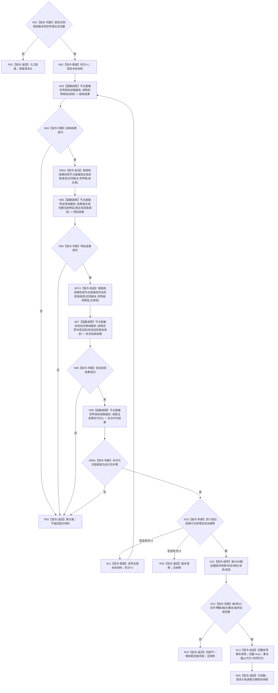

# 读取完整世界事实快照目标函数流程图 v0.1

更新时间：2026-08-02

## 依据

```text
正式规范：4010—4050、4170、4190、4200、4210
函数合同：WORLD-TREE-P1 函数功能确认 2.1、2.4
并发合同：L2 不持 L1 许可；各具名服务返回自己的事实截止代次
```

## 身份与边界

本图只描述一次完整快照公开函数。世界结构、特征、状态动态查询的内部非平凡过程分别由其服务合同负责。

## 函数合同

```text
根函数：世界树快照读取服务::读取完整世界事实快照
归属：海中鱼巣.领域.服务.世界树快照 / 海中鱼巣/领域/服务.世界树快照.ixx / L2
待新增：是
完整签名：世界树读取结果 读取完整世界事实快照(const 世界树读取请求& 请求) const
参数：`请求: const 世界树读取请求&`，输入、只读借用，仅同步调用有效；调用方拥有合同/规则版本和场景根稳定身份见证，服务不保存引用
非法值：合同/规则版本零或不支持、世界根稳定身份见证不完整；非法请求不得调用任何提供者
返回：`世界树读取结果` 调用方拥有的纯值；仅 `已读取` 携带一个 `完整=true` 且共同代次非零的快照；未找到/入口拒绝/版本漂移/许可拒绝/资源失败/内部不一致均不含快照并保留请求头
被调函数流程图：各查询提供者为独立服务合同；本包只为具有非平凡组合循环的本根制图，完整签名见函数确认 2.4
```

## 流程图



## 节点合同

| 节点组 | 类型 | 输入 / 输出 | 事实读写 | 验证 |
| --- | --- | --- | --- | --- |
| N01—N02 | 指令 | 请求 -> 轮次材料 | 无 | 坏入口不调用提供者 |
| N03/N05A/N05/N07A/N07/N09/N09A | 指令 / 函数调用 | 稳定身份值 -> 完整请求 DTO -> 值式结果 | 只读各事实所有者 | 每个服务自己取得并释放许可；末次读取非成功不重试 |
| N10—N11 | 指令 | 四代次 -> 重试/继续 | 无 | 只对全成功代次漂移完整重试一次 |
| N12—N14 | 指令 | 同代次材料 -> 完整快照 | 无 | 稳定排序和完整性矩阵 |
| R01—R05 | 指令-返回 | 分类 -> 世界树读取结果 | 无 | 非成功不携带快照 |

## 关键边界

```text
许可拒绝、未找到、资源失败或内部不一致不进入重试。
SQL、材料、缓存和界面投影不参与快照裁决。
单对象读取只筛选本函数成功快照，不重新访问仓库。
```
