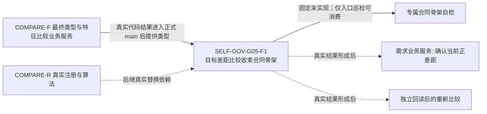
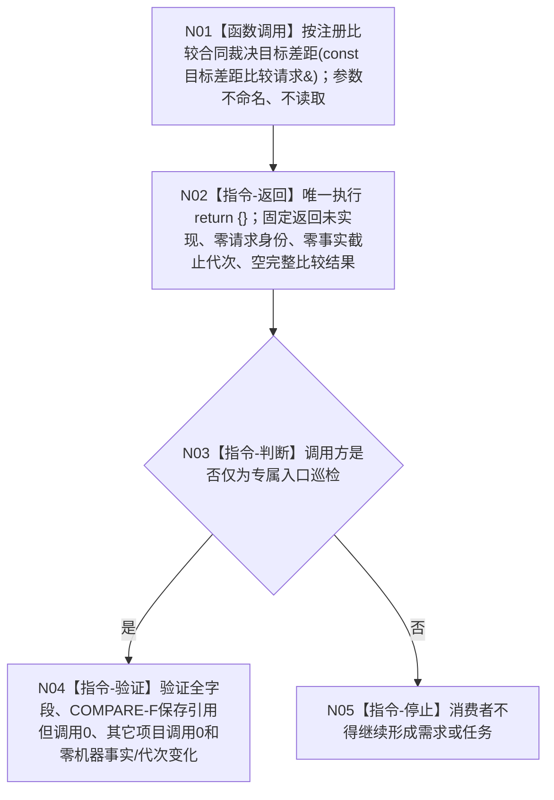

# SELF-GOV-G05-F1 目标差距比较收束合同骨架业务流程图 v0.1

日期：2026-08-03

创建侧当前代码基线：`dce077a4d82b543654482f5cb3524f8819e2e5a9`。

## 1. 目标与边界

本叶建立 G05“比较与条件裁决”中独立于需求领域的目标差距比较收束最终 ABI。它只提供一个固定 `未实现` 的安全骨架，使后继能够在不改变公开合同的前提下接入 COMPARE-R 真实注册比较。

直接依据：4180、5090、6180、COMPARE-F v0.1 详细设计，以及已发布的 `BIZ-L2-004-01_确认当前正差距`。本图不读取工作区未发布的 L3 目标业务图，不把其内容当正式依据。

完成边界：只允许证明模块、DTO、构造和入口已编译接入并可安全巡检；不证明注册存在、算法执行、当前事实读取、正差距成立、G05完成或消费者可继续。

业务输入：任意 `目标差距比较请求` 的同步只读借用；骨架不读取其字段。前置条件：COMPARE-F 最终类型与服务已进入正式 main，且本服务已由装配宿主以更短生命周期构造。业务输出：按值返回固定 `未实现/零请求身份/零事实截止代次/空比较结果`。完成条件：调用方只消费该未实现结果并停止成功后继，调用前后全部机器事实与发布代次不变。

## 2. 提供者与消费者

## 3. 骨架业务流程

| 节点 | 类型 | 输入/结果绑定 | 事实读写 | 后继与验证 |
| --- | --- | --- | --- | --- |
| N01 | 函数调用 | 调用方请求 -> `const 目标差距比较请求&`；返回值 -> `目标差距比较结果` | 读0/写0 | 进入唯一返回指令；验证参数引用0 |
| N02 | 本函数内返回 | `return {}` -> 固定未实现结果 | 读0/写0 | 返回调用方；逐字段验证 |
| N03 | 调用方内判断 | 返回状态 -> 是否仅作入口巡检 | 读返回值/写0 | 仅巡检或停止；禁止成功分支 |
| N04 | 调用方内验证 | 固定结果与前后权威导出 | 只读验证材料 | 全字段、调用边、事实与代次全部满足 |
| N05 | 调用方内停止 | `状态=未实现` | 写0 | 需求/任务/方法/结算后继调用数0 |

能力与目标函数映射：N01—N02 唯一映射到待新增 `特征判断收束服务::按注册比较合同裁决目标差距`；N03—N05 属合法消费者的未实现处理合同，不伪写为本叶新增生产函数。详细字段、物理位置和验证读取见配套详细设计 §§3—9。

## 4. 真实替换边界

后继真实实现只能原位替换根函数体。它必须固定构造 `用途=目标判断`、`左=当前事实`、`右=目标状态`、`要求结果=具名关系|差异材料` 的 COMPARE-F 请求；调用方不得选择用途、交换左右或覆盖当前注册。

COMPARE-R 尚未冻结并实现当前唯一注册、算法执行和按算法族收束严格正差距的完整矩阵，因此本叶不得调用 COMPARE-F、猜测裸值符号、默认相等或把未实现映射为材料缺失。构造期保存 COMPARE-F 服务的非拥有引用只用于冻结最终依赖形态，不产生调用边。

## 5. 验收矩阵

| 编号 | 输入 | 骨架结果 | 下游调用 | 机器事实 |
| --- | --- | --- | --- | --- |
| F1-A01 | 默认请求 | 未实现、零身份、零代次、空比较结果 | 0 | 不变 |
| F1-A02 | 字段完整请求 | 与默认请求完全相同 | 0 | 不变 |
| F1-A03 | 非法和边界整数请求 | 与默认请求完全相同 | 0 | 不变 |
| F1-A04 | SQL、材料、缓存不可用 | 与默认请求完全相同 | 0 | 不变 |
| F1-A05 | 生产消费者尝试继续 | 必须因未实现停止 | 0 | 不变 |
