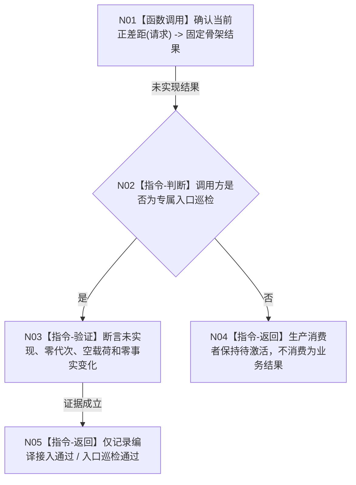

# SELF-GOV-G05 正差距确认合同骨架能力流程图 v0.1

更新时间：2026-08-03

## 依据

```text
规范：3100、4050、4180、5090、6180、8300、ACCEPTANCE-01
目标函数图：流程图/目标业务流程图/L2/BIZ-L2-004-01_确认当前正差距_目标函数流程图_v0.1.md
当前代码：海中鱼巣/领域/服务.需求.ixx 尚无 确认当前正差距
```

## 身份与边界

这是 SELF-GOV-G05 最早施工叶的正式能力流程。它只建立最终 ABI 和安全未实现结果，不构成正差距业务闭环；完整业务流程仍由 BIZ-L2-004-01 冻结。

## 业务输入、输出与完成条件

```text
输入：任意 需求正差距请求，包括默认值和未来合法请求。
输出：需求正差距状态::未实现、事实截止代次 0、空载荷、形成内存权威发布=false、可重试=false。
前置：最终 DTO 和枚举值按本设计冻结；需求服务现有两个引用依赖保持不变。
完成：公开函数可编译链接，并由既有需求任务方法分层自检实际进入和退出；调用前后结构数量不变。
非完成：没有读取世界事实、没有执行比较、没有形成需求候选，也没有解除 G06 及后继生产消费者门禁。
```

## 流程图



## 节点合同

| 节点 | 类型 | 输入 | 输出 | 事实读写 | 验证 |
| --- | --- | --- | --- | --- | --- |
| N01 | 函数调用 | `请求 -> 请求` | `需求正差距结果 -> 固定骨架结果` | 零读取、零写入 | 函数身份唯一，直接调用边 0 |
| N02 | 指令-判断 | 调用来源 | 巡检或生产分支 | 无 | 生产调用点必须为 0 |
| N03 | 指令-验证 | 骨架结果、调用前后结构数量 | 弱验收证据 | 只读隔离自检材料 | 全字段和零变化 |
| N04 | 指令-返回 | 未实现 | 待激活 | 无 | 不建立需求候选 |
| N05 | 指令-返回 | 巡检证据 | L0/L1 结论 | 无 | 禁止升级 L2/L3 |

## 能力裁决

| 所需能力 | 当前证据 | 裁决 |
| --- | --- | --- |
| 最终需求正差距 ABI | 当前不存在 | 在现有 `服务.需求.ixx` 适配扩展 |
| 当前世界事实读取 | 世界树最终骨架存在但真实成功能力未闭合 | 本叶不调用，后继提供者 |
| 特征比较最终类型 | COMPARE-F 设计已冻结但代码尚未进入正式 main | 本叶真实类型依赖，保持待激活 |
| 注册比较合同裁决 | 4180 已冻结逻辑，COMPARE-R 真实实现未形成 | 骨架不调用，后继真实提供者 |
| 安全入口巡检 | 既有 `自检.需求任务方法分层.ixx` 已装配需求服务 | 原位扩展，不新增工程文件 |

## 关键边界

- 骨架结果不是无差距、已满足、失败或等待；唯一语义是能力尚未实现。
- SQL 只可在后继合法恢复 / 持久证据边界使用，本叶不得读取 SQL；内存已发布事实仍是未来真实裁决的唯一权威输入。
- 空骨架只在 COMPARE-F 最终类型进入代码后清理需求接口、编译和入口门控；它不能绕过类型提供者，也不解除真实比较、世界读取和消费者依赖。
