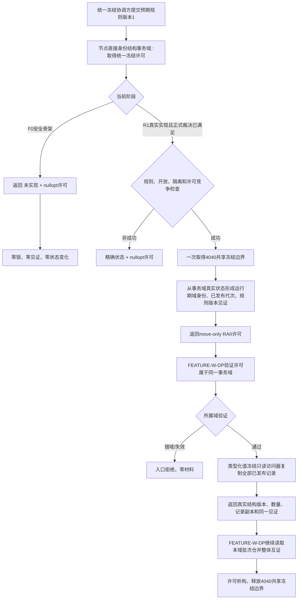

# WORLD-TREE-CORE-FREEZE-DP 统一4040冻结许可与真实结构见证提供者业务流程图 v0.1

创建侧正式基线：`1d7667118f63b4c3be15571c7214c2efb577b6d0`

本图同时区分 `F0安全骨架` 与 `R1真实实现后继`。F0只冻结最终ABI并稳定返回未实现，不产生许可、见证或记录副本，也不解除 FEATURE-W-DP 门禁。

## 固定边界

- 统一冻结许可只保护节点直接4040事务域的一次共享只读边界；不扩成全仓、全进程、SQL或外设万能冻结。
- 上层只传规则版本、许可对象引用和值式结果；互斥、锁守卫、原子指针、仓容器和事务内部令牌均不可见。
- 许可持有期间阻止同事务域新独占写入；它不发布事实、不推进代次、不写SQL、不触发恢复。
- 类型化值副本只来自当前 `节点直接类型化值仓库` 的已发布 `类型化值读回`；不得新建无类型值仓或按业务字段筛选。
- SQL、持久材料、日志和缓存只作证据，不参与许可、域身份、代次、结构版本和读取成功裁决。

## F0与R1完成边界

F0最多声明“最终冻结ABI安全骨架已编译接入”；不得声明真实许可、真实见证、类型化值全量冻结或FEATURE-W-DP门禁已满足。R1只有在域身份签发/恢复语义和类型化值结构版本推进/恢复语义取得正式裁决后，才能原位替换F0并解除对应门禁。
