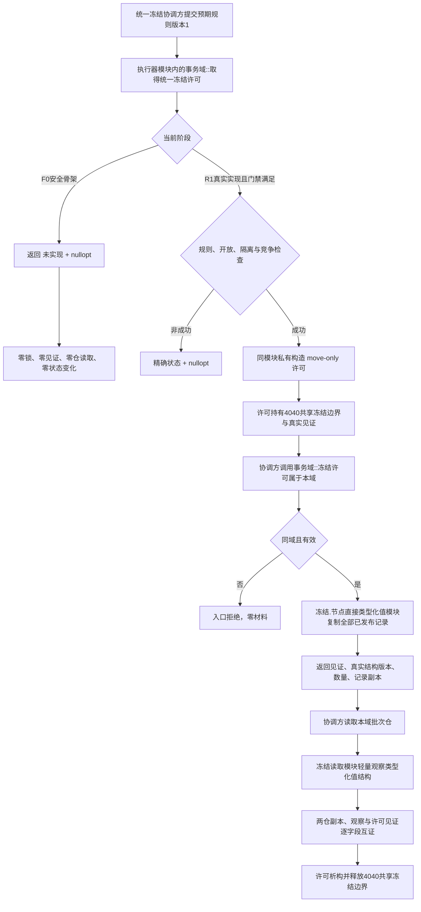
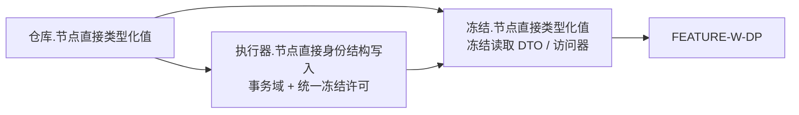

# WORLD-TREE-CORE-FREEZE-DP 统一4040冻结许可与真实结构见证提供者业务流程图 v0.3

修订基线：`dd497341216b05e2d4b55af6afa1df5402882cc3`

本图不可变替换 v0.2 的 ABI 物理所有权：统一冻结许可与事务域同归执行器模块；类型化值冻结读取由单向依赖的新冻结模块承载。机器行为与 F0 / R1 分账不变。



## 模块流



禁止反向边：

```text
执行器 -X-> 冻结.节点直接类型化值
类型化值仓 -X-> 执行器 / 冻结读取模块
冻结读取模块 -X-> 跨模块前置声明事务域
任一模块 -X-> 许可.节点直接统一冻结旧拟建路径
```

## 固定边界

- F0 的许可始终无效，冻结读取两个根始终返回未实现空结果。
- 统一许可的私有构造权只授予同模块事务域；不存在公开工厂、通行证或可伪造 cookie。
- 上层只持 move-only 许可和值式结果，不接触锁、仓内部容器或可写事务许可。
- 许可持有期间禁止 I/O、日志、等待、回调及反向取得独占许可。
- F0 不解除 FEATURE-W-DP；R1 仍等待域身份、类型化值结构版本和损坏隔离三项正式裁决。
