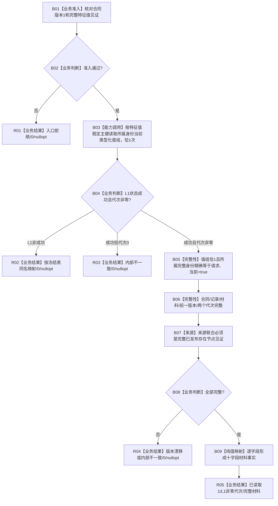

# WORLD-TREE-FEATURE-HQ 具名已发布特征值材料真实读取业务流程图 v0.1

日期：2026-08-03

设计身份：WORLD-TREE-FEATURE-HQ

## 1. 依据与目标

```text
规范/4020_子规范_领域类型化数据记录与组合读取投影边界.md
规范/4170_子规范_特征批次发布记录与幂等账.md
规范/4200_子规范_世界树业务服务与同代次完整事实快照.md
规范/4201_子规范_世界树合同骨架与未实现结果.md
规范/详细设计/20260803_WORLD-TREE-P1BF_特征服务合同骨架详细设计_v0.3.md
```

目标是在 P1BF v0.4 最终 ABI 内，把具名特征值稳定身份映射为当前内存权威的唯一已发布原始值材料事实。SQL、4170批次引用、旧特征栈、日志和缓存都不是事实来源。

## 2. 输入、输出与完成条件

输入：合同版本1和完整 `节点类型::特征值` 身份见证。

输出：成功时返回 `已读取(1)`、L1非零事实截止代次和一个完整 `世界树特征值材料事实`；非成功固定返回代次0、`nullopt`。

完成条件：目标函数直接且恰调用一次 L1 `读取所属身份当前类型化值组`；成功只接受唯一精确所属、当前、完整且来源为存在节点的类型化值读回；全程只读、零机器事实变化。

## 3. 业务流程



## 4. 能力与函数映射

| 节点 | 能力 | 裁决 | 目标函数/材料 |
| --- | --- | --- | --- |
| B01 | L2入口准入 | 本函数内指令 | 合同版本、节点见证、节点类型 |
| B03 | 同一许可的当前值组读取 | 复用L1正式能力 | `结构_.读取所属身份当前类型化值组` |
| B05—B07 | 领域唯一性和完整性 | 本函数内纯值判断 | `类型化值读回` |
| B09 | 共享事实投影 | 本函数内逐字段构造 | `世界树特征值材料事实` |
| R01—R05 | 结构化状态 | 复用P1BF状态1—8 | `节点直接具名特征值材料读取结果` |

## 5. 事实与事务边界

本闭环只取得 L1 函数内部的一次短共享许可；许可不越过 L1 返回。FEATURE-HQ 只接收值式副本，不访问仓库、许可、事务域或锁。结果事实截止代次只能来自该 L1 结果头，不得使用时钟、仓库高水位、4170批次代次或 SQL 行版本。

## 6. 完成边界

本业务图只覆盖一个具名特征值的真实材料读取，不证明宿主组 FEATURE-Q、特征写入、4170批次读回、状态比较、世界快照或服务验收完成。
