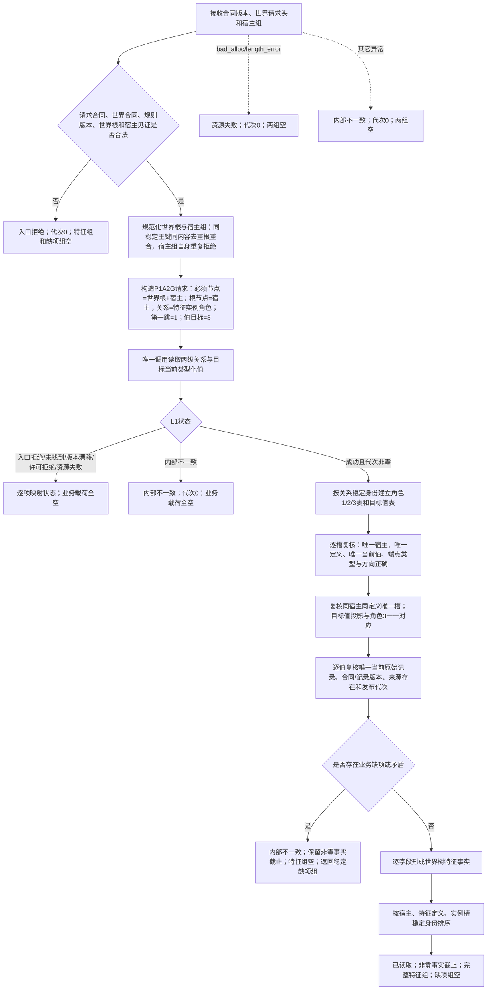

# WORLD-TREE-FEATURE-Q 当前完整特征真实读取业务流程图 v0.1

日期：2026-08-03

业务身份：WORLD-TREE-FEATURE-Q

状态：正式设计；代码待实现；等待 WORLD-TREE-P1BF v0.4 骨架真实结果后激活

## 1. 业务目标与边界

本流程只读取一组具名宿主在一个 L1 已发布事实截止内的全部当前实例特征。它复用
`节点直接结构查询服务::读取两级关系与目标当前类型化值` 的一次共享许可投影，
由特征事实所有者解释关系类型 `特征实例角色(22)` 的角色1宿主槽、角色2定义模板和
角色3当前值，形成 P1BF v0.4 预冻结的 `世界树特征事实`。

本流程不读取历史特征值，不读取4170批次账，不写特征，不取得或传递 L1 许可，不查询
SQL、材料文件、缓存、旧特征栈或显示投影。空宿主组和合法宿主零槽均可成功；已发现槽
却缺定义、缺当前值、重复角色、跨宿主或原始值不完整时整轮为内部不一致，不返回部分特征。

## 2. 参与能力

```text
调用方
-> 节点直接特征查询服务::读取宿主组完整当前特征
-> 节点直接结构查询服务::读取两级关系与目标当前类型化值（唯一一次）
-> P1A2G 一次共享许可内值式投影
-> 当前已发布节点 / 关系22 / 类型化值记录
```

P1A2G 只提供业务中性材料，不解释角色22。FEATURE-Q 是角色1—3业务完整性、字段映射、
缺项诊断和特征稳定排序的唯一所有者。

## 3. 业务流程



## 4. 完整性裁决

| 结构 | 成功条件 | 缺项种类 |
| --- | --- | --- |
| 角色1宿主槽 | `宿主 -> 实例槽`；每槽恰一宿主；宿主属于请求组 | `特征槽` |
| 角色2定义模板 | `实例槽 -> 抽象定义`；每槽恰一 | `特征定义` |
| 角色3当前值 | `实例槽 -> 特征值`；每槽恰一 | `特征当前值` |
| 原始类型化值 | 角色3目标恰一当前记录；来源为已发布存在节点；发布代次不晚于事实截止 | `特征当前值` |
| 宿主+定义唯一性 | 同宿主同定义只有一个当前实例槽 | `特征槽` |

宿主没有任何角色1关系不是缺项，而是合法零特征。只有角色1已经建立后，槽的角色2、角色3
或原始值不完整才形成缺项。缺项只在业务可判定的 `内部不一致` 分支返回，特征组必须为空。

## 5. 状态与消费边界

```text
P1A2G成功 -> 已读取
P1A2G未找到 -> 未找到
P1A2G入口拒绝 -> 入口拒绝
P1A2G版本漂移 -> 版本漂移
P1A2G许可拒绝 -> 许可拒绝
P1A2G资源失败 -> 资源失败
P1A2G内部不一致 -> 内部不一致
业务角色/字段不完整 -> 内部不一致 + 稳定缺项组
```

调用方只有收到 `已读取`、非零事实截止和空缺项组时才能进入成功后继。任何非成功均不得
转为空成功、未找到回退、SQL回源或旧特征服务读取。

## 6. 完成声明

本流程落地最多证明节点直接新域当前完整特征读取真实成功，并保持一次 L1 许可、稳定字段来源
与非成功零部分特征。它不证明历史材料读取、4170批次、特征写入、状态动态写入、P1C快照组合、
生产接线或世界树服务验收。
