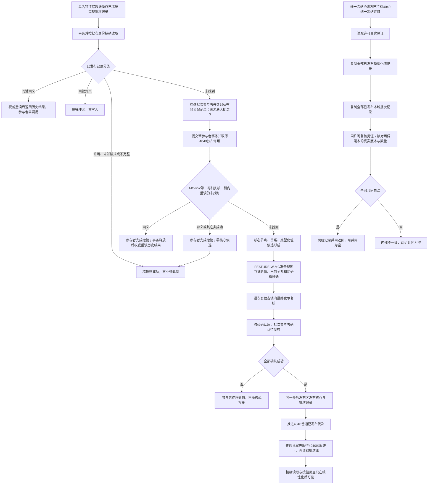

# WORLD-TREE-FEATURE-W-DP 特征批次账与领域事务参与者提供者业务流程图 v0.1

重做设计正式基线：`78418dc55002840a4c7efba25409e71d1dfa7ee5`

状态：待激活。该图冻结4170节点直接新域批次账、4040领域参与者和只读提供面，不证明代码已经存在。

## 固定业务边界

- 批次账只保存强类型批次身份、格式版本、规则版本、宿主和完整有序项目，不复制原始值本体。
- 来源只保存当前 `类型化值读回.来源` 中已发布节点身份见证；关系22不存在第四来源角色。
- `读取已发布批次` 只按强类型批次身份读取本域唯一记录。
- `按特征值读取批次引用组` 对每个项目分别判断“新值命中”和“写前当前值命中”：恰一角色命中时复制一次，双角色命中为内部不一致，均不命中继续扫描。
- 两个普通读取根必须由数据操作先取得一次本事务域4040读取许可，并在许可全程持有期间进入批次仓；参与者虽在代次推进前完成自身发布，也不能被普通读取提前观察。
- SQL、日志、快照文件和旧默认域4170账只能提供证据或恢复输入，不参与运行期成功裁决。
- CORE-FREEZE-DP-F0 v0.3 结果 `c55870c1` 已把统一许可/见证/所属域根放入执行器模块，把类型化值冻结访问器放入 `海中鱼巣.核心.冻结.节点直接类型化值`，并以顺序225接入；所有运行根仍固定未实现、false或空。只有 CORE-FREEZE-DP-R1 的真实结果可解除冻结读取门禁。4170第一写前锁内重读还必须等待已发布计划 `WORLD-TREE-FEATURE-W-MC-PW v0.1` 的真实代码结果；不得以F0空骨架、准备阶段晚重读、普通读取许可、最大批次编号或调用方输入补位。
- 两个普通读取根与冻结读取严格分离：普通读取由数据操作每次取得一个现有 `节点直接身份结构读取许可`，无效统一归 `许可拒绝`；冻结读取只消费协调方传入的统一冻结许可，绝不自行取得普通许可或第二冻结许可。
- F0/R1明确 `未实现` 保持领域 `未实现(12)`；旧领域状态1—11数值不改。所有非成功均零业务载荷。

## R1未决门禁

以下三项尚无正式机器语义，必须先由用户裁决并形成 `WORLD-TREE-CORE-FREEZE-DP-R1` 设计、计划和真实结果，本图不得补造：

1. `FREEZE-R1-DOMAIN-ID`：运行期域身份的形成者、跨恢复稳定性、唯一性与何时更新。
2. `FREEZE-R1-TYPE-VERSION`：类型化值仓结构版本初值、精确递增点、恢复赋值、溢出和坏版本分类。
3. `FREEZE-R1-ISOLATION`：许可/见证/结构观察损坏时由哪个所有者隔离事务域、隔离发生时点及返回状态。

## 完成声明边界

本图只允许后继声明“节点直接新域特征批次账与领域参与者提供者通过具名矩阵”。不证明特征写业务、关系22完整发布、统一快照、SQL恢复、生产装配或世界树服务验收完成。
