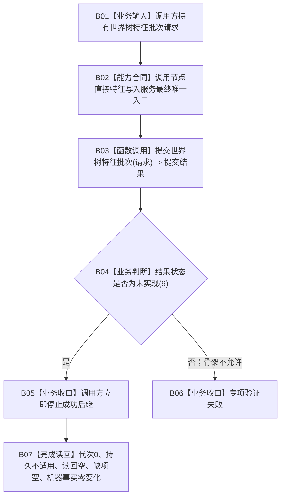

# WORLD-TREE-FEATURE-W-F 特征写入最终合同骨架业务流程图 v0.1

日期：2026-08-03

## 依据

```text
规范/4030_子规范_基础信息服务分层与领域写授权.md
规范/4170_子规范_特征批次发布记录与幂等账.md
规范/4200_子规范_世界树业务服务与同代次完整事实快照.md
规范/4201_子规范_世界树合同骨架与未实现结果.md
规范/详细设计/20260802_WORLD-TREE-P1_函数功能确认_v0.1.md
规范/详细设计/20260803_WORLD-TREE-P1BF_特征服务合同骨架详细设计_v0.3.md
当前代码基线 57e1a526cfba595df1d033c2d33a9962b769476b
```

## 身份与边界

本图只冻结“调用方可以按最终强类型 ABI 调用特征批次写入口，并对显式未实现安全停止”的骨架闭环。它不读取请求、不调用任何依赖、不形成候选、不探测幂等、不写特征、批次账或 SQL。

`节点直接特征批次提交状态::未实现=9` 已由本设计包同步修订的4201 v0.5冻结；骨架仍因P1BF与FEATURE-W-DP最终类型尚未进入正式代码而保持待激活。

## 业务流程图



## 节点实现分析与能力映射

| 节点 | 唯一职责 | 输入 | 输出 | 读取 / 写入事实 | 所需能力 | 裁决 | 验证 |
| --- | --- | --- | --- | --- | --- | --- | --- |
| B01 | 承载最终请求形状 | 调用方值式请求 | const 借用 | 无 | 最终 DTO | 新建于写服务模块 | 默认、非法、完整、大容器请求 |
| B02 | 固定唯一公开服务入口 | 请求 | 函数调用资格 | 无 | 最终模块、类、构造 | 新建 | AST 唯一定义 |
| B03 | 返回安全未实现 | 请求不读取 | 固定结果 | 零读零写 | 单函数骨架 | 新建 | 对应单函数图 |
| B04 | 消费者识别稳定非成功 | 提交结果 | 分支 | 无 | 未实现稳定值 | 复用4201 v0.5 | 数值与分支断言 |
| B05 | 禁止进入真实写后继 | 未实现结果 | 本轮结束 | 零写 | 合法消费合同 | 复用4201 | 成功后继调用数0 |
| B06 | 暴露骨架漂移 | 非未实现结果 | 自检失败 | 无 | 专项验证 | 新建 | 四类请求全部覆盖 |
| B07 | 证明固定空载荷 | 固定结果 | 可审计结论 | 六仓、批次账、代次均不变 | 权威导出对比 | 组合复用 | 前后逐值相等 |

## 输入、输出与完成条件

```text
输入：世界树特征批次请求，由调用方拥有；同步调用期间 const 借用且不保存。
输出：节点直接特征批次提交结果，由调用方按值拥有。
骨架唯一结果：未实现(9)、发布代次0、持久证据不适用、读回空、缺项组空。
完成：最终类型、模块、构造和签名可以编译；调用方收到未实现后安全停止；全部机器事实零变化。
非完成：任何真实准入、批次幂等、候选、撤销、最后发布、读回、恢复或生产接线。
```

## 事务与失败边界

骨架没有事务边界，因为它不得取得事务许可或调用提交服务。`未实现` 是逻辑内非成功，不记录为错误，不映射为资源失败、未找到或空成功。固定结果之外的任何行为都是本叶验证失败，不是可接受的业务分支。

## 双向引用

- 根函数图：`流程图/20260803_节点直接特征写入服务提交世界树特征批次_函数流程图_v0.1.md`
- 详细设计：`规范/详细设计/20260803_WORLD-TREE-FEATURE-W-F_特征写入最终合同骨架详细设计_v0.1.md`
- 施工计划：`计划/20260803_WORLD-TREE-FEATURE-W-F_特征写入最终合同骨架代码实施切片_v0.1.md`
