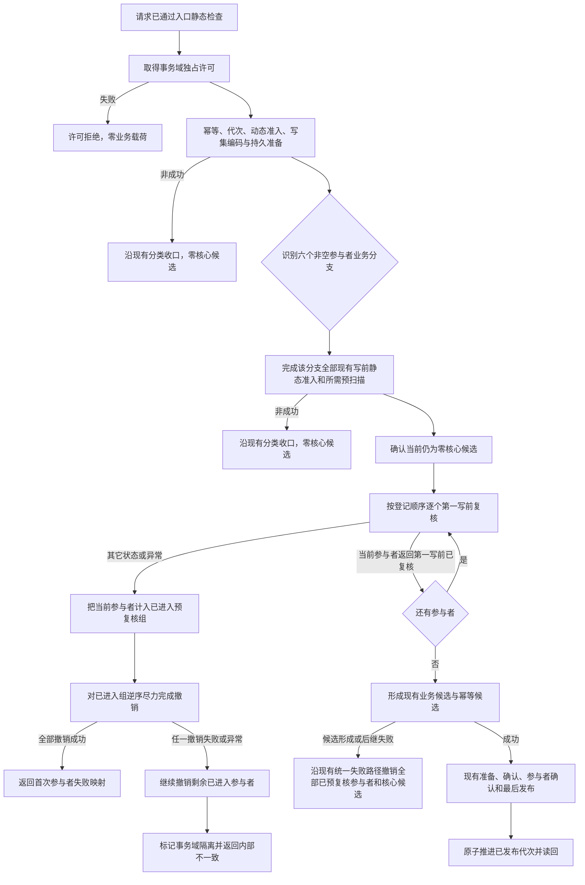

# WORLD-TREE-FEATURE-W-MC-PW 参与者第一写前复核提供者业务流程图 v0.1

日期：2026-08-03
创建侧正式代码基线：`9e9964693019c1827649224c92565d95e0b4504c`

## 1. 目标与边界

本图冻结 L1 类型化结构事务新增的真实第一写前复核阶段：事务域独占许可已经取得、当前请求的写前静态准入已经完成、任何核心仓候选尚未形成时，按登记顺序调用全部非空参与者。它为 4170 批次账的锁内侧账重读提供通用承载点，但不解释批次身份、特征语义或侧账内容。

本图不实现特征批次仓和领域参与者，不改变现有准备、确认、最后发布与代次推进语义，不让参与者接触核心仓、事务域许可、锁、计划身份见证或候选读回。

## 2. 正常与失败闭环

## 3. 六个接入分支

| 分支 | 当前正式代码首笔候选 | 第一写前复核前必须完成的现有工作 |
| --- | --- | --- |
| 仅含类型合同 | `结构化发布合同未发布候选`，当前约第2351行 | 形成、排序完整计划合同组；逐项读取精确合同并区分已存在同义/异义；按命名域读取高水位并用本请求内模拟高水位验证每个计划键严格连续 |
| 仅含关系失效 | `结构化失效已发布关系`，当前约第2563行 | 排序、去重并预读验证全部当前关系；先保存句柄和失效后见证 |
| 仅含类型化值退役 | `结构化退役值未发布候选`，当前约第2783行 | 排序、去重并预读验证全部当前值；先保存退役前值 |
| 仅含类型化值发布 | `结构化发布值未发布候选`，当前约第3057行 | 验证映射、所属节点、合同、材料、来源、唯一合同键和前版本；先形成全部计划值 |
| 仅含索引和节点删除 | `结构化创建/移除索引候选`，当前约第3307/3320行 | 验证全部创建键未占用、已占用同义/异义分类、索引目标、移除前态和删除节点当前见证；先形成索引与删除操作计划 |
| 仅含节点关系和索引创建 | `结构化创建节点未发布候选`，当前约第3683行 | 验证全部映射、稳定键、外部端点、局部引用闭包及每个创建索引键未占用/已占用分类；先形成不依赖候选句柄的计划见证 |

行号只用于锚定创建侧基线；执行期以具名调用和同一语义切点复核，不得按行号机械插入。

## 4. 结果不变量

1. 预复核失败且撤销完整：零核心候选、零已发布事实变化、零代次推进，返回首次失败的现有外层分类。
2. 当前失败参与者自身已经进入调用序列，必须先于更早参与者接受逆序撤销；未调用的后续参与者不得撤销。
3. 撤销失败时仍继续清理其余已进入参与者，最终隔离事务域并返回 `内部不一致`。
4. 全部预复核通过后，任何候选形成、准备或确认失败都必须撤销全部已预复核参与者，包括尚未执行 `准备提交` 的参与者。
5. 空参与者组保持旧路径；六个非空分支不得用默认成功、空钩子或绕过调用模拟通过。
6. 可由现有只读接口在独占许可内提前判定的合同精确占用、合同命名域高水位和索引键占用，不得留给首个候选函数判定；预扫描分类必须保持当前外层映射：合同已存在同义/异义与索引键已占用同义/异义均为 `入口拒绝`，合同计划键不等于模拟高水位加一或高水位饱和为 `版本漂移`。

## 5. 完成声明边界

本图只冻结第一写前复核提供者的 L1 业务中性事务位置和失败闭环，不证明 4170 领域参与者、特征批次账、FEATURE-W-DP、生产装配或服务验收已经实现。
