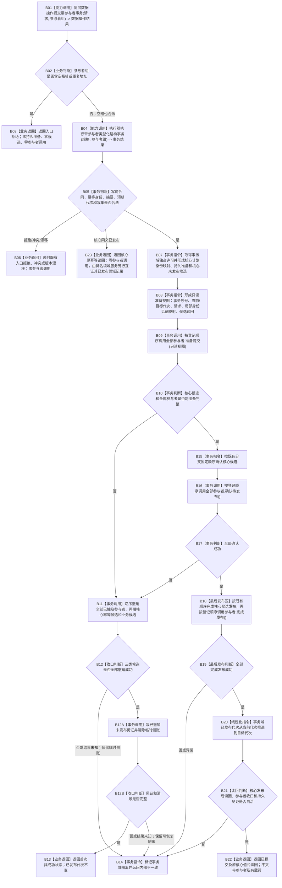

# WORLD-TREE-FEATURE-W-MC 类型化结构事务参与者桥接业务流程图 v0.1

更新时间：2026-08-03

## 依据

```text
代码复核基线：4232074bafbcc0bb01ccad7b739851e9af547a36
规范/4030_子规范_基础信息服务分层与领域写授权.md v1.1
规范/4040_子规范_不透明结构事务候选确认撤销与最后发布.md v1.3
规范/代码文件建立归属与模块命名规范.md v2.4
海中鱼巣/核心/执行器.节点直接身份结构写入.ixx
海中鱼巣/核心/数据操作.节点直接类型化结构.ixx
海中鱼巣/核心/自检.节点直接身份结构写入.ixx
```

## 身份与边界

本图是 WORLD-TREE-FEATURE-W-MC v0.1 的正式目标业务流程图，只冻结“业务中性类型化结构写集与零个或多个具名内部参与者在同一 4040 事务共同收口”的基础能力。

输入是业务中性的 `节点直接类型化结构数据操作请求` 和仅由同层数据操作构造的参与者地址组；输出仍是原 `节点直接类型化结构数据操作结果`。本叶子不建立特征批次账、不解释领域字段、不增加持久端口、不修改 L2 公开提交服务。

完成条件：旧单参入口保持原行为；带参与者入口能按登记顺序准备和确认、按逆序撤销、在同一最后发布区完成发布，并只以事务域代次推进作为普通读取线性化点。

## 业务流程图



## 节点合同与能力裁决

| 节点 | 输入 | 读取 / 写入事实 | 所需能力 | 裁决 | 验证 |
| --- | --- | --- | --- | --- | --- |
| B01—B04 | 请求、借用参与者地址组 | 不读写机器事实 | 数据操作同层重载、执行器重载 | 扩展既有模块；不新建通用服务 | 空组回归；空指针/重复拒绝 |
| B05—B08 | 规格、独占许可 | 读取当前代次；形成持久准备、核心候选和纯值视图 | 既有 P1A2 写前校验、身份映射、候选读回 | 直接复用并补充视图投影 | 参与者无法取得仓库、许可、会话或锁 |
| B09—B17 | 只读视图、参与者组 | 参与者自行形成私有候选；核心候选仍不可普通读取 | 新强类型生命周期协议 | 新建协议；禁止复用旧回调参与者 | 顺序、异常、状态映射、逆序撤销矩阵 |
| B18—B20 | 全部已确认候选 | 完成核心与参与者发布，最后推进统一代次 | 既有最后发布区 + 新参与者完成发布 | 原位扩展每个真实写集分支 | 发布前不可读、代次推进后共同可读 |
| B21—B22 | 发布结果 | 读取核心权威结果；参与者私有载荷不进入核心结果 | 既有 P1A2 读回和持久见证 | 直接复用 | 原结果字段、状态数值和持久状态不漂移 |

## 事务与失败边界

```text
空参与者组：合法，必须与旧单参入口逐字段等价。
空指针或重复地址：第一持久准备前入口拒绝。
核心幂等账同义已发布：不重放参与者生命周期；原样返回核心历史结果。调用者必须把参与者完整语义纳入请求意图摘要，并由具名领域服务互证其领域已发布记录。
参与者准备 / 确认返回非成功或抛异常：映射首次状态；失败项一经开始准备即计入已触及前缀，逆序撤销全部已触及参与者，再撤核心幂等候选和业务候选。
参与者、幂等候选或业务候选任一撤销失败或结果未知：不得写已撤销未发布见证、不得清临时侧账；保留可恢复现场并隔离，返回内部不一致。
三类候选全部撤销成功后才写已撤销未发布见证并清临时侧账；见证失败、结果未知或清账失败时隔离并保留可恢复侧账。
最后发布阶段参与者失败或抛异常：不得尝试撤销已完成发布候选；事务域隔离，代次不得推进。
事务域代次推进：唯一普通读取线性化点；锁释放、参与者返回和持久见证均不是线性化点。
```

## 非目标

```text
不包含领域特征批次参与者、特征批次仓、SQL端口、恢复材料或4170业务语义。
不允许L2公开服务接收参与者、span、回调、许可、会话、锁或仓库。
不建立通用无类型载荷、领域variant或第二套结构执行器。
不改变既有请求、结果、幂等、持久材料格式和恢复入口。
```

## 双向引用

- 执行器根函数：[节点直接身份结构写入执行器执行带参与者类型化结构事务](20260803_节点直接身份结构写入执行器执行带参与者类型化结构事务_函数流程图_v0.1.md)
- 数据操作根函数：[节点直接类型化结构数据操作提交带参与者事务](20260803_节点直接类型化结构数据操作提交带参与者事务_函数流程图_v0.1.md)
- 详细设计：`规范/详细设计/20260803_WORLD-TREE-FEATURE-W-MC_类型化结构事务参与者桥接详细设计_v0.1.md`
