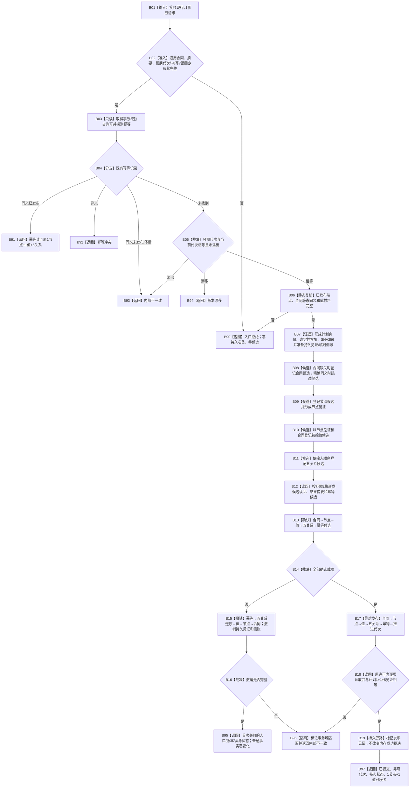

# WORLD-TREE-P1B-L1M 节点直接混合原子写集业务流程图 v0.1

日期：2026-08-03

代码基线：`466d1ab0272ebb122203354a2a1e7be893db964a`

## 身份与边界

本图冻结 W0 所需的唯一 L1 提供能力：现行公开 `节点直接类型化结构提交服务::提交` 接受固定顺序的8项混合写集——1个类型合同、1个节点、1个初始类型化值、5个关系——并按固定7项读回，在一个独占许可内完成候选登记、候选值式读回、确认、逆序撤销、最后发布、代次推进和原许可通用读回。

本能力不解释状态、关系19或角色1—5的业务含义；这些属于 W0。L1只解释通用写项种类、局部身份、端点、类型合同和值材料。不新增第二公开提交入口，不拆事务，不向L2公开仓库、句柄、许可、候选或锁。

创建侧核对确认：当前执行器只有“仅含类型合同”“仅含类型化值发布”“仅含节点关系和索引创建”等互斥成功形状；目标8项会落入末尾不支持收口，当前能力尚未实现。

## 输入、输出与形状

| 项目 | 冻结合同 |
| --- | --- |
| 输入 | 现行 `节点直接类型化结构事务请求`；合同版本1、写集规则版本2、两摘要非零、预期代次非零 |
| 写项顺序 | 合同、节点、初始值、关系1—5，恰8项 |
| 读回顺序 | 当前节点、当前类型化值、当前关系1—5，恰7项，预期版本均1 |
| 初始值 | 所属身份必须是本次唯一节点局部身份；无预期当前值版本；合同等于写项1；来源是当前已发布节点见证 |
| 五关系 | 源端都是本次唯一节点局部身份；目标端都是当前已发布节点见证 |
| 成功 | `已提交(1)` 或同幂等重试 `幂等读回(2)`；非零代次，1节点+1值+5关系原许可读回 |
| 失败 | 入口拒绝、幂等冲突、版本漂移、许可拒绝、资源失败、内部不一致；不增加公开状态 |

同身份同版本的合同尚未发布时建立候选；已经发布且静态内容逐字段相同则作为本事务已满足项，不重复候选；任一静态字段不同则在持久准备前入口拒绝。发布代次字段不属于写项静态内容比较。

## 业务流程

## 节点—能力—物理位置

| 节点 | 能力 | 物理位置 | 事实读写 |
| --- | --- | --- | --- |
| B02/B06 | 混合形状与合同静态内容复核 | `执行器.节点直接身份结构写入.ixx` 私有谓词及现有准备前复核 | 只读请求/已发布合同与端点 |
| B03—B07 | 许可、幂等、代次、编码、持久准备 | 现行 `执行带参与者类型化结构事务_` 前段 | 只读权威事实；准备旁路证据 |
| B08—B11 | 四类候选登记及事务内见证 | 现行四仓公开候选入口，由执行器编排 | 仅本事务候选可见 |
| B12 | 通用候选读回/幂等计划记录 | 执行器混合分支 | 值式材料 |
| B13/B15/B17 | 确认、逆序撤销、最后发布 | 执行器混合分支调用现行仓库生命周期函数 | 唯一写入边界 |
| B18/B19 | 原许可读回和持久发布见证 | 执行器现行仓读回/端口 | 内存权威+非权威持久旁路 |

## 分支事务矩阵

| 分支 | 持久准备 | 候选 | 确认 | 发布 | 代次变化 |
| --- | ---: | ---: | ---: | ---: | ---: |
| 静态非法/合同异义 | 0 | 0 | 0 | 0 | 0 |
| 幂等同义/异义 | 0 | 0 | 0 | 0 | 0 |
| 代次漂移/许可拒绝 | 0 | 0 | 0 | 0 | 0 |
| 候选或确认失败且撤销完整 | 1次准备+撤销 | 部分 | 部分 | 0 | 0 |
| 撤销失败/发布或读回矛盾 | 1 | 部分/全部 | 部分/全部 | 未知/部分 | 隔离，不继续使用 |
| 成功 | 1 | 合同0或1、节点1、值1、关系5、幂等1 | 全部 | 全部 | 精确+1 |

## 完成边界

本图只冻结 L1 对固定混合创建形状的提供者能力，不证明 W0、P1B-F、P1B-Q或FEATURE-Q已经实现。SQL只承担持久见证旁路，不能参与内存结果裁决。
