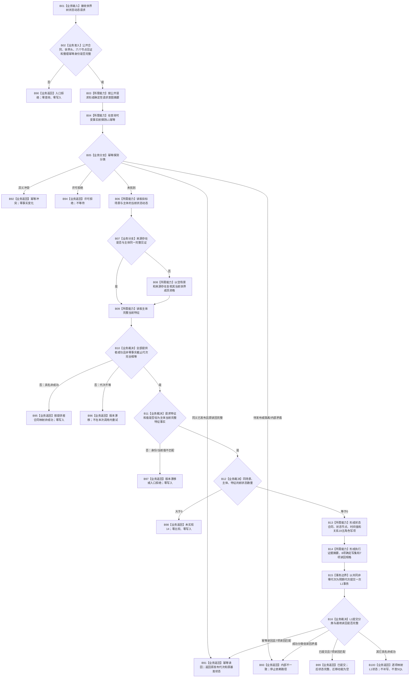

# WORLD-TREE-P1B-W0 首个基准状态原子发布业务流程图 v0.1

更新时间：2026-08-03

## 依据

```text
代码基线：main == origin/main == ae777e65bdbde44a17af648d00745b6f37760318
规范/4030_子规范_基础信息服务分层与领域写授权.md
规范/4040_子规范_不透明结构事务候选确认撤销与最后发布.md
规范/4050_子规范_入口拒绝逻辑内结果与内部逻辑错误.md
规范/4180_子规范_特征值域差异算子与比较算法注册.md
规范/4200_子规范_世界树业务服务与同代次完整事实快照.md
规范/4201_子规范_世界树合同骨架与未实现结果.md
规范/4210_子规范_动态信息分层获取与聚合_20260720.md
规范/详细设计/20260803_WORLD-TREE-P1B-F_状态动态最终合同骨架详细设计_v0.1.md
规范/详细设计/20260803_WORLD-TREE-P1B-F_状态动态类型合同身份补充详细设计_v0.1.md
规范/详细设计/20260803_WORLD-TREE-P1B-Q_真实状态动态查询详细设计_v0.1.md
规范/详细设计/20260803_WORLD-TREE-P1BF_特征服务合同骨架详细设计_v0.2.md
```

## 身份与边界

本图是 WORLD-TREE-P1B-W0 的正式目标业务流程图，只冻结“同场景、同主体、同特征尚无任何前状态时，原子发布首个基准状态”这一条真实写入闭环。

本叶不实现等价后继或差异后继。只要已经存在一个匹配前状态，就固定返回 `节点直接状态动态发布状态::未实现(14)`，保持零比较、零写入。`未实现` 不得转换为比较未注册、空成功或默认动态。

创建侧接口核对发现：上述代码基线的 L1 提交执行器尚无“类型合同 + 节点 + 类型化值 + 关系”混合原子写集成功分支。因而本图是 W0 目标合同，不是当前可执行能力证明；只有 `WORLD-TREE-P1B-L1M`“节点直接混合原子写集提供者”真实代码结果把本次8项写集与7项读回的单事务登记、读回、确认、逆序撤销和最后发布形状进入正式 main 后，B15 才可激活。仅空骨架不能解除门禁，禁止把8项拆成多个事务绕过该门禁。

业务输入为调用方拥有的 `世界树状态动态请求`；业务输出为调用方拥有的 `节点直接状态动态发布结果`。SQL、材料、日志、控制面板和旧状态动态栈均不参与机器裁决。

## 业务输入、输出与完成条件

| 项目 | 冻结合同 |
| --- | --- |
| 输入 | 合同版本1、世界请求头、完整后状态、命名域为 `0x5754534400000001` 的非零整理幂等身份 |
| 输出成功 | `已提交(1)` 或 `幂等读回(2)`、非零发布代次、原 L1 持久证据状态、完整后状态读回、迁移动能为空、缺项组为空 |
| 逻辑内非成功 | 入口拒绝、幂等冲突、版本漂移、许可拒绝、已有前状态的未实现14 |
| 内部/资源非成功 | 资源失败或内部不一致；代次和读回按详细设计清空 |
| 原子写集 | 状态发生时间类型合同、状态节点、发生时间值、关系19角色1—5，共8项 |
| 原许可读回 | 当前状态节点、当前发生时间值、五条当前关系，共7项 |
| 完成条件 | 普通内存权威一次发布基准状态；任一发布前失败零普通可读变化；不创建任何动态 |

## 业务流程图



## 业务节点—能力—目标函数映射

| 业务节点 | 所需能力 | 复用/新增裁决 | 目标函数组 | 事实读写 |
| --- | --- | --- | --- | --- |
| B02 | 强类型请求准入 | 原位实现 | `节点直接动态业务服务::发布状态并整理动态` 本函数内指令 | 只读请求 |
| B03 | 确定性意图摘要 | 扩展现有状态动态数据操作 | `节点直接状态动态数据操作::形成状态动态请求意图摘要` | 无机器事实 |
| B04 | 幂等先探测 | 复用 P1A2 | `节点直接类型化结构提交服务::探测幂等` | 只读内存幂等账 |
| B06 | 状态动态当前事实 | 复用 P1B-Q | `节点直接状态动态查询服务::读取世界状态动态` | 只读内存已发布事实 |
| B08 | 来源存在资格 | 组合 P1B-Q 的空场景分支 | `节点直接状态动态查询服务::读取世界状态动态` | 只读内存世界结构 |
| B09 | 当前特征和值材料 | 复用 FEATURE-Q | `节点直接特征查询服务::读取宿主组完整当前特征` | 只读内存已发布事实 |
| B13 | 状态中性写项 | 原位实现状态服务并扩展数据操作 | `节点直接状态业务服务::形成完整世界实例状态写项` → 数据操作同名函数 | 只形成调用方值式写项 |
| B14 | 基准事务及执行证据 | 扩展现有数据操作 | `节点直接状态动态数据操作::形成基准状态事务` | 只形成值式事务请求 |
| B15 | 原子提交、撤销、最后发布 | 复用 P1A2 | `节点直接类型化结构提交服务::提交` | 唯一机器事实写入边界 |
| B16 | 专属读回映射 | 原位实现 | `节点直接动态业务服务::发布状态并整理动态` 本函数内指令 | 只读提交结果 |

## 事务与分支矩阵

| 分支 | 查询 | 比较 | L1提交 | 普通可读事实变化 |
| --- | --- | --- | --- | --- |
| 非法请求 | 0 | 0 | 0 | 0 |
| 同义已发布 | 0 | 0 | 0 | 0；返回原结果 |
| 幂等冲突/隔离/许可拒绝 | 0 | 0 | 0 | 0 |
| 提供者非成功/代次漂移 | 1—3次只读 | 0 | 0 | 0 |
| 已有前状态 | 2—3次只读 | 0 | 0 | 0 |
| 首个基准状态 | 2—3次只读 | 0 | 1 | 成功时一次发布8项并推进一个代次 |
| L1提交非成功 | 2—3次只读 | 0 | 1 | 由L1保证发布前失败零变化或隔离 |

## 关键边界

```text
1. 本叶只完成首状态分支；已有前状态不是无变化，而是稳定未实现14。
2. 状态发生时间0属于现行类型合同合法值；不得自行改为非零准入。
3. 同源时P1B-Q调用一次；异源时第二次使用空场景，仅验证来源存在，不读取其状态动态。
4. FEATURE-Q恰调用一次；COMPARE调用数固定为0。
5. 三个只读结果的事实截止代次必须相等且非零；不取最大值、不用时钟替代。
6. SQL、材料、旧栈、日志和显示不得补判任何成功。
7. 只有L1提交是写入边界；状态服务和数据操作只形成调用方拥有的纯值规格。
8. 失败后不得二次补写；提交成功但专属读回不一致属于内部不一致。
```

## 验证点

- 同源/异源调用次数和参数精确可见。
- 首状态写集恰8项、读回恰7项，顺序和局部身份固定。
- 已有前状态返回未实现14，比较服务和提交服务调用数均为0。
- SQL关闭、持久材料不可用或日志不可用不改变内存裁决。
- Debug/Release、完整自检和 AST 调用边均通过后，才可声明基准状态写入候选形成。
