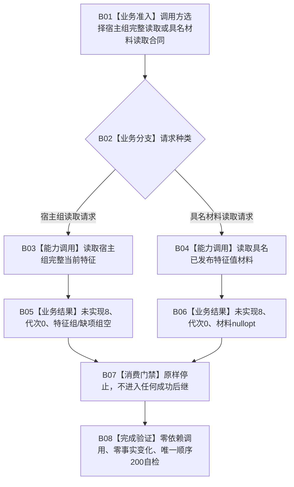

# WORLD-TREE-P1BF 特征双读取安全骨架业务流程图 v0.1

日期：2026-08-03

设计身份：WORLD-TREE-P1BF v0.4

## 1. 依据与业务边界

```text
规范/4020_子规范_领域类型化数据记录与组合读取投影边界.md
规范/4170_子规范_特征批次发布记录与幂等账.md
规范/4200_子规范_世界树业务服务与同代次完整事实快照.md
规范/4201_子规范_世界树合同骨架与未实现结果.md
规范/详细设计/20260803_WORLD-TREE-P1BF_特征服务合同骨架详细设计_v0.3.md
```

本图冻结一个业务闭环：先把“宿主组完整当前特征”和“具名已发布特征值材料”两个最终公开读取合同安全接入同一特征查询服务，使合法消费者能够编译、调用并结构化停止于 `未实现`。本图不是当前代码事实，不证明真实读取、同代次组合或服务验收。

## 2. 输入、输出和前置

输入：任意宿主组读取请求或具名特征值材料读取请求。

输出：对应结果固定为 `未实现(8)`；事实截止代次为0；宿主组结果的特征组/缺项组为空，具名结果的材料为 `nullopt`。

前置：P1A3F v0.3 已建立唯一世界树共享事实头；P1A2/P1A2Q 已建立最终 L1 查询依赖类型；现有顺序180、190和20项自检基线真实存在且写权释放。

完成：两个最终公开签名、DTO、字段顺序、物理所有权、固定无抛返回和唯一顺序200自检真实编译接入；依赖调用、参数读取和机器事实变化均为0。

## 3. 业务流程



## 4. 节点—能力—目标函数映射

| 节点 | 所需能力 | 裁决 | 目标函数/事实 |
| --- | --- | --- | --- |
| B03 | 宿主组完整当前特征最终 ABI | 复用既有 v0.2 单函数图与 v0.3 冻结签名 | `节点直接特征查询服务::读取宿主组完整当前特征` |
| B04 | 具名已发布特征值材料最终 ABI | 本 v0.4 新增第二公开函数 | `节点直接特征查询服务::读取具名已发布特征值材料` |
| B05 | 宿主组安全未实现 | 固定 prvalue | `{未实现,0,{}, {}}` |
| B06 | 具名材料安全未实现 | 固定 prvalue | `{未实现,0,std::nullopt}` |
| B07 | 合法消费者拒绝 | 复用4201 | 两种未实现均不得转成功、未找到或回源 |
| B08 | 唯一弱验收 | 原位扩充 | `WORLD-TREE-P1BF-S01` / 顺序200 |

## 5. 事实读写与禁止边

两个公开函数都不读取参数，不调用保存的 `结构_`，不取得许可、锁或事务，不访问仓库、SQL、材料、日志、缓存、时钟或旧特征栈，不写任何机器事实。新增 `世界树特征值材料事实` 只是跨两个以上世界树领域消费者共享的纯值载荷，不成为第二权威；未来真实字段唯一来源仍是当前内存中已发布的 `类型化值读回`。

## 6. 完成边界

P1BF v0.4 必须先于后继 FEATURE-Q/HQ 进入正式代码，以冻结两个最终 ABI；但骨架只解除编译、链接和安全拒绝门控。FEATURE-Q/HQ 对真实成功、非零代次、完整材料和同代次组合的依赖全部保持，不得以本骨架宣称满足。
