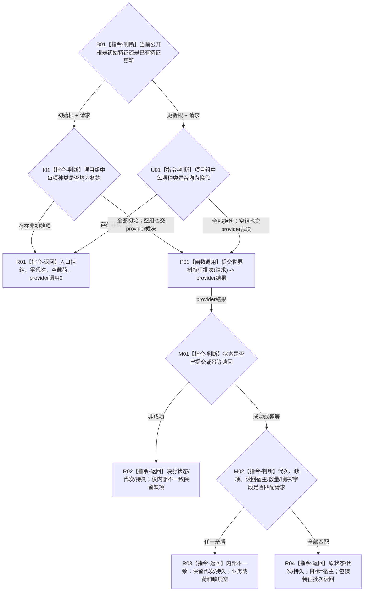

# WORLD-TREE-P1C-FW 特征两写真实门面替换业务流程图 v0.1

日期：2026-08-03

创建侧当前代码基线：`0371103724e2d6cb7eda79a6060be15d7d22ef54`。

## 1. 目标、输入与完成边界

本叶只在 P1C-F 最终模块和原签名内，把 `发布存在初始特征`、`更新存在已有特征` 两个固定未实现骨架替换为真实门面委托。输入均为调用方拥有的 `世界树特征批次请求`，输出均为按值 `世界树写入结果`。门面先区分全初始或全换代批次，再至多一次调用 `节点直接特征写入服务::提交世界树特征批次`；特征身份分配、批次幂等、事务、撤销、发布和原许可读回仍唯一归真实 FEATURE-W provider。

完成只证明两个特征写门面根无损映射真实 provider 结果。它不实现 FEATURE-W、FEATURE-W-DP、P1C-F 骨架、生产路由、旧入口删除或服务验收；其它七个门面根保持其届时正式行为。

## 2. 业务流程

## 3. 节点、能力与目标函数映射

| 节点 | 输入 / 输出 | 事实读写 | 能力裁决 | 目标函数 / 验证 |
| --- | --- | --- | --- | --- |
| B01、I01、U01 | 公开根与批次请求 / 继续或入口拒绝 | 门面0写 | 在 P1C-F 原根内新增最小种类门禁 | 两根签名不变；空组不在门面重复裁决 |
| P01 | 原请求 / `节点直接特征批次提交结果` | 真实 FEATURE-W 独占事务内写入并原许可读回 | 复用最终 provider；不得直调 DP、L1 或仓 | 合法种类门禁后恰调用1次 |
| M01—M02 | provider结果和原请求 / 统一映射 | 只读同步值 | 原位适配，不建立 helper、DTO 或第二入口 | 九状态、未知值、成功绑定闭包 |
| R01—R04 | 分支材料 / `世界树写入结果` | 门面0写 | 复用 P1C-F 统一结果 | 每字段逐值验证；日志调用0 |

## 4. 事务、结果与完成条件

| 路径 | provider调用 | 门面事实写 | 成功完成条件 |
| --- | --- | --- | --- |
| 初始种类不匹配 | 0 | 0 | 不成功；入口拒绝 |
| 更新种类不匹配 | 0 | 0 | 不成功；入口拒绝 |
| 初始合法种类 | 1 | 0 | provider成功读回与请求宿主、数量、顺序及字段匹配 |
| 更新合法种类 | 1 | 0 | 同上，并且每个读回实例槽/前一原始值版本匹配写前请求 |

provider `未实现` 必须映射为世界树 `未实现`，不能回退旧特征栈、SQL或材料。provider `内部不一致` 原样保留其缺项组；其它非成功清空缺项组。provider 已发布但门面发现坏成功形状时，返回 `内部不一致`，保留原发布代次与持久状态，清空目标、旧/新关系、操作读回和缺项组，不二次写入或快照补证。门面日志调用边固定为0；最终运行期日志责任属于 P1D 正式请求入口。

## 5. 旧材料退出时点

旧六写图、旧 P1C 大详细设计和旧大计划均为未发布 WIP，不是本叶依据。待 P1C-SW、P1C-FW 和后继状态动态一写叶的新设计/计划均发布并登记精确 blob 后，且在任一真实写门面计划转为可执行前，由旧材料原所有者退出旧六图与旧大设计/计划；若届时旧文件已被提交，则另作纯文档退役提交。本叶不删除或修改其它所有者 WIP。
