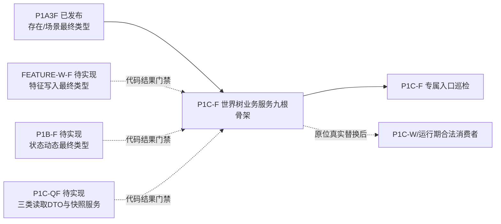
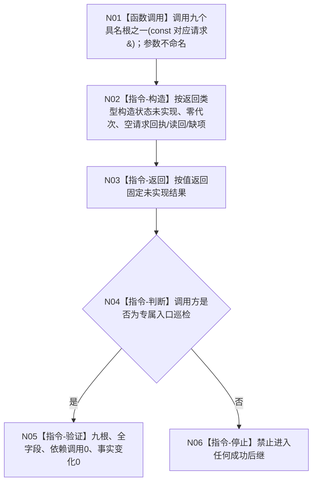

# WORLD-TREE-P1C-F 统一世界树业务服务最终合同骨架业务流程图 v0.1

日期：2026-08-03

创建侧当前代码基线：`3ea95e2667c565d1fe7ea69e340189dcfb90b8f0`。

## 1. 目标与边界

本叶只建立 L2 `世界树业务服务` 的最终模块、两个门面专属 DTO、五引用构造和九个公开根函数。九根对任意请求均不命名、不读取参数，不调用五个保存依赖，不读取或写入机器事实，只返回结构化 `世界树业务状态::未实现(11)`。

业务输入是三个读取入口复用的两类 P1C-QF 读取请求、门面专属创建存在请求及三个事实所有者拥有的写请求。输出是三类 P1C-QF 读取结果或门面专属统一写结果。调用方收到未实现后必须立即停止，禁止形成成功、空成功、SQL回源、旧入口回退或后继机器事实。

本叶只允许取得 `编译接入通过` 与 `入口巡检通过`；不证明真实查询、真实写入、统一快照、事务、幂等、发布后读回、运行期装配、旧入口删除或服务验收。

## 2. 提供者与门禁



## 3. 九根共同流程



| 节点 | 输入/输出 | 事实读写 | 调用 | 完成验证 |
| --- | --- | --- | --- | --- |
| N01 | 对应请求同步 const 借用 | 读0/写0 | 只进入选定门面根 | 九根各唯一一次定义 |
| N02 | 三读构造对应默认请求回执；六写构造零发布结果 | 读0/写0 | 项目调用0 | 默认/非法/完整/边界请求结果一致 |
| N03 | 调用方按值取得结果 | 读0/写0 | 0 | `未实现=11`，全部载荷为空 |
| N04—N06 | 只消费结果状态 | 机器事实不变 | 成功后继0 | 自检停止；生产消费者保持门控 |

## 4. 九根身份

```text
查询存在完整事实(const 世界树对象读取请求&) -> 世界树存在读取结果
查询场景完整事实(const 世界树对象读取请求&) -> 世界树场景读取结果
读取完整世界事实快照(const 世界树读取请求&) -> 世界树读取结果
创建存在并接纳到场景(const 世界树创建存在请求&) -> 世界树写入结果
发布存在初始特征(const 世界树特征批次请求&) -> 世界树写入结果
更新存在已有特征(const 世界树特征批次请求&) -> 世界树写入结果
发布状态并整理动态(const 世界树状态动态请求&) -> 世界树写入结果
移动世界树成员(const 移动世界树成员请求&) -> 世界树写入结果
移除世界树存在(const 移除世界树存在请求&) -> 世界树写入结果
```

旧六写图只作为真实替换差距证据；本骨架不执行其中任何准入、组合、委托或映射节点。两个代表性单函数图分别冻结读根和写根；其余七根的逐字返回表达式由详细设计唯一冻结，不复制七份同构流程图。
