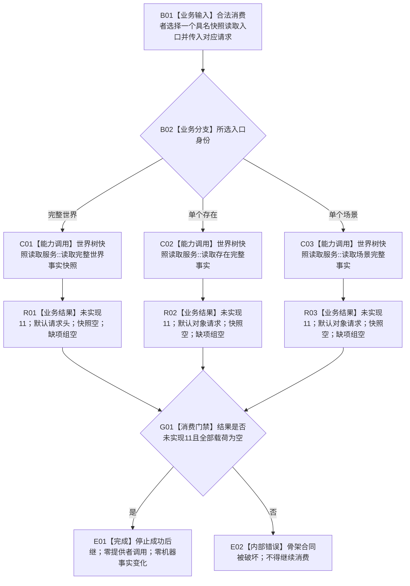

# WORLD-TREE-P1C-QF 完整快照读取最终合同骨架业务流程图 v0.1

更新时间：2026-08-03

## 依据

```text
规范/4200_子规范_世界树业务服务与同代次完整事实快照.md v0.9
规范/4201_子规范_世界树合同骨架与未实现结果.md v0.4
规范/详细设计/20260803_WORLD-TREE-P1A3F_世界结构合同骨架详细设计_v0.1.md
规范/详细设计/20260803_WORLD-TREE-P1BF_特征服务合同骨架详细设计_v0.2.md
规范/详细设计/20260803_WORLD-TREE-P1B-F_状态动态最终合同骨架详细设计_v0.1.md
规范/详细设计/20260803_WORLD-TREE-P1B-F_状态动态类型合同身份补充详细设计_v0.1.md
```

## 身份与边界

本图冻结一个业务闭环：合法消费者调用三个具名完整快照读取入口之一，当前合同骨架不读取请求、不调用任何提供者，固定返回 `世界树业务状态::未实现(11)` 和空载荷，消费者据此停止成功后继。

本叶子只建立 `世界树快照读取服务` 的最终公开读取合同和安全拒绝行为。它不读取世界事实，不组合代次，不建立 `世界树业务服务`，不写机器事实，不访问 SQL、材料、仓库、许可、锁、事务、缓存、日志或时钟。

## 业务输入、输出和完成条件

```text
输入：调用方已经选择的一个具名入口，以及该入口对应的 const 借用请求。
输出：入口专属结果；状态固定未实现11，快照为空，缺项组为空，请求回显保持默认空值。
前置：三个构造依赖的最终类型已经进入正式代码，使服务可按最终构造签名编译。
完成：消费者收到未实现11后停止读取成功路径；三依赖调用数和机器事实变化均为0。
```

## 流程图



## 节点合同

| 节点 | 唯一职责 | 输入 | 输出 | 事实读写 | 后继条件 | 验证 |
| --- | --- | --- | --- | --- | --- | --- |
| B01 | 接收已经选定的具名入口和对应请求 | const 借用请求 | 入口身份 | 无 | 进入分支 | 三入口分别直达 |
| B02 | 只按调用方选择区分三个公开能力 | 入口身份 | C01/C02/C03 | 无 | 恰一分支 | 无万能读取入口 |
| C01 | 调用整树读取根 | `世界树读取请求` | `世界树读取结果` | 骨架零读零写 | 调用返回 | 目标函数图 v0.2 |
| C02 | 调用存在读取根 | `世界树对象读取请求` | `世界树存在读取结果` | 骨架零读零写 | 调用返回 | 目标函数图 v0.2 |
| C03 | 调用场景读取根 | `世界树对象读取请求` | `世界树场景读取结果` | 骨架零读零写 | 调用返回 | 目标函数图 v0.2 |
| R01—R03 | 检查各专属固定结果 | 专属结果 | 固定未实现组合 | 无 | 进入消费门禁 | 状态11、空快照、空缺项 |
| G01 | 防止消费者误把骨架当成功 | 专属结果 | 停止/内部错误 | 无 | 精确组合 | 成功后继调用数0 |
| E01 | 完成安全拒绝闭环 | 固定组合 | 无 | 无 | 结束 | 三依赖和全部机器事实逐值不变 |
| E02 | 拒绝非冻结组合 | 非冻结结果 | 内部错误材料 | 无 | 结束 | 不写机器事实 |

## 业务节点—能力—目标函数映射

| 业务节点 | 所需能力 | 复用裁决 | 目标函数 / 施工图 |
| --- | --- | --- | --- |
| C01 | 整树读取最终 ABI 和安全拒绝 | 新建 P1C-QF 骨架；不复用旧世界快照 | `世界树快照读取服务::读取完整世界事实快照` / v0.2 图 |
| C02 | 存在读取最终 ABI 和安全拒绝 | 新建 P1C-QF 骨架；不调用整树根 | `世界树快照读取服务::读取存在完整事实` / v0.2 图 |
| C03 | 场景读取最终 ABI 和安全拒绝 | 新建 P1C-QF 骨架；不调用整树根 | `世界树快照读取服务::读取场景完整事实` / v0.2 图 |
| G01 | 合法消费者停止成功后继 | 由专项自检调用三根并断言 | `运行世界树完整快照读取合同骨架自检()` |

## 关键边界

```text
P1A3F、P1BF、P1B-F在本叶子中只提供最终类型和构造引用类型，不发生运行期调用。
未实现11不是未找到、空成功、资源失败、许可拒绝或版本漂移。
骨架不回显请求；默认请求字段防止调用方误把未验证输入当作已裁决事实。
后继P1C-Q只能在原模块、原类和原三签名内替换函数体，不建立第二读取入口。
```
