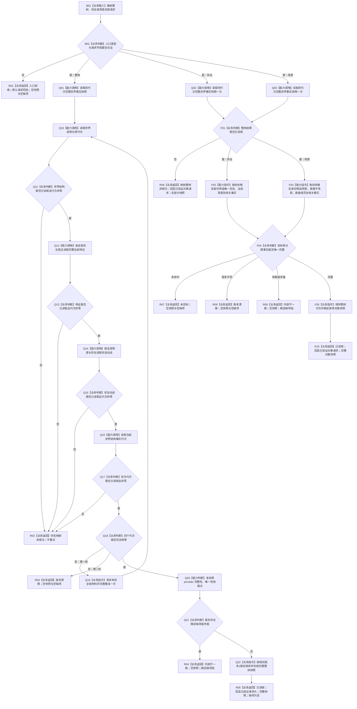

# WORLD-TREE-P1C-Q 同代次完整快照真实读取业务流程图 v0.1

日期：2026-08-03

设计身份：WORLD-TREE-P1C-Q

## 1. 依据

```text
规范/0050_子规范_*.md
规范/4020_子规范_领域类型化数据记录与组合读取投影边界.md
规范/4030_子规范_*.md
规范/4190_子规范_*.md
规范/4200_子规范_世界树业务服务与同代次完整事实快照.md
规范/4201_子规范_世界树合同骨架与未实现结果.md
规范/详细设计/20260803_WORLD-TREE-P1C-QF_完整快照读取最终合同骨架详细设计_v0.1.md
规范/详细设计/20260803_WORLD-TREE-P1A3_现实世界引导与结构提供者详细设计_v0.2.md
规范/详细设计/20260803_WORLD-TREE-P1BF_特征服务合同骨架详细设计_v0.2.md
规范/详细设计/20260803_WORLD-TREE-P1B-Q_真实状态动态查询详细设计_v0.1.md
```

本图是 P1C-Q 目标业务设计，不是当前代码事实。只有 P1C-QF、P1A3、FEATURE-Q、P1B-Q 的真实代码结果全部进入正式 `main` 后，才允许实施。

## 2. 业务目标与完成边界

业务输入为一个合法世界根，或该世界中的一个存在/场景目标。业务输出必须是一个调用方按值拥有、只含同一非零内存已发布代次事实的完整快照，或一个具名非成功结果。

完成要求：

```text
整树读取只通过世界结构、特征、状态动态三个具名 L2 provider
每轮末尾重新读取当前内存事实代次
四个非零代次完全相等才形成完整快照
只有四个 provider 调用均成功但代次不等时完整重试一次
任一许可拒绝、未实现、资源失败、未找到、入口拒绝或内部不一致立即返回
存在/场景入口只调用整树入口一次，再作纯值筛选
SQL、材料、缓存、显示、旧栈和无代次读取均不参与
```

本业务不写机器事实，不取得跨服务许可，不返回部分快照，不证明 P1C-W、运行期装配或世界树服务验收完成。

## 3. 业务流程图



## 4. 业务节点—能力—目标函数映射

| 业务节点 | 所需能力 | 复用 / 扩展裁决 | 唯一目标函数或承载 |
| --- | --- | --- | --- |
| B02 | 世界树请求头与对象目标准入 | P1C-QF DTO 原位复用 | P1C-Q 三个公开根内本地判断 |
| Q10 | 当前世界结构与首代次 | 复用 P1A3 真实 provider | `节点直接世界结构读取服务::读取世界结构` |
| Q12 | 全部存在的完整当前特征 | 复用 FEATURE-Q 真实 provider | `节点直接特征查询服务::读取宿主组完整当前特征` |
| Q14 | 全部场景与存在的状态动态 | 复用 P1B-Q 真实 provider | `节点直接状态动态查询服务::读取世界状态动态` |
| Q16 | 末次内存事实代次 | 复用 P1A3 真实 provider | `节点直接世界结构读取服务::读取当前事实代次` |
| Q18—Q22 | 两轮一致性、完整性、稳定排序 | 原位扩展 P1C-QF 整树根 | `世界树快照读取服务::读取完整世界事实快照` |
| F02 | 存在专属纯值筛选 | 原位扩展 P1C-QF 存在根 | `世界树快照读取服务::读取存在完整事实` |
| F03 | 场景专属纯值筛选 | 原位扩展 P1C-QF 场景根 | `世界树快照读取服务::读取场景完整事实` |
| R01—R10 | 三种专属结果与稳定状态 | 原位复用 P1C-QF DTO | 三个公开根按值返回 |

## 5. 事实、事务和验证边界

| 项目 | 冻结合同 |
| --- | --- |
| 权威来源 | 仅当前内存已发布事实及 provider 返回的非零事实截止代次 |
| 读许可 | 各 provider 内部独立 try-lock；P1C 不取得、不保存、不传递许可 |
| 重试 | 仅四个调用全部成功但代次不等时，整轮最多重试一次 |
| 非成功 | 任一 provider 非成功立即同名映射；不得重试、SQL 回源或旧栈回退 |
| 缺项 | 只在内部不一致分支携带；成功和其它非成功分支为空 |
| 对象读取 | 恰调用整树根一次；之后只读返回值，不再调用 provider |
| 写入 | 全路径为0；节点、关系、类型化值、幂等、持久侧账和事实代次均不变 |
| 服务验收 | P1B-W 不是本叶编译依赖，但正式状态/动态写入形成验收材料前仍须 P1B-W |

## 6. 配套设计

```text
流程图/20260803_世界树快照读取服务读取完整世界事实快照_函数流程图_v0.3.md
流程图/20260803_世界树快照读取服务读取存在完整事实_函数流程图_v0.3.md
流程图/20260803_世界树快照读取服务读取场景完整事实_函数流程图_v0.3.md
规范/详细设计/20260803_WORLD-TREE-P1C-Q_同代次完整快照真实读取详细设计_v0.1.md
计划/20260803_WORLD-TREE-P1C-Q_同代次完整快照真实读取代码实施切片_v0.1.md
```
