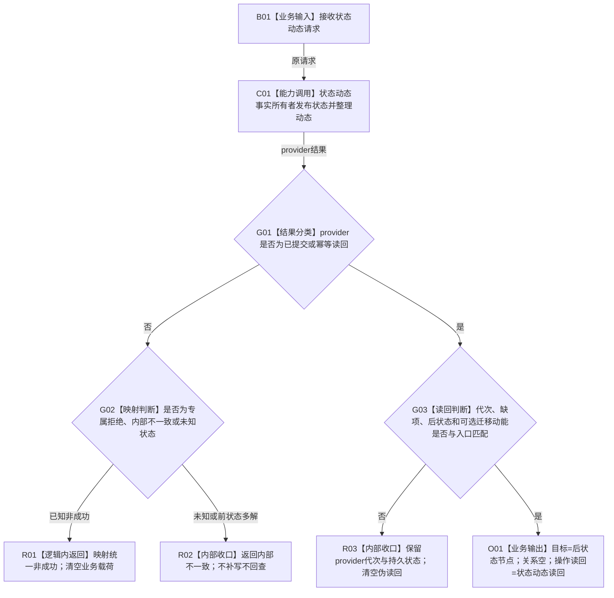

# WORLD-TREE-P1C-SDW 状态动态一写真实门面替换业务流程图 v0.1

更新时间：2026-08-03

## 依据

```text
规范/0050_项目通用机器逻辑与禁止性规则总纲_20260721.md
规范/4200_子规范_世界树业务服务与同代次完整事实快照.md
规范/4201_子规范_世界树合同骨架与未实现结果.md
规范/详细设计/20260803_WORLD-TREE-P1C-F_统一世界树业务服务最终合同骨架详细设计_v0.1.md
规范/详细设计/20260803_WORLD-TREE-P1B-F_状态动态最终合同骨架详细设计_v0.1.md
规范/详细设计/20260803_WORLD-TREE-P1B-Q_真实状态动态查询详细设计_v0.1.md
规范/详细设计/20260803_WORLD-TREE-P1B-W0_首个基准状态原子发布详细设计_v0.1.md
规范/详细设计/20260802_WORLD-TREE-P1_函数功能确认_v0.1.md
正式代码基线：0371103724e2d6cb7eda79a6060be15d7d22ef54
```

## 身份与边界

本图冻结一个门面替换闭环：在 P1C-F 的原模块、原类和原签名内，只把 `世界树业务服务::发布状态并整理动态` 从固定未实现骨架替换为对状态动态事实所有者的一次真实委托和无损统一映射。

门面不读取状态、特征或快照，不选择前状态，不调用比较，不形成写集，不取得许可或事务，也不重试。P1B-W0 当前只真实闭合首个基准状态；已有前状态仍由 provider 结构化返回 `未实现(14)`。本叶不得把该边界扩写为后继状态或迁移动能已经实现。

## 输入、输出和完成条件

```text
输入：调用方拥有并在同步调用期 const 借用的 世界树状态动态请求。
输出：调用方按值拥有的 世界树写入结果。
前置：P1C-F 最终门面代码和 P1B-W0 真实 provider 结果进入正式 main；共享代码/自检资源释放。
完成：门面恰一次调用状态动态 provider；十四状态和未知值唯一映射；成功读回匹配请求；其它八根原样保持。
事务：门面不开事务；原子确认、逆序撤销、最后发布、代次推进、幂等账和原许可读回均由 provider/L1 独占。
```

## 流程图



## 节点合同

| 节点 | 输入 | 输出 | 事实读写 | 后继 | 验证 |
| --- | --- | --- | --- | --- | --- |
| B01 | 世界树状态动态请求 | const借用请求 | 无 | C01 | 不保存请求 |
| C01 | 原请求逐值传入 | 节点直接状态动态发布结果 | provider可在其单一事务中写入 | G01 | provider调用恰1；其它依赖调用0 |
| G01—G02 | provider状态 | 世界树业务状态 | 门面0写 | R01/R02/G03 | 十四状态和未知值源码闭包 |
| G03 | 成功状态、代次、读回 | 合法读回或矛盾 | 门面0写 | O01/R03 | 可达成功运行验证；坏形状源码闭包 |
| O01 | 已验证provider读回 | 世界树写入结果 | 无新增写入 | 返回 | 原代次、持久状态和读回无损映射 |

## 能力与函数映射

| 业务节点 | 裁决 | 目标函数 |
| --- | --- | --- |
| C01 | 复用 P1B 最终事实所有者；门面不得复制状态选择、比较或事务 | `节点直接动态业务服务::发布状态并整理动态(const 世界树状态动态请求&) const noexcept` |
| G01—O01 | 原位扩展 P1C-F 一个既有骨架根 | `世界树业务服务::发布状态并整理动态(const 世界树状态动态请求&) const noexcept` |
| 验证 | 原位扩充 `WORLD-TREE-P1C-F-S01`，不新增顶层身份 | `运行世界树业务服务合同骨架自检()` |

## 关键边界

```text
门面日志调用边固定为0；provider 已分类结果不重复诊断，门面自发现矛盾也只结构化返回。
真实入口只验证合规 provider 可达路径；未知枚举和矛盾成功读回不得用伪 provider 制造，改由源码闭包证明。
其它八根只要求相对 S0 原样保持；不得假定 P1C-SW 或其它独立叶尚未执行。
旧六写图和旧 P1C 大包不作为依据，也不由本叶删除。
```
