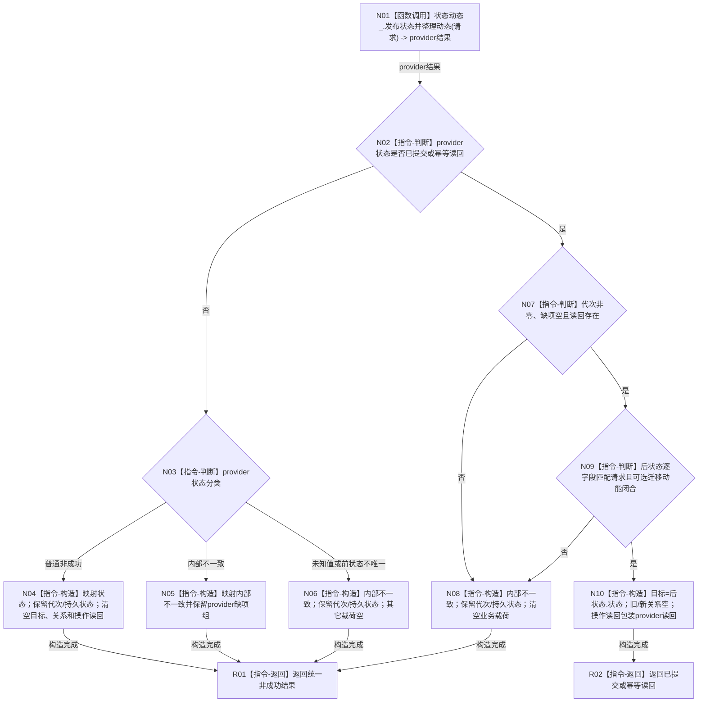

# WORLD-TREE-P1C-SDW 状态动态一写真实门面替换目标函数流程图 v0.1

更新时间：2026-08-03

## 依据

```text
流程图/20260803_WORLD-TREE-P1C-SDW_状态动态一写真实门面替换_业务流程图_v0.1.md
规范/详细设计/20260803_WORLD-TREE-P1C-SDW_状态动态一写真实门面替换_详细设计_v0.1.md
正式代码基线：0371103724e2d6cb7eda79a6060be15d7d22ef54
```

## 身份与边界

正式目标函数施工图，一图只冻结一个根。该根只委托状态动态事实所有者并映射结果；不重复 P1B 的准入、查询、比较、幂等探测或事务形成。

## 函数合同

```text
根函数：世界树业务服务::发布状态并整理动态
归属模块 / 文件 / 层级：海中鱼巣.领域.服务.世界树 / 海中鱼巣/领域/服务.世界树.ixx / L2统一门面
现有或待新增：由 P1C-F 建立的现有最终骨架；本叶只原位替换函数体
完整签名：世界树写入结果 世界树业务服务::发布状态并整理动态(const 世界树状态动态请求& 请求) const noexcept
参数：请求；const借用；调用方拥有且覆盖同步调用；门面不保存；非法值由provider结构化裁决
返回结果：世界树写入结果；成功/幂等携带匹配后状态的状态动态读回，其它分支按映射返回空业务载荷
被调函数流程图：P1B-W0正式函数图；本图不展开provider内部过程
```

## 流程图



## 节点合同

| 节点 | 类型 | 参数 / 输入绑定 | 结果 / 输出绑定 | 事实读写 | 后继条件 | 验证 |
| --- | --- | --- | --- | --- | --- | --- |
| N01 | 函数调用 | `请求 -> 请求` | `节点直接状态动态发布结果 -> provider结果` | provider独占可能写入 | 调用完成 | 恰1次；无重试 |
| N02—N03 | 本函数内指令 | provider状态 | 分类 | 无 | 状态值 | 14值+未知值源码闭包 |
| N04—N06 | 本函数内指令 | 非成功结果 | 统一非成功 | 无 | 构造完成 | 映射、载荷与缺项规则 |
| N07 | 本函数内指令 | 成功结果 | 基础形状真/假 | 无 | 基础形状 | 可达运行+坏形状源码闭包 |
| N09 | 本函数内指令 | 请求和读回 | 字段匹配真/假 | 无 | 匹配 | 状态五见证、时间、关系与可选迁移动能 |
| N10 | 本函数内指令 | 匹配读回 | 统一成功结果 | 无 | 构造完成 | 目标、空关系、variant顺序 |
| R01/R02 | 本函数内指令 | 构造结果 | 按值返回 | 无 | 结束 | `noexcept`；门面日志0 |

## 关键边界

```text
状态映射：已提交/幂等读回/入口拒绝/幂等冲突/版本漂移/许可拒绝/资源失败/内部不一致/未实现同义映射；
前状态不唯一->内部不一致；比较未注册->资源失败；不可比/差异不可表示/历史插入拒绝->入口拒绝；未知值->内部不一致。
成功读回允许迁移动能为空；非空时只能是与后状态闭合的状态迁移动能。W0当前运行矩阵不伪造该不可达分支。
本函数不调用查询_、特征_、比较_、状态_、数据操作_、提交_、快照_、日志、SQL、仓库或旧入口。
```
