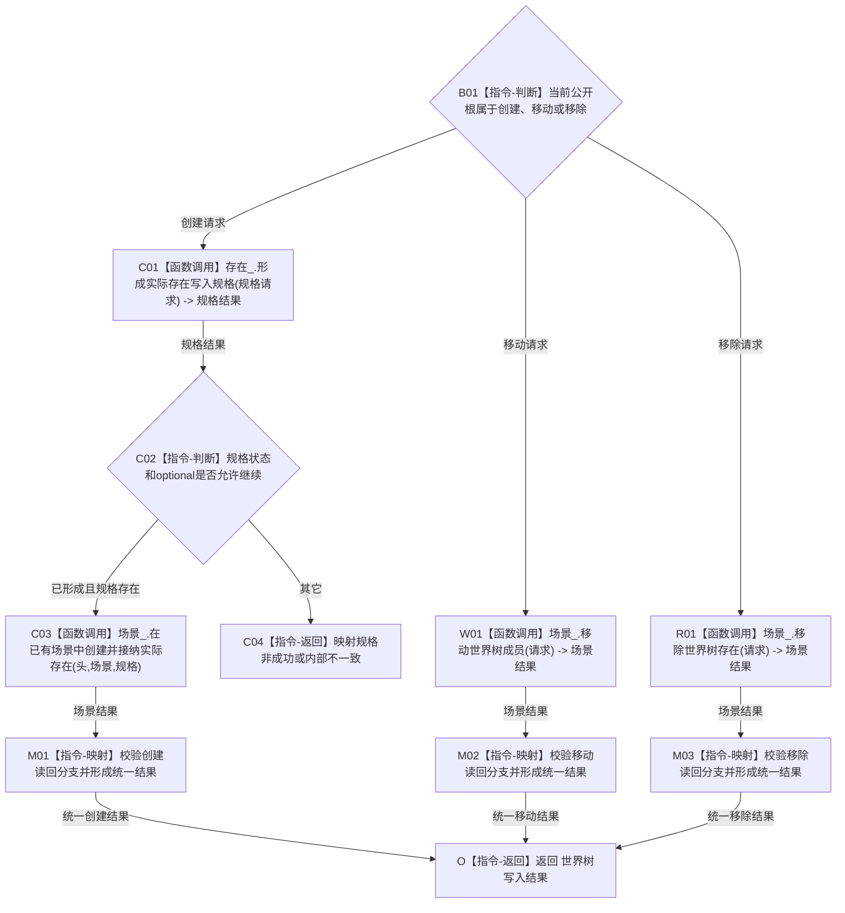

# WORLD-TREE-P1C-SW 结构三写真实门面替换业务流程图 v0.1

日期：2026-08-03

创建侧当前代码基线：`488cb76512254ebb81e7ee4ed02dbf9756e4caae`。

## 1. 目标与边界

本叶只在 P1C-F 最终模块和原签名内，把 `创建存在并接纳到场景`、`移动世界树成员`、`移除世界树存在` 三个固定未实现骨架替换为真实门面委托。世界结构准入、稳定身份分配、幂等、事务、撤销、最后发布和原许可读回仍唯一归 P1A3；门面不复制或重做这些领域逻辑。

门面只负责：创建入口先经存在服务形成不可变规格，再交场景服务；移动/移除各调用场景服务一次；把 provider 的结构化状态、原发布代次、持久状态和入口匹配读回映射成 `世界树写入结果`。三个读取根和特征/状态动态三个写根继续返回未实现。

业务输入为 `世界树创建存在请求`、`移动世界树成员请求` 或 `移除世界树存在请求` 中的一种；输出统一为调用方按值拥有的 `世界树写入结果`。前置条件是 P1C-F 五引用门面与 P1A3 真实存在/场景 provider 由同一装配宿主持有且寿命覆盖同步调用。门面不取得事务许可，不保存请求或结果。

## 2. 业务流程

## 3. 节点、能力与目标函数映射

| 节点 | 输入 / 输出 | 事实读写 | 能力裁决 | 目标函数 / 验证 |
| --- | --- | --- | --- | --- |
| B01 | 当前公开根及其强类型请求 / 唯一分支 | 不读写机器事实 | 复用 P1C-F 九根静态身份 | 三根各定义一次，禁止万能请求入口 |
| C01 | 幂等身份、规则版本1 / 规格结果 | provider 只形成纯值规格 | 复用 P1A3 存在规格 provider | 创建根中恰调用1次 |
| C03 | 头、场景、规格 / 场景结果 | P1A3 独占事务内写入并原许可读回 | 复用 P1A3 场景创建 provider | 仅 C01 成功且规格存在时恰调用1次 |
| W01 | 原移动请求 / 场景结果 | P1A3 独占事务内移动关系并读回 | 复用 P1A3 场景移动 provider | 移动根恰调用1次 |
| R01 | 原移除请求 / 场景结果 | P1A3 独占事务内失效归属并读回 | 复用 P1A3 场景移除 provider | 移除根恰调用1次 |
| C04、M01—M03、O | provider结果 / 统一结果 | 门面0写；只做值式映射 | 在 P1C-F 原函数体内扩展 | 专属读回、代次、持久状态和缺项矩阵 |

## 4. 事实、事务与完成条件

| 路径 | 门面读取 | 门面写入 | 事务所有者 | 成功完成条件 |
| --- | --- | --- | --- | --- |
| 创建 | 请求值、规格结果、场景结果 | 0 | P1A3 场景服务原事务 | 非零代次；创建读回与场景/归属匹配 |
| 移动 | 请求值、场景结果 | 0 | P1A3 场景服务原事务 | 非零代次；成员、旧关系、新父关系匹配 |
| 移除 | 请求值、场景结果 | 0 | P1A3 场景服务原事务 | 非零代次；存在和已失效归属匹配 |

provider 的 `未实现` 必须原样映射为世界树 `未实现`，不能回退旧结构栈或 SQL。provider `内部不一致` 原样保留其缺项组；其它非成功清空缺项组。provider 已发布但门面发现读回分支/字段矛盾时，返回 `内部不一致`，保留原非零发布代次与持久状态，清空目标、关系、操作读回和缺项组；不得二次写入或用快照补证。

## 5. 旧材料退出时点

旧六写图、旧 P1C 大详细设计和旧大计划均为未发布 WIP，不是本叶依据。待 P1C-SW、后继特征两写叶和状态动态一写叶的新版设计/计划均发布并登记精确 blob 后，且在任一真实写门面计划转为可执行前，由其原所有者从工作区丢弃旧六图与旧大设计/计划；若届时任一旧文件已被误提交，则另作纯文档退役提交。禁止引用旧文件维持双设计链。
