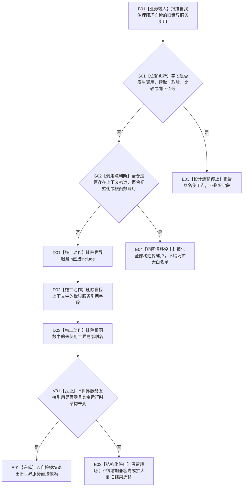

# WORLD-TREE-P1D-MIG-SELF-CLOSURE-WORLD-REF 自我治理闭环自检旧世界服务引用退出业务流程图 v0.1

更新时间：2026-08-03

## 依据

```text
规范/0050_项目通用机器逻辑与禁止性规则总纲_20260721.md
规范/4200_子规范_世界树业务服务与同代次完整事实快照.md
海中鱼巣/线程/自检.自我治理闭环.ixx @ b8dd29cdcda86fb88c0bee4a91467f5d637f817c
海中鱼巣/线程/自检.自我治理闭环.ixx blob 6a62610950517d0baf14246635ef46a073f5d775
```

## 身份与边界

本图冻结一个消费者迁移闭环：从自我治理闭环专项自检移除从未被调用的旧 `世界服务&` 引用。迁移精确覆盖旧头文件 include、上下文字段和根函数局部别名三点；全仓没有该上下文的构造或根函数调用点，因此不存在外部实参传递链需要同步修改。

本叶保留仍被运行时矩阵真实读取的 `世界树初始化结果`，也暂时保留未使用但属于另一独立切片的 `世界树初始化服务&`。不删除 `世界服务.h`，不建立兼容壳，不调用统一门面。

本叶与其它旧消费者迁移叶不存在接口、代码文件或真实结果依赖；迁移主题和创建先后不构成依赖，可在独立 S0 通过后直接施工。

## 输入、输出和完成条件

```text
输入：自我治理闭环自检模块当前源码及全仓构造/调用扫描。
输出：目标模块不再直接包含或保存世界服务；自检上下文其余字段和报告全部不变。
前置：世界字段仅有声明和局部别名两处，局部别名没有读取、调用、取址或传递；全仓构造点为0。
完成：目标文件中世界服务.h、世界服务类型、上下文.世界和局部世界别名均零命中；运行时矩阵结构不变。
```

## 流程图



## 节点合同

| 节点 | 输入 | 输出 | 事实读写 | 后继 | 验证 |
| --- | --- | --- | --- | --- | --- |
| B01 | 当前源码 | 旧引用集合 | 无 | G01 | 精确词和AST/编译证据 |
| G01 | 字段及局部别名 | 使用数 | 无 | 0则G02 | `世界.` 调用0 |
| G02 | 全仓源码 | 构造/调用点数 | 无 | 0则施工 | 类型与根函数仅定义命中 |
| D01 | 旧头直接include | include删除 | 无 | D02 | 精确删除一行 |
| D02 | `世界服务& 世界` | 字段删除 | 无 | D03 | 其余字段顺序不变 |
| D03 | `auto& 世界 = 上下文.世界` | 局部别名删除 | 无 | V01 | 其余局部绑定不变 |
| V01 | 目标差异 | 零命中/不变量 | 无 | 成功或停止 | 构建、自检、模块依赖、scoped diff |
| E01 | 全部门禁通过 | 消费者退出 | 无 | 结束 | 不删除旧头文件本体 |

## 能力与函数映射

| 业务节点 | 裁决 | 目标 |
| --- | --- | --- |
| G01—G02 | 复用当前源码、全仓搜索和模块依赖扫描 | `自我治理闭环自检上下文`、`运行自我治理闭环自检` |
| D01—D03 | 删除无运行时语义的直接旧服务依赖 | `海中鱼巣/线程/自检.自我治理闭环.ixx` |
| V01 | 复用原自检报告和原矩阵；不增加新入口 | `自我治理闭环自检报告 运行自我治理闭环自检(...)` |

## 关键边界

```text
世界树初始化结果仍承载本旧专项自检的实际裸句柄输入，本叶不伪装它已经迁移。
世界树初始化服务引用虽同样未使用，但不与本叶合并，避免扩大具名“世界服务引用”切片。
世界服务.h只能在全部消费者迁移后的最终生产原子切换叶直接删除。
```
