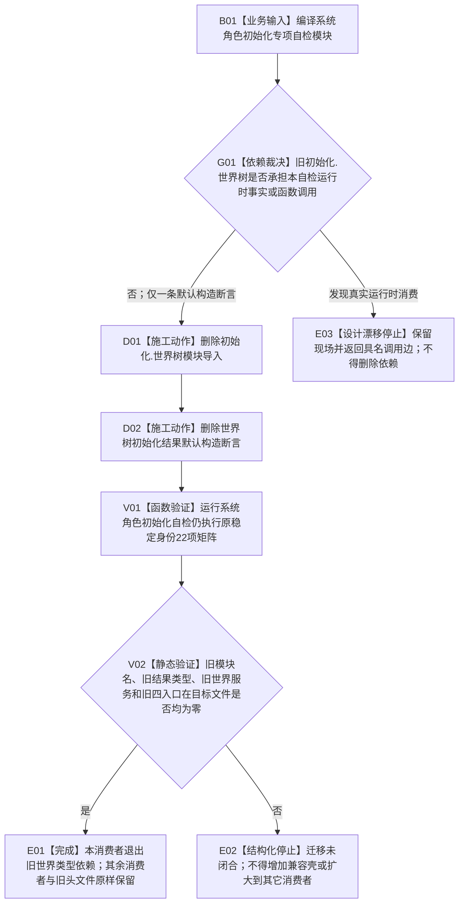

# WORLD-TREE-P1D-MIG-SYSROLE-TEST 系统角色自检旧世界类型退出业务流程图 v0.1

更新时间：2026-08-03

## 依据

```text
规范/0050_项目通用机器逻辑与禁止性规则总纲_20260721.md
规范/4200_子规范_世界树业务服务与同代次完整事实快照.md
海中鱼巣/自检.系统角色初始化.ixx @ b8404079aaed5b6012fbe459526f5491fb8921af
海中鱼巣/自检.系统角色初始化.ixx blob c08e2fbc22fdb8adcad524388eee32abe5753f83
```

## 身份与边界

本图冻结一个迁移闭环：系统角色初始化专项自检停止导入旧 `初始化.世界树` 模块，删除只证明 `世界树初始化结果` 可默认构造的过期编译断言，同时完整保留该自检对新运行期上下文、稳定键、系统角色材料、幂等、冲突、并发和发布的全部真实验证。

本叶不建立新生产入口，不调用世界树统一门面，不把旧结果转换成新结果，不增加兼容转发壳，也不删除 `海中鱼巣/领域/世界服务.h`。旧头文件只能在最终生产原子切换叶中直接删除。

## 输入、输出和完成条件

```text
输入：当前系统角色初始化专项自检模块及其既有 bool 历史兼容回归通过参数。
输出：原签名、原22项运行时验收和原自检单元结果保持不变；旧世界初始化模块依赖减少一条。
前置：目标文件无其它写入所有者；当前模块中旧类型只被 import 和一条 static_assert 消费。
完成：目标文件内“初始化.世界树”和“世界树初始化结果”均零命中；运行时行为与顶层自检数量不变。
```

## 流程图



## 节点合同

| 节点 | 输入 | 输出 | 事实读写 | 后继条件 | 验证 |
| --- | --- | --- | --- | --- | --- |
| B01 | 目标模块源码 | 编译依赖集合 | 无机器事实读写 | 进入依赖裁决 | 当前源码 blob 固定 |
| G01 | import、类型引用和函数体调用边 | 仅编译依赖 / 真实消费 | 无 | 仅编译依赖才施工 | 文本扫描与模块依赖扫描 |
| D01 | 单一旧模块 import | 删除后的 import 组 | 无 | 精确删除一行 | 禁止新增替代 import |
| D02 | 单一旧类型 `static_assert` | 删除后的编译契约组 | 无 | 精确删除一条断言 | 其余断言逐字不变 |
| V01 | 原 `历史兼容回归通过` 参数 | 原 `自检单元结果` | 只运行既有隔离自检事实 | 22项矩阵不变 | Debug/Release 自检 |
| V02 | 目标文件 | 零命中结论 | 无 | 全部零才完成 | `rg` 精确词组 |
| E01 | 全部门禁通过 | 消费者迁移完成 | 无 | 结束 | 顶层数量不变 |
| E02/E03 | 残留或漂移 | 具名停止材料 | 无 | 结束 | 零范围扩张 |

## 能力与函数映射

| 业务节点 | 复用 / 删除裁决 | 目标函数或文件 |
| --- | --- | --- |
| G01 | 复用当前代码和模块依赖扫描；不建立新能力 | `海中鱼巣/自检.系统角色初始化.ixx` |
| D01—D02 | 删除无业务语义的旧编译依赖，不替换为新门面 | 同上 |
| V01 | 完整复用既有运行时系统角色自检 | `自检单元结果 运行系统角色初始化自检(bool 历史兼容回归通过)` |

## 关键边界

```text
不修改运行时系统角色初始化函数、DTO、请求、结果、稳定键或验收矩阵。
不因本叶删除世界服务.h、初始化.世界树.ixx或任何旧生产入口。
不建立“旧结果 -> 新结果”适配结构、别名、转发函数或默认成功。
本叶完成只减少一个自检模块的旧类型依赖，不证明生产消费者已经迁移。
```
