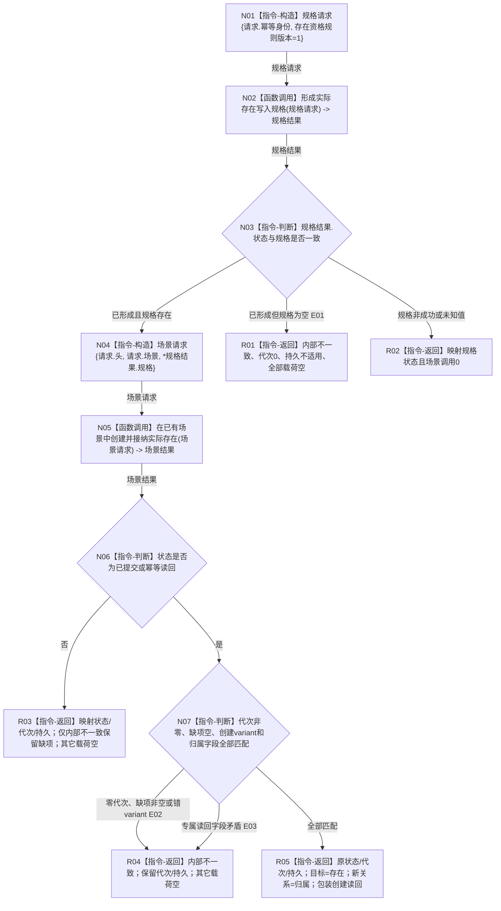

# 世界树业务服务::创建存在并接纳到场景 P1C-SW目标函数流程图 v0.1

日期：2026-08-03

## 1. 依据与身份

```text
正式规范：0050、4030、4200 v0.9、4201 v0.5
最终门面合同：WORLD-TREE-P1C-F v0.1 详细设计 §§3—5
真实 provider 合同：WORLD-TREE-P1A3 v0.3 / 详细设计 v0.2 §§2—4
创建侧代码基线：488cb76512254ebb81e7ee4ed02dbf9756e4caae
```

本图唯一根函数属于 `海中鱼巣.领域.服务.世界树`、物理文件 `海中鱼巣/领域/服务.世界树.ixx`、L2 世界组合门面；当前为待实现目标函数，必须在 P1C-F 原签名内替换骨架，不新增重载。

## 2. 函数合同

```text
完整签名：世界树写入结果 创建存在并接纳到场景(const 世界树创建存在请求& 请求) const noexcept
参数：请求由调用方拥有，函数同步 const 借用且不保存；字段为 世界树请求头 头、世界树节点身份见证 场景、世界树幂等身份 幂等身份
非法值：合同/规则版本、世界根、场景、幂等身份的合法性由具名 provider 裁决；门面不补默认值、不预判
返回结果：调用方按值拥有；成功/幂等包装世界树创建存在读回；provider 非成功逐项映射；门面映射矛盾返回内部不一致
被调函数图：场景创建 provider 见 流程图/20260803_在已有场景中创建并接纳实际存在_函数流程图_v0.2.md；纯值规格形成由 P1A3 详细设计 §4.3 冻结，无独立复杂施工图
被调完整签名：节点直接实际存在规格结果 节点直接存在业务服务::形成实际存在写入规格(const 形成节点直接实际存在规格请求&) const noexcept
被调完整签名：节点直接场景写入结果 节点直接场景业务服务::在已有场景中创建并接纳实际存在(const 节点直接场景创建并接纳请求&) const noexcept
诊断责任：门面只返回结构化内部不一致且不写日志；E01—E03只作防御分支标识，最终日志责任归P1D正式运行期入口
```

## 3. 流程图



## 4. 节点合同

| 节点 | 类型 | 参数 / 输入绑定 | 结果 / 输出绑定 | 事实读写 | 验证 |
| --- | --- | --- | --- | --- | --- |
| N01 | 本函数内构造 | `请求.幂等身份`、规则版本常量1 | `形成节点直接实际存在规格请求` | 0 | 字段逐值断言 |
| N02 | 函数调用 | `const 形成节点直接实际存在规格请求&` <- N01 | `节点直接实际存在规格结果` -> N03 | provider 纯值形成；门面0写 | 调用恰1 |
| N03—N04 | 判断 / 构造 | 规格状态和 optional；原头/场景 | 场景请求或结构化返回 | 0 | 可达路径运行验证；五状态与空规格防御分支源码闭包 |
| N05 | 函数调用 | `const 节点直接场景创建并接纳请求&` <- N04 | `节点直接场景写入结果` -> N06 | P1A3 事务唯一写入 | 条件调用0/1 |
| N06—N07 | 判断 | provider 全结果 | 映射分类 | 只读值式结果 | 可达路径运行验证；九状态、未知值和坏形状源码闭包 |
| R01—R05 | 本函数内返回 | 对应分支材料 | `世界树写入结果` | 0 | 每字段逐值断言 |

## 5. 关键边界

门面不分配稳定身份、不取得许可、不调用提交服务、不读取快照、不写日志。E01—E03只作防御分支标识；不可由合规provider主动形成的坏结果不伪造运行时覆盖，由等价源码闭包证明。成功读回必须同时满足场景归属 optional 与专属归属相等、源端等于请求场景、目标端等于新存在、类型为归属、`角色或顺序=0`。
