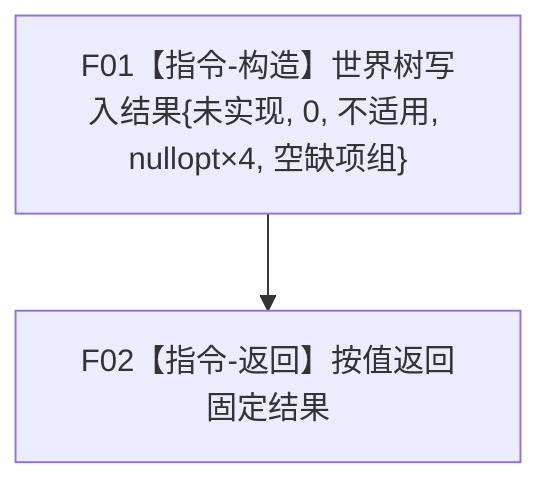

# 世界树业务服务::创建存在并接纳到场景 合同骨架函数流程图 v0.1

日期：2026-08-03

## 1. 函数合同

```text
根函数：海中鱼巣::世界树业务服务::创建存在并接纳到场景
归属：海中鱼巣.领域.服务.世界树 / 海中鱼巣/领域/服务.世界树.ixx / L2世界组合服务
现有或待新增：待新增
完整签名：世界树写入结果 创建存在并接纳到场景(const 世界树创建存在请求&) const noexcept
参数：故意不命名；调用方拥有，函数同步const借用；默认、非法、完整和边界字段均不读取
返回：调用方按值拥有；固定未实现11、发布代次0、持久不适用、目标/旧关系/新关系/操作读回空、缺项组空
依赖：保存存在与场景服务引用但调用0；其它三引用调用0
```

## 2. 流程图



| 节点 | 参数读取 | 项目调用 | 输出 | 事实变化 | 验证 |
| --- | --- | --- | --- | --- | --- |
| F01 | 0 | 0 | 固定未实现写入结果 | 0 | 默认/非法/完整/边界请求一致 |
| F02 | 0 | 0 | 调用方取得按值结果 | 0 | `noexcept`、成员签名唯一 |

骨架不得形成存在规格、探测幂等、调用场景服务或取得代次。后继真实实现只能原位替换函数体。
