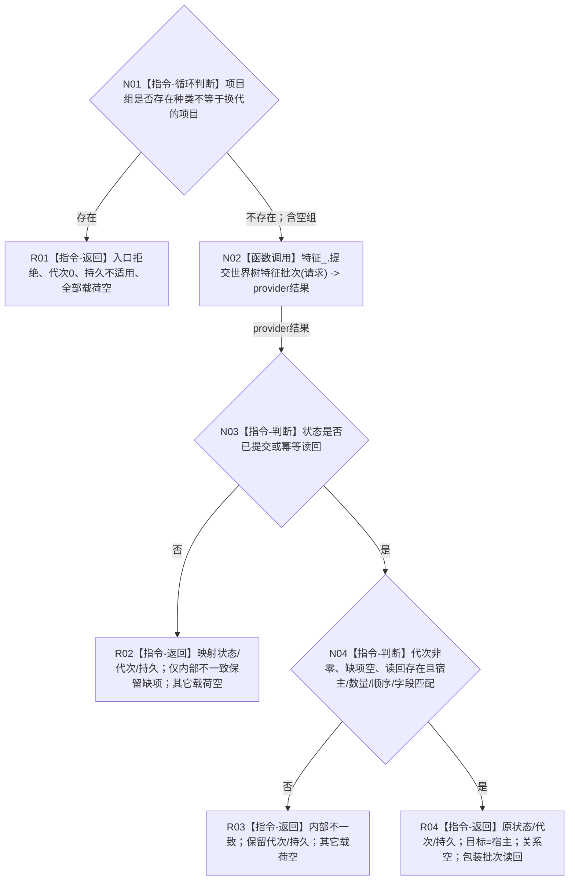

# 世界树业务服务::更新存在已有特征 P1C-FW 目标函数流程图 v0.1

日期：2026-08-03

## 1. 依据与身份

```text
正式规范：0050、4030、4170、4200 v0.9、4201 v0.5
最终门面合同：WORLD-TREE-P1C-F v0.1 详细设计 §§3—5
最终 provider ABI：WORLD-TREE-FEATURE-W-F v0.1
真实 provider 底座：WORLD-TREE-FEATURE-W-DP v0.1；其结果不能单独证明 FEATURE-W 真实业务已形成
创建侧代码基线：0371103724e2d6cb7eda79a6060be15d7d22ef54
```

本图唯一根函数属于 `海中鱼巣.领域.服务.世界树`、物理文件 `海中鱼巣/领域/服务.世界树.ixx`、L2 世界组合门面；当前为待实现目标函数，只能原位替换 P1C-F 同签名骨架。

## 2. 函数合同

```text
完整签名：世界树写入结果 更新存在已有特征(const 世界树特征批次请求& 请求) const noexcept
参数：请求由调用方拥有，函数同步const借用且不保存；字段为合同版本、世界请求头、批次幂等身份、业务规则版本、宿主和有序项目组
非法值：本根只拒绝非换代种类；空组、版本、身份、四个写前字段、类型和事务语义由真实 provider 裁决
返回结果：调用方按值拥有；成功/幂等时目标=读回宿主、关系字段空、操作读回包装世界树特征批次读回；非成功逐项映射
被调完整签名：节点直接特征批次提交结果 节点直接特征写入服务::提交世界树特征批次(const 世界树特征批次请求&) const noexcept
被调函数图：真实行为由未来 WORLD-TREE-FEATURE-W 原位替换设计冻结；FEATURE-W-F 骨架图不能充当真实 provider 图
```

## 3. 流程图



## 4. 节点合同

| 节点 | 类型 | 参数 / 输入绑定 | 结果 / 输出绑定 | 事实读写 | 后继条件 | 验证 |
| --- | --- | --- | --- | --- | --- | --- |
| N01 | 本函数内循环判断 | `请求.项目组` | bool不匹配 | 0 | 任一非换代立即R01；否则N02 | 混合/全初始/未知值调用0；全换代/空组调用1 |
| N02 | 函数调用 | `const 世界树特征批次请求&` <- 原请求 | `节点直接特征批次提交结果` -> N03 | FEATURE-W事务唯一写入 | 调用完成 | 恰调用1 |
| N03—N04 | 本函数内判断 | provider全结果及原请求 | 非成功映射或成功载荷 | 只读值式结果 | 分类完成 | 九状态、未知值、成功绑定源码闭包 |
| R01—R04 | 本函数内返回 | 对应分支材料 | `世界树写入结果` | 0 | 函数结束 | 每字段逐值断言 |

## 5. 成功绑定与关键边界

读回项目数必须等于请求项目数且按索引一一对应。每项除初始根的共同字段外，还必须满足：请求实例槽、写前当前关系、写前当前值、写前原始值版本全部存在；读回实例槽等于请求实例槽；读回前一原始值版本等于请求写前原始值版本。读回当前值必须不同于写前当前值，当前值关系必须不同于写前当前关系；首次发布代次和当前状态发布代次非零。

门面不调用 DP、L1、仓库、SQL、日志、时钟或快照，不新增 helper 或测试 seam。字段完整性本由 provider 裁决；上述成功绑定只防止错误批次被门面包装。未知状态和坏成功形状只做源码闭包，不伪造运行覆盖。
