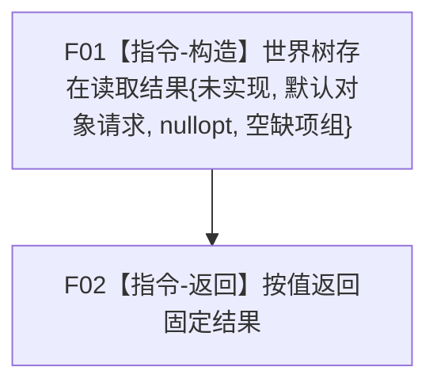

# 世界树业务服务::查询存在完整事实 合同骨架函数流程图 v0.1

日期：2026-08-03

## 1. 函数合同

```text
根函数：海中鱼巣::世界树业务服务::查询存在完整事实
归属：海中鱼巣.领域.服务.世界树 / 海中鱼巣/领域/服务.世界树.ixx / L2世界组合服务
现有或待新增：待新增
完整签名：世界树存在读取结果 查询存在完整事实(const 世界树对象读取请求&) const noexcept
参数：故意不命名；调用方拥有，函数同步const借用；默认、非法、完整和边界字段均不读取
返回：调用方按值拥有；固定未实现11、默认对象请求、空快照、空缺项组
依赖：保存世界树快照读取服务引用但调用0；其它四引用调用0
```

## 2. 流程图



| 节点 | 参数读取 | 项目调用 | 输出 | 事实变化 | 验证 |
| --- | --- | --- | --- | --- | --- |
| F01 | 0 | 0 | 固定未实现存在读取结果 | 0 | 字段逐值相同 |
| F02 | 0 | 0 | 调用方取得按值结果 | 0 | `noexcept`、成员签名唯一 |

调用方收到结果后必须停止成功路径。后继真实实现只能在原模块、原类和原签名内替换函数体。
