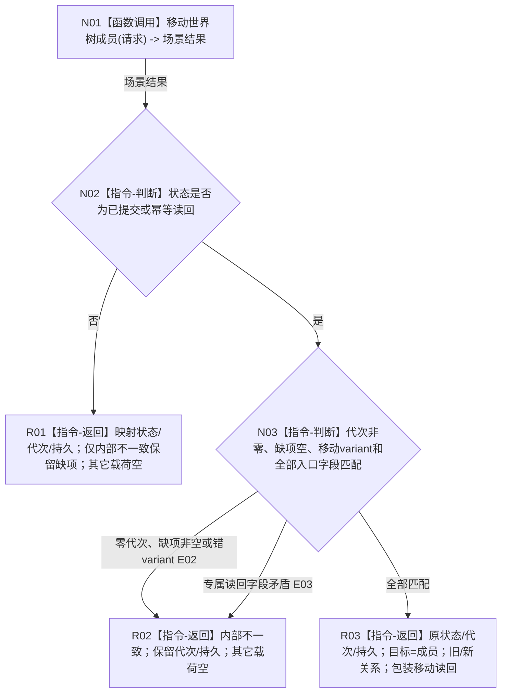

# 世界树业务服务::移动世界树成员 P1C-SW目标函数流程图 v0.1

日期：2026-08-03

## 1. 依据与身份

```text
正式规范：0050、4030、4200 v0.9、4201 v0.5
最终门面合同：WORLD-TREE-P1C-F v0.1 详细设计 §§3—5
真实 provider 合同：WORLD-TREE-P1A3 v0.3 / 详细设计 v0.2 §§3.2、4.5
创建侧代码基线：488cb76512254ebb81e7ee4ed02dbf9756e4caae
```

本图唯一根函数属于 `海中鱼巣.领域.服务.世界树`、物理文件 `海中鱼巣/领域/服务.世界树.ixx`、L2 世界组合门面；当前为待实现目标函数，原位替换 P1C-F 骨架。

## 2. 函数合同

```text
完整签名：世界树写入结果 移动世界树成员(const 移动世界树成员请求& 请求) const noexcept
参数：请求由调用方拥有，函数同步 const 借用且不保存；字段为头、幂等身份、种类、成员、预期旧父场景、预期旧关系、新父场景
非法值：完整性、单父、无环、世界归属和幂等语义由场景 provider 裁决；门面不预判
返回结果：调用方按值拥有；成功/幂等时目标=成员并包装旧/新关系与世界树移动读回；非成功逐项映射
被调函数图：流程图/20260803_移动世界树成员_函数流程图_v0.2.md
被调完整签名：节点直接场景写入结果 节点直接场景业务服务::移动世界树成员(const 移动世界树成员请求&) const noexcept
诊断责任：门面只返回结构化内部不一致且不写日志；E02—E03只作防御分支标识，最终日志责任归P1D正式运行期入口
```

## 3. 流程图



## 4. 节点合同

| 节点 | 类型 | 参数 / 输入绑定 | 结果 / 输出绑定 | 事实读写 | 验证 |
| --- | --- | --- | --- | --- | --- |
| N01 | 函数调用 | `const 移动世界树成员请求&` <- 原请求 | `节点直接场景写入结果` -> N02 | P1A3 事务唯一写入；门面0写 | 恰调用1次 |
| N02—N03 | 判断 | provider 全结果及原请求 | 非成功映射或成功载荷 | 只读值式结果 | 可达路径运行验证；九状态、未知值、两种成员种类和坏形状源码闭包 |
| R01—R03 | 本函数内返回 | 对应分支材料 | `世界树写入结果` | 0 | 每字段逐值断言 |

## 5. 关键边界

门面调用场景 provider 恰一次，不读取快照、不重试写入、不写日志。成功读回必须满足成员和预期旧关系逐值相等；新关系源端=请求新父场景、目标端=请求成员、`角色或顺序=0`；成员种类为存在时关系类型=归属，为子场景时关系类型=普通父子。E02/E03只作不可达防御分支标识，provider 已分类结果只传播。
