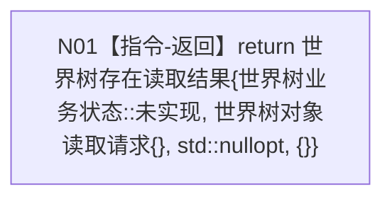

# 世界树快照读取服务读取存在完整事实函数流程图 v0.2

更新时间：2026-08-03

## 依据

```text
4200 v0.9；4201 v0.4；WORLD-TREE-P1C-QF 详细设计 v0.1 §3—§7
```

## 身份与边界

本图只描述待新增的存在读取合同骨架。它不读取参数、不调用整树读取根或三个构造依赖、不形成存在快照。

## 函数合同

```text
根函数：世界树快照读取服务::读取存在完整事实
归属模块 / 文件 / 层级：海中鱼巣.领域.服务.世界树快照 / 海中鱼巣/领域/服务.世界树快照.ixx / L2
现有或待新增：待新增最终合同骨架
完整签名：世界树存在读取结果 世界树快照读取服务::读取存在完整事实(const 世界树对象读取请求& 请求) const noexcept
参数：请求；const借用；调用期间有效；骨架不读取；非法值与合法值取得同一未实现结果
返回结果：调用方按值拥有；固定状态未实现11、默认对象请求、快照std::nullopt、缺项组空；不存在事实截止代次
被调函数流程图：无；不会调用读取完整世界事实快照；项目内调用、成员调用、回调和未解析调用均为0
```

## 流程图



## 节点合同

| 节点 | 类型 | 参数 / 输入绑定 | 结果 / 输出绑定 | 事实读写 | 后继条件 | 验证 |
| --- | --- | --- | --- | --- | --- | --- |
| N01 | 本函数内指令-返回 | 不读取 `请求` | 固定 `世界树存在读取结果` prvalue | 无 | 函数结束 | 状态11；默认对象请求；空快照/缺项；三依赖调用0 |

## 关键边界

```text
不得读取或回显请求，不得调用整树根、世界结构_、特征_、状态动态_。
不得把未实现映射为未找到或不存在当前场景。
后继真实实现只允许原位替换函数体；签名、DTO、模块和构造依赖不变。
```
