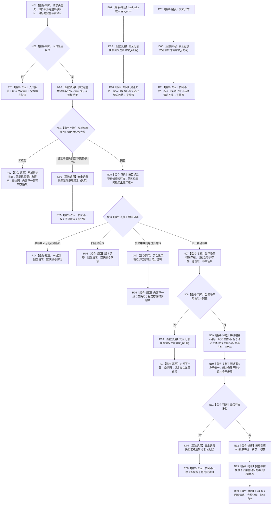

# 世界树快照读取服务::读取存在完整事实 函数流程图 v0.3

日期：2026-08-03

设计身份：WORLD-TREE-P1C-Q / F-P1CQ-02

## 1. 函数合同

```text
根函数：世界树快照读取服务::读取存在完整事实
归属模块 / 文件：海中鱼巣.领域.服务.世界树快照 / 海中鱼巣/领域/服务.世界树快照.ixx
层级：L2 世界组合读取服务
现有或待扩展：P1C-QF 最终骨架原位替换
完整签名：世界树存在读取结果 读取存在完整事实(const 世界树对象读取请求& 请求) const noexcept
参数：请求；const 借用；调用方拥有；函数不保存
返回：调用方按值拥有的世界树存在读取结果
直接复杂被调函数：读取完整世界事实快照；恰调用一次
```

## 2. 流程图



## 3. 节点合同

| 节点 | 类型 | 输入 | 输出 | 事实读写 | 验证 |
| --- | --- | --- | --- | --- | --- |
| N01—N02 | 本函数内指令 | 对象请求 | 准入分类 | 只读参数 | 非法入口整树调用0 |
| N03 | 函数调用 | `世界树读取请求{请求.头}` | 整树结果 | 只读内存事实 | 每次对象调用恰一次 |
| N05—N08 | 本函数内指令 | 完整整树快照、目标 | 唯一存在和当前场景 | 纯值筛选 | provider二次调用0 |
| N09—N12 | 本函数内指令 | 五类整树事实 | 相关特征/状态/动态 | 纯值筛选和排序 | 不改变整树材料 |
| N13 | 本函数内指令 | 筛选材料 | 存在完整事实快照 | 局部构造 | 事实截止代次原样沿用 |
| D01—D06 | 函数调用 | 本层首次异常说明 | 无机器事实 | 诊断旁路 | 不重复整树/provider诊断 |
| R01—R11 | 本函数内返回 | 分支材料 | 世界树存在读取结果 | 写入0 | 非成功无部分快照 |

## 4. 关键边界

```text
直接 provider 调用：0
整树根调用：恰1
整树非成功：不再筛选，不重新访问 provider
目标不存在：未找到
稳定主键存在但目标版本/类型不符：版本漂移
当前场景归属缺失、重复、方向错误或场景多解：内部不一致
合法零特征、零状态、零动态：成功空组
SQL、材料、缓存、旧栈：0调用
```

上游业务图：`流程图/20260803_WORLD-TREE-P1C-Q_同代次完整快照真实读取业务流程图_v0.1.md`。

被调整树图：`流程图/20260803_世界树快照读取服务读取完整世界事实快照_函数流程图_v0.3.md`。
