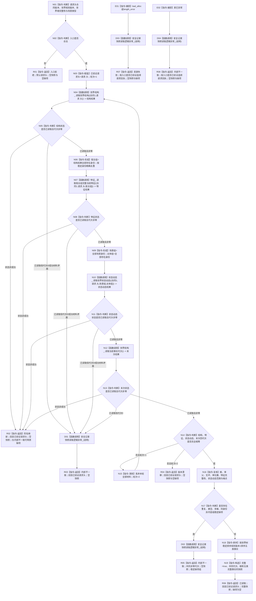

# 世界树快照读取服务::读取完整世界事实快照 函数流程图 v0.3

日期：2026-08-03

设计身份：WORLD-TREE-P1C-Q / F-P1CQ-01

## 1. 身份与边界

```text
根函数：世界树快照读取服务::读取完整世界事实快照
归属模块：海中鱼巣.领域.服务.世界树快照
物理文件：海中鱼巣/领域/服务.世界树快照.ixx
层级：L2 世界组合读取服务
现有或待扩展：P1C-QF 代码结果中的最终骨架原位替换
完整签名：世界树读取结果 读取完整世界事实快照(const 世界树读取请求& 请求) const noexcept
参数：请求；const 借用；调用方拥有；函数不保存
返回：调用方按值拥有的世界树读取结果
```

本图只冻结根函数直接过程。三个 provider 的内部复杂过程分别由 P1A3、FEATURE-Q、P1B-Q 自有流程图承载。

## 2. 流程图



## 3. 节点合同

| 节点 | 类型 | 输入绑定 | 输出绑定 | 事实读写 | 后继 / 验证 |
| --- | --- | --- | --- | --- | --- |
| N01—N03 | 本函数内指令 | `请求` | 已验证请求头、轮次 | 只读参数 | 非法入口零 provider 调用 |
| N04 | 函数调用 | `{节点直接世界结构读取合同版本, 请求.头}` | `结构结果` | 只读内存世界结构 | 每轮恰一次 |
| N06 | 本函数内指令 | `结构结果.存在组` | 唯一宿主组 | 只读局部值 | 不加入场景宿主 |
| N07 | 函数调用 | 请求头、宿主组 | `特征结果` | 只读内存特征 | 每轮恰一次；空宿主组仍合法调用并取得代次 |
| N09 | 本函数内指令 | 结构场景/存在 | 场景组、主体组 | 只读局部值 | 均稳定唯一 |
| N10 | 函数调用 | 请求头、场景组、主体组 | `状态动态结果` | 只读内存状态动态 | 每轮恰一次；合法零事实仍为已读取非零代次 |
| N12 | 函数调用 | 无参数 | `末次结果` | 只读内存事实代次 | 每轮恰一次 |
| N14—N15 | 本函数内指令 | 四代次、轮次 | 重试或版本漂移 | 丢弃局部材料 | 仅全成功代次不等可重试；最多两轮 |
| N16—N19 | 本函数内指令 | 四份同代次材料 | 完整快照或缺项 | 只读和局部构造 | 无 SQL/缓存/旧栈 |
| D01—D04 | 函数调用 | 本层首次发现说明 | 无机器返回材料 | 诊断旁路 | provider 已诊断非成功不重复记录 |
| R01—R08 | 本函数内返回 | 冻结分支材料 | `世界树读取结果` | 无机器事实变化 | 非成功绝不携带部分快照 |

## 4. 状态映射和关键边界

```text
provider 已读取 -> 继续
provider 未找到 -> 世界树业务状态::未找到
provider 入口拒绝 -> 世界树业务状态::入口拒绝
provider 版本漂移 -> 世界树业务状态::版本漂移
provider 许可拒绝 -> 世界树业务状态::许可拒绝
provider 资源失败 -> 世界树业务状态::资源失败
provider 内部不一致 -> 世界树业务状态::内部不一致；只可转交稳定缺项组
provider 未实现 -> 世界树业务状态::未实现
```

成功状态携带零代次属于 provider 合同矛盾，立即返回内部不一致，不作为代次漂移重试。只有四个状态全部为已读取、四代次均非零但不完全相等时，才执行一次完整重试。

```text
直接 provider 最大调用数（两轮）：结构读取2、特征读取2、状态动态读取2、末次代次读取2
SQL、材料、缓存、显示、旧世界服务、L1仓库、事务、许可传递、写入调用：0
```

## 5. 双向引用

上游业务图：`流程图/20260803_WORLD-TREE-P1C-Q_同代次完整快照真实读取业务流程图_v0.1.md`。

本函数被以下目标函数恰调用一次：

```text
世界树快照读取服务::读取存在完整事实
世界树快照读取服务::读取场景完整事实
```
