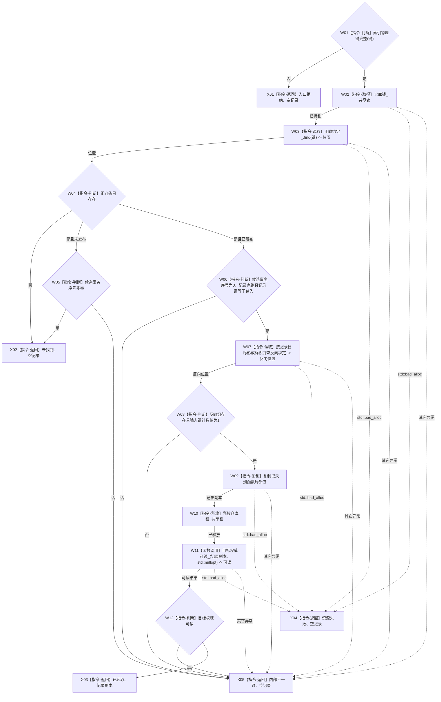

# 可重建索引仓库读取索引物理键结构化函数流程图 v0.1

更新时间：2026-08-03

## 依据

```text
4010 §5—§7；WORLD-TREE-P1A2Q详细设计v0.1 §2.1
```

## 身份与边界

本图是目标单函数施工图，只冻结待新增 L1 内部结构化读取；其内部句柄结果不得暴露给 L2。

## 函数合同

```text
根函数：可重建索引仓库::读取索引物理键结构化
归属模块 / 文件 / 层级：海中鱼巣.核心.仓库.可重建索引 / 核心/仓库.可重建索引.ixx / L1
现有或待新增：待新增；现有无事务序号 optional 重载改为其兼容包装
完整签名：可重建索引精确读取结果 读取索引物理键结构化(const 索引物理键& 键) const
参数：键 -> const借用，只在同步调用内读取且不保存；不完整为非法
返回结果：调用方拥有内部值；已读取才携带恰一当前记录，未找到/入口拒绝/资源失败/内部不一致均为空
被调函数流程图：目标权威可读_ 为现有简单私有二选一读取，不另建施工图；公开服务消费见 流程图/20260803_节点直接结构查询服务读取当前索引_函数流程图_v0.1.md
```

## 流程图



## 节点合同

| 节点 | 类型 | 参数 / 输入绑定 | 结果 / 输出绑定 | 事实读写 | 后继条件 | 验证 |
| --- | --- | --- | --- | --- | --- | --- |
| W01 | 本函数内判断 | `键` | 完整/非法 | 无 | 非法到X01；完整到W02 | 全部必需字段 |
| W02—W06 | 本函数内锁、读取和判断 | `键 -> 正向绑定_` | 正向条目或无条目 | 只读索引正向表 | 缺失/合法候选到X02；状态矛盾到X05；已发布完整到W07 | 未发布可见性、发布候选序号、记录完整性 |
| W07—W10 | 本函数内读取、判断、复制和释放 | `记录目标 -> 反向绑定_`；`键 -> 反向组计数` | 已解锁记录副本 | 只读索引反向表 | 错配到X05；一致到W11 | 缺失、重复、错误目标组；跨仓调用前已解锁 |
| W11—W12 | 函数调用与判断 | `记录副本 -> 目标权威可读_.记录`；`std::nullopt -> 普通视图` | 目标可读性 | 只读节点仓或关系仓 | 不可读到X05；可读到X03 | 节点/关系悬空和目标种类二选一 |
| X01—X05 | 本函数内返回 | 对应分支材料 | 结构化状态和可选记录 | 零机器事实写入 | 函数结束 | 状态与载荷互斥、异常分类 |

## 关键边界

```text
只校验当前普通视图；不读取其它事务候选，不扫描SQL，不持索引锁跨仓读取。
内部记录含句柄，只能交给持事务域共享许可的 L1 查询服务立即投影。
```
