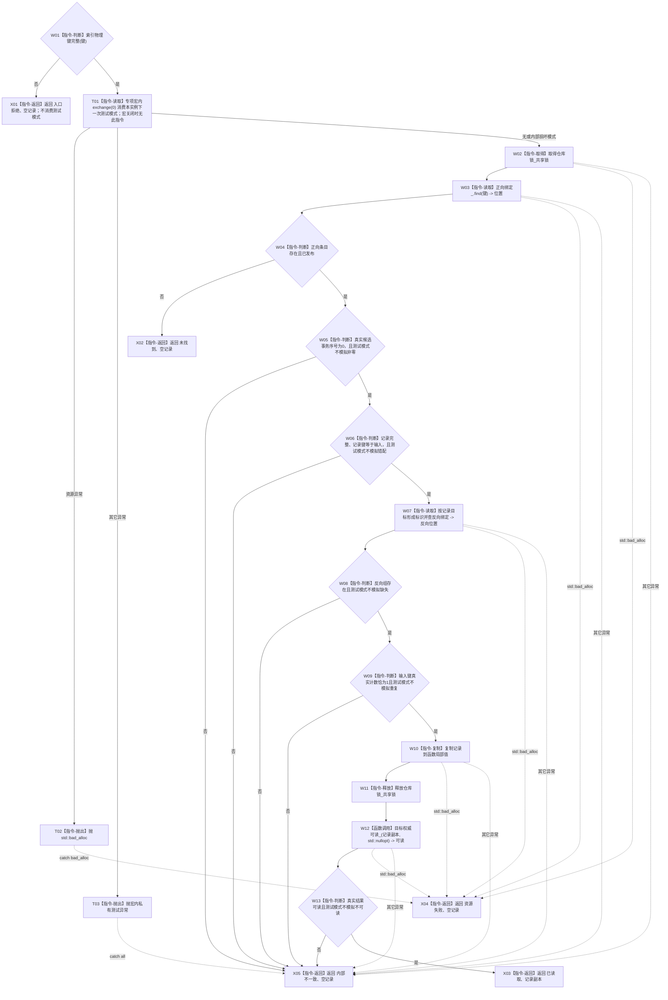

# 可重建索引仓库读取索引物理键结构化函数流程图 v0.3

更新时间：2026-08-03

## 依据

```text
4010 §5—§7
WORLD-TREE-P1A2Q 按精确索引键读取当前目标详细设计 v0.2 §2.1
WORLD-TREE-P1A2Q 故障注入补充详细设计 v0.2 §2—§3
```

## 身份与边界

本图是目标单函数施工图，只冻结待新增 L1 内部结构化读取。v0.3 在 v0.2 正常流程上补齐专项宏内的一次性异常/内部损坏谓词注入；测试模式不修改正反绑定或其它机器事实。

## 函数合同

```text
根函数：可重建索引仓库::读取索引物理键结构化
归属模块 / 文件 / 层级：海中鱼巣.核心.仓库.可重建索引 / 核心/仓库.可重建索引.ixx / L1
现有或待新增：待新增；执行侧已有未提交 WIP 不替代正式实现结果
完整签名：可重建索引精确读取结果 读取索引物理键结构化(const 索引物理键& 键) const
参数：键 -> const 借用，只在同步调用内读取且不保存；不完整为入口拒绝
返回结果：调用方拥有内部值；已读取才携带恰一当前记录，未找到/入口拒绝/资源失败/内部不一致均为空
被调函数流程图：目标权威可读_ 是现有简单私有二选一读取；公开服务消费见 流程图/20260803_节点直接结构查询服务读取当前索引_函数流程图_v0.3.md
```

## 流程图



图中的“其它异常”实际由统一 `catch (...)` 进入 X05；只有 `std::bad_alloc` 进入 X04。Mermaid 合并虚线只表达异常边界，不改变这一区分。

## 节点合同

| 节点 | 类型 | 参数 / 输入绑定 | 结果 / 输出绑定 | 事实读写 | 后继条件 | 验证 |
| --- | --- | --- | --- | --- | --- | --- |
| W01 / X01 | 本函数内判断 / 返回 | `键` | 完整性或入口拒绝 | 无 | 非法直接返回；合法到 T01 | 非法键不消费注入，零仓调用 |
| T01—T03 | 本函数内读取 / 抛出 | 本实例宏内原子测试字段 | 当前栈局部模式或测试异常 | 只消费测试指令；不读写机器事实 | 异常到统一 catch；其它到 W02 | 一次性、跨实例隔离、宏关闭零实体 |
| W02—W06 | 本函数内锁、读取、判断 | `键 -> 正向绑定_`；局部模式 | 正向条目及状态 | 只读索引正向表 | 缺失到 X02；候选序号/键矛盾到 X05 | 真实比较独立存在；模式只强制失败谓词 |
| W07—W11 | 本函数内读取、判断、复制、释放 | `记录目标 -> 反向绑定_`；局部模式 | 已解锁记录副本 | 只读索引反向表 | 缺失/重复到 X05；一致到 W12 | 反向缺失/重复各自具名；零容器修改 |
| W12—W13 | 函数调用 / 判断 | `记录副本 -> 目标权威可读_`；局部模式 | 目标可读性 | 只读节点或关系仓；索引锁已释放 | 不可读到 X05；可读到 X03 | 目标不可读模式不跳回持锁区 |
| X02—X05 | 本函数内返回 | 对应分支材料 | 结构化状态与互斥载荷 | 无 | 函数结束 | 注入后第二次同输入恢复正常；权威导出不变 |

## 关键边界

```text
测试模式是宏内防御谓词注入，不是私有容器写入口，也不证明机器结构真实损坏。
生产真实字段比较必须独立保留；宏关闭时测试枚举、字段、设置函数和分支均不存在。
只校验当前普通视图；不读取其它事务候选，不扫描 SQL，不持索引锁跨仓读取。
内部记录含句柄，只能交给持事务域共享许可的 L1 查询服务立即投影。
```
