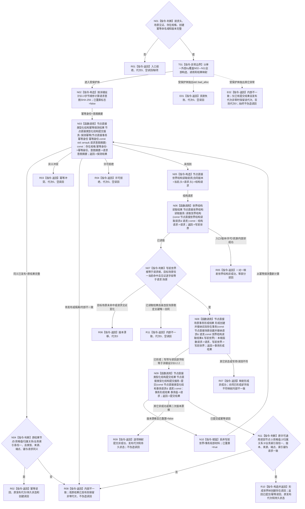

# 在已有场景中创建并接纳实际存在函数流程图 v0.2

更新时间：2026-08-03

## 依据

```text
4200 v0.8；业务节点到能力与目标函数映射.md“世界事实维护”；WORLD-TREE-P1业务流程图C01/C02/W01/W02；P1A3详细设计v0.2 §3.2.2/§3.3/§4.4/§5
```

## 身份与边界

目标单函数施工图；一图唯一根函数。本函数只把存在服务已形成的纯值规格与已有场景组合成一次 L1 事务，不直达仓库或分配稳定主键。

## 函数合同

```text
根函数：节点直接场景业务服务::在已有场景中创建并接纳实际存在
归属模块 / 文件 / 层级：海中鱼巣.领域.服务.节点直接场景 / 海中鱼巣/领域/服务.节点直接场景.ixx / L2
现有或待新增：P1A3F v0.2 骨架原位替换为真实行为
完整签名：节点直接场景写入结果 节点直接场景业务服务::在已有场景中创建并接纳实际存在(const 节点直接场景创建并接纳请求& 请求) const
参数：请求为const借用，只在同步调用内存续；请求头、场景见证、存在规格及命名域/版本必须完整；不保存引用
返回结果：调用方拥有的值；只有已提交/幂等读回携带非零发布代次、持久状态和一个世界树创建存在读回
被调函数流程图：读取世界结构 -> 流程图/20260803_读取世界结构_函数流程图_v0.2.md
```

## 流程图



## 节点合同

| 节点 | 类型 | 参数 / 输入绑定 | 结果 / 输出绑定 | 事实读写 | 后继条件 | 验证 |
| --- | --- | --- | --- | --- | --- | --- |
| N01/T01/N02 | 本函数内判断/异常边界/构造 | 全部公开请求字段 | 入口分类、意图摘要和重算标志 | 零写入 | 完整到N03；受保护体异常到E01/E02 | 每字段改变摘要、非法命名域/版本、两类异常 |
| N03 | 函数调用 | `存在规格.幂等身份->幂等身份`；`意图摘要->请求意图摘要` | 探测结果 | 只读幂等账 | 全状态分流 | 同义优先于当前图变化 |
| N04 | 本函数内判断 | 探测原结果 | 创建专属读回 | 零写入 | 同义到R02 | 四类通用读回数量/字段 |
| N05 | 本函数内构造 | `请求.头->结构请求.头` | 完整世界结构读取请求 | 零写入 | 到N06 | 合同版本和头逐字段复制 |
| N06 | 函数调用 | `结构请求->请求` | 写前世界 | 只读世界结构 | 已读取到N07 | 不将非成功当作空世界 |
| N07 | 本函数内判断 | 请求根/场景见证和写前世界 | 目标场景准入 | 零写入 | 见证漂移到R06；读取结果违反唯一合同到R11；完整到N08 | 根和场景见证逐字段同义、场景稳定主键唯一 |
| N08 | 函数调用 | `本根函数请求->请求`；`写前世界->写前世界` | 事务形成结果 | 只形成局部不可变请求 | 已形成到N09 | 写项1—4、读回1‑4、双摘要和预期代次 |
| N09 | 函数调用 | `事务形成结果.事务值->请求` | 提交结果 | 单次L1最后发布与原许可读回 | 漂移重算或结果分流 | 各L1状态、持久状态、事实代次 |
| N10 | 本函数内赋值 | 首次漂移的局部材料 | 已重算=true | 只丢弃局部副本 | 回N03 | 至多一次 |
| N11 | 本函数内判断 | 原许可通用读回和详细设计§3.2.2 | 创建专属读回材料 | 零补写 | 完整到R10 | 节点/值/关系/索引各恰一 |
| R01—R11/E01—E02 | 本函数内返回 | 具名分支材料 | 合同允许的节点直接场景写入结果 | 零补写 | 函数结束 | 非成功不伪造业务读回；异常不越界 |

## 关键边界

```text
存在服务规格不含稳定主键或写能力；场景服务不直达仓库。
同义幂等在读取当前世界之前返回；提交版本漂移最多从幂等探测开始完整重算一次。
稳定主键、关系主键、类型化值记录身份均由L1在独占许可内分配；L2只使用局部身份。
std::bad_alloc映射资源失败；其它异常映射内部不一致；异常不越过本L2边界。
```
