# 执行节点直接恢复事务目标函数流程图 v0.1

更新时间：2026-08-03

## 依据

```text
正式规范：4010、4020、4040、4070、4200
函数合同：WORLD-TREE-P1 函数功能确认 §2.3
当前事实：03a8b7ac；P1A1 六仓只有普通逐记录候选，事务域没有恢复代次和等待恢复状态
```

## 身份与边界

本图只描述 L1 执行器的批量恢复根函数。它不读取 SQL、不解码原始材料、不按历史事务逐笔重放；恢复服务和数据操作已把持久证据准入为强类型稳定材料。

## 函数合同

```text
根函数：节点直接身份结构写入执行器::执行节点直接恢复事务
归属：海中鱼巣.核心.执行器.节点直接身份结构写入 / 海中鱼巣/核心/执行器.节点直接身份结构写入.ixx / L1
待新增：是；唯一合法调用者为 节点直接类型化结构数据操作::恢复
完整签名：节点直接恢复数据操作结果 执行节点直接恢复事务(const 节点直接恢复数据操作规格& 规格) const
参数：规格: const 节点直接恢复数据操作规格&，只读借用；调用者拥有至同步返回，执行器不保存引用
非法值：非等待恢复域、故障隔离、当前代次非零、六仓非空、截止代次零、材料重复/断序/高水位矛盾、历史占用缺失、端点或合同不能解析、幂等记录与侧账非一一对应
返回：节点直接恢复数据操作结果，调用方拥有纯值；成功为 已恢复/精确同义/已恢复治理空域，逻辑内返回为材料不完整/格式不支持/身份冲突/版本漂移/关系矛盾/资源失败，部分发布或开放失败为内部不一致并永久故障隔离
被调函数流程图：六仓恢复四函数为各仓窄原语，本计划不为显然的单次容器暂存/交换重复建图；普通提交另见 20260802_执行节点直接类型化结构事务_函数流程图_v0.1.md
```

## 流程图

```mermaid
flowchart TD
    N01["N01【函数调用】节点直接身份结构事务许可 节点直接身份结构事务域::取得恢复独占许可() -> 许可"] --> N02{"N02【指令-判断】许可有效、当前代次=0、六仓为空且规格完整"}
    N02 -- "否" --> R01["R01【指令-返回】返回 入口拒绝/内部不一致；零普通可见事实"]
    N02 -- "是" --> N03["N03【指令-构造】验证每键版本1..最大值连续且仅最大版可当前；只安装最大版；按稳定键并集秩形成节点材料：仓库编号取空仓，节点编号=创建序号=秩，两个next=N+1，曾发布=true"]
    N03 --> N04["N04【函数调用】节点直接身份恢复候选结果 节点直接身份仓库::结构化建立恢复未发布候选(const 节点直接身份仓库权威材料&, std::uint64_t)：节点材料,许可.事务序号 -> 节点候选结果"]
    N04 --> N05{"N05【指令-判断】节点候选已形成"}
    N05 -- "否" --> X00["X00【指令-赋值】保存首次失败；进入逆序撤销链"]
    N05 -- "是" --> N05A["N05A【函数调用】std::vector<节点直接恢复节点内部投影> 节点直接身份恢复候选::读取本事务节点投影组() const -> 节点投影组"]
    N05A --> N06["N06【指令-构造】形成类型合同仓权威恢复材料并复核合同身份/版本/生命周期"]
    N06 --> N07["N07【函数调用】节点直接类型合同恢复候选结果 节点直接类型合同仓库::结构化建立恢复未发布候选(const 节点直接类型合同仓库权威材料&, std::uint64_t)：合同材料,许可.事务序号 -> 合同候选结果"]
    N07 --> N08{"N08【指令-判断】合同候选已形成"}
    N08 -- "否" --> X00
    N08 -- "是" --> N09["N09【指令-构造】形成类型化值仓权威恢复材料并复核节点来源、合同和值版本链"]
    N09 --> N10["N10【函数调用】节点直接类型化值恢复候选结果 节点直接类型化值仓库::结构化建立恢复未发布候选(const 节点直接类型化值仓库权威材料&, std::uint64_t)：值材料,许可.事务序号 -> 值候选结果"]
    N10 --> N11{"N11【指令-判断】值候选已形成"}
    N11 -- "否" --> X00
    N11 -- "是" --> N12["N12【指令-构造】用节点投影组形成关系仓权威恢复材料并解析全部端点"]
    N12 --> N13["N13【函数调用】正式关系恢复候选结果 正式关系仓库::结构化建立恢复未发布候选(const 正式关系恢复材料&, std::uint64_t)：关系材料,许可.事务序号 -> 关系候选结果"]
    N13 --> N14{"N14【指令-判断】关系候选已形成"}
    N14 -- "否" --> X00
    N14 -- "是" --> N14A["N14A【函数调用】std::vector<节点直接恢复关系内部投影> 正式关系恢复候选::读取本事务关系投影组() const -> 关系投影组"]
    N14A --> N15["N15【指令-构造】用节点投影组/关系投影组形成仅含当前项的索引仓权威恢复材料"]
    N15 --> N16["N16【函数调用】可重建索引恢复候选结果 可重建索引仓库::结构化建立恢复未发布候选(const 可重建索引权威材料&, std::uint64_t)：索引材料,许可.事务序号 -> 索引候选结果"]
    N16 --> N17{"N17【指令-判断】索引候选已形成"}
    N17 -- "否" --> X00
    N17 -- "是" --> N18["N18【指令-构造】确认请求只含已发布幂等记录，并形成与正尝试序号侧账一一对应的恢复材料"]
    N18 --> N19["N19【函数调用】节点直接事务幂等恢复候选结果 节点直接事务幂等仓库::结构化建立恢复未发布候选(const 节点直接事务幂等仓库恢复材料&, std::uint64_t)：幂等材料,许可.事务序号 -> 幂等候选结果"]
    N19 --> N20{"N20【指令-判断】幂等候选已形成"}
    N20 -- "否" --> X00
    N20 -- "是" --> C01["C01【函数调用】节点直接恢复仓操作状态 节点直接身份仓库::确认恢复候选(节点直接身份恢复候选&, std::uint64_t)：节点候选,许可.事务序号 -> 节点确认状态"]
    C01 --> C02{"C02【指令-判断】节点确认成功"}
    C02 -- "否" --> X00
    C02 -- "是" --> C03["C03【函数调用】节点直接恢复仓操作状态 节点直接类型合同仓库::确认恢复候选(节点直接类型合同恢复候选&, std::uint64_t)：合同候选,许可.事务序号 -> 合同确认状态"]
    C03 --> C04{"C04【指令-判断】合同确认成功"}
    C04 -- "否" --> X00
    C04 -- "是" --> C05["C05【函数调用】节点直接恢复仓操作状态 节点直接类型化值仓库::确认恢复候选(节点直接类型化值恢复候选&, std::uint64_t)：值候选,许可.事务序号 -> 值确认状态"]
    C05 --> C06{"C06【指令-判断】值确认成功"}
    C06 -- "否" --> X00
    C06 -- "是" --> C07["C07【函数调用】节点直接恢复仓操作状态 正式关系仓库::确认恢复候选(正式关系恢复候选&, std::uint64_t)：关系候选,许可.事务序号 -> 关系确认状态"]
    C07 --> C08{"C08【指令-判断】关系确认成功"}
    C08 -- "否" --> X00
    C08 -- "是" --> C09["C09【函数调用】节点直接恢复仓操作状态 可重建索引仓库::确认恢复候选(可重建索引恢复候选&, std::uint64_t)：索引候选,许可.事务序号 -> 索引确认状态"]
    C09 --> C10{"C10【指令-判断】索引确认成功"}
    C10 -- "否" --> X00
    C10 -- "是" --> C11["C11【函数调用】节点直接恢复仓操作状态 节点直接事务幂等仓库::确认恢复候选(节点直接事务幂等恢复候选&, std::uint64_t)：幂等候选,许可.事务序号 -> 幂等确认状态"]
    C11 --> C12{"C12【指令-判断】幂等确认成功"}
    C12 -- "否" --> X00
    X00 --> X01{"X01【指令-判断】幂等候选是否已形成"}
    X01 -- "是" --> X02["X02【函数调用】节点直接恢复仓操作状态 节点直接事务幂等仓库::撤销恢复候选(节点直接事务幂等恢复候选&, std::uint64_t)：幂等候选,许可.事务序号 -> 幂等撤销状态"]
    X01 -- "否" --> X03{"X03【指令-判断】索引候选是否已形成"}
    X02 --> X03
    X03 -- "是" --> X04["X04【函数调用】节点直接恢复仓操作状态 可重建索引仓库::撤销恢复候选(可重建索引恢复候选&, std::uint64_t)：索引候选,许可.事务序号 -> 索引撤销状态"]
    X03 -- "否" --> X05{"X05【指令-判断】关系候选是否已形成"}
    X04 --> X05
    X05 -- "是" --> X06["X06【函数调用】节点直接恢复仓操作状态 正式关系仓库::撤销恢复候选(正式关系恢复候选&, std::uint64_t)：关系候选,许可.事务序号 -> 关系撤销状态"]
    X05 -- "否" --> X07{"X07【指令-判断】值候选是否已形成"}
    X06 --> X07
    X07 -- "是" --> X08["X08【函数调用】节点直接恢复仓操作状态 节点直接类型化值仓库::撤销恢复候选(节点直接类型化值恢复候选&, std::uint64_t)：值候选,许可.事务序号 -> 值撤销状态"]
    X07 -- "否" --> X09{"X09【指令-判断】合同候选是否已形成"}
    X08 --> X09
    X09 -- "是" --> X10["X10【函数调用】节点直接恢复仓操作状态 节点直接类型合同仓库::撤销恢复候选(节点直接类型合同恢复候选&, std::uint64_t)：合同候选,许可.事务序号 -> 合同撤销状态"]
    X09 -- "否" --> X11{"X11【指令-判断】节点候选是否已形成"}
    X10 --> X11
    X11 -- "是" --> X12["X12【函数调用】节点直接恢复仓操作状态 节点直接身份仓库::撤销恢复候选(节点直接身份恢复候选&, std::uint64_t)：节点候选,许可.事务序号 -> 节点撤销状态"]
    X11 -- "否" --> X13{"X13【指令-判断】全部已形成候选均撤销成功"}
    X12 --> X13
    X13 -- "是" --> R02["R02【指令-返回】返回首次非成功分类；代次仍为0且普通入口未开放"]
    X13 -- "否" --> I01["I01【指令-写入】标记事务域故障隔离"]
    C12 -- "是" --> P01["P01【函数调用】节点直接恢复仓操作状态 节点直接身份仓库::完成发布恢复候选(节点直接身份恢复候选&, std::uint64_t) noexcept：节点候选,许可.事务序号 -> 节点发布状态"]
    P01 --> P02{"P02【指令-判断】节点发布成功"}
    P02 -- "否" --> I01
    P02 -- "是" --> P03["P03【函数调用】节点直接恢复仓操作状态 节点直接类型合同仓库::完成发布恢复候选(节点直接类型合同恢复候选&, std::uint64_t) noexcept：合同候选,许可.事务序号 -> 合同发布状态"]
    P03 --> P04{"P04【指令-判断】合同发布成功"}
    P04 -- "否" --> I01
    P04 -- "是" --> P05["P05【函数调用】节点直接恢复仓操作状态 节点直接类型化值仓库::完成发布恢复候选(节点直接类型化值恢复候选&, std::uint64_t) noexcept：值候选,许可.事务序号 -> 值发布状态"]
    P05 --> P06{"P06【指令-判断】值发布成功"}
    P06 -- "否" --> I01
    P06 -- "是" --> P07["P07【函数调用】节点直接恢复仓操作状态 正式关系仓库::完成发布恢复候选(正式关系恢复候选&, std::uint64_t) noexcept：关系候选,许可.事务序号 -> 关系发布状态"]
    P07 --> P08{"P08【指令-判断】关系发布成功"}
    P08 -- "否" --> I01
    P08 -- "是" --> P09["P09【函数调用】节点直接恢复仓操作状态 可重建索引仓库::完成发布恢复候选(可重建索引恢复候选&, std::uint64_t) noexcept：索引候选,许可.事务序号 -> 索引发布状态"]
    P09 --> P10{"P10【指令-判断】索引发布成功"}
    P10 -- "否" --> I01
    P10 -- "是" --> P11["P11【函数调用】节点直接恢复仓操作状态 节点直接事务幂等仓库::完成发布恢复候选(节点直接事务幂等恢复候选&, std::uint64_t) noexcept：幂等候选,许可.事务序号 -> 幂等发布状态"]
    P11 --> P12{"P12【指令-判断】幂等发布成功"}
    P12 -- "否" --> I01
    P12 -- "是" --> N21["N21【函数调用】bool 节点直接身份结构事务域::从零设置恢复事实截止代次并开放(节点直接身份结构事务许可&, std::uint64_t) noexcept：许可,规格.请求.恢复事实截止代次 -> 已开放"]
    N21 --> N22{"N22【指令-判断】已开放"}
    N22 -- "否" --> I01
    N22 -- "是" --> N23["N23【函数调用】节点直接身份仓库权威材料 节点直接身份仓库::导出权威状态() const -> 节点读回"]
    N23 --> N24["N24【函数调用】节点直接类型合同仓库权威材料 节点直接类型合同仓库::导出权威状态() const -> 合同读回"]
    N24 --> N25["N25【函数调用】节点直接类型化值仓库权威材料 节点直接类型化值仓库::导出权威状态() const -> 值读回"]
    N25 --> N26["N26【函数调用】正式关系仓库权威材料 正式关系仓库::导出权威状态() const -> 关系读回"]
    N26 --> N27["N27【函数调用】可重建索引权威材料 可重建索引仓库::导出可丢弃加速材料() const -> 索引读回"]
    N27 --> N28["N28【函数调用】节点直接事务幂等仓库恢复材料 节点直接事务幂等仓库::导出恢复材料() const -> 幂等读回"]
    N28 --> N29{"N29【指令-判断】稳定字段对请求逐值一致、内部字段对本次确定性映射逐值一致，且业务仓/治理空域分类唯一"}
    N29 -- "否" --> I01
    N29 -- "是；仅治理代次1空域" --> R03["R03【指令-返回】返回 已恢复治理空域；事实截止代次=1"]
    N29 -- "是；完整业务事实" --> R04["R04【指令-返回】返回 已恢复；事实截止代次=请求截止"]
    I01 --> R05["R05【指令-返回】返回 内部不一致；保留已发布子仓/代次现状且普通许可永久拒绝"]
```



## 节点合同

| 节点 | 类型 | 参数 / 输入绑定 | 结果 / 输出绑定 | 事实读写与后继 | 验证 |
| --- | --- | --- | --- | --- | --- |
| N01—N02 | 函数调用 / 本函数内指令 | `事务域_`、`规格` | 恢复许可与入口分类 | 只读域状态；拒绝到 R01 | 等待恢复、故障隔离、代次和六仓空性 |
| N03—N05A | 指令 / 函数调用 | 节点历史、高水位、占用、事务序号 | 节点影子候选与本事务节点投影组 | 普通读取不可见；失败到 X00 | 版本链归并、稳定排序、内部号只属本次运行期 |
| N06—N11 | 指令 / 函数调用 | 合同/值历史和节点投影 | 合同、值两个影子候选 | 各仓失败到 X00 | 候选完整定义后结果声明；版本链、来源、当前唯一、高水位/占用 |
| N12—N17 / N14A | 指令 / 函数调用 | 关系历史、节点投影组、索引读回 | 关系影子候选、本事务关系投影组、索引影子候选 | 各仓失败到 X00 | 端点当前性；索引只装当前可重建项 |
| N18—N20 | 指令 / 函数调用 | 仅已发布幂等历史及持久侧账 | 幂等影子候选 | 失败到 X00 | 已隔离记录不得进入本函数；已发布记录与正尝试序号侧账一一对应 |
| C01—C12 | 函数调用 / 判断 | 六候选和事务序号 | 六仓逐仓确认状态 | 任一失败到 X00 | 每个确认故障点独立注入 |
| X00—X13 | 指令 / 函数调用 / 判断 | 已形成候选集合、首次失败、事务序号 | 逆序撤销状态 | 撤销不全到 I01 | 不调用未形成候选；严格幂等→索引→关系→值→合同→节点 |
| P01—P12 | 函数调用 / 判断 | 六个已确认候选和事务序号 | 六仓逐仓发布状态 | 任一非成功到 I01 | 每次发布无分配；不隐藏合并调用 |
| N21—N29 | 函数调用 / 判断 | 恢复截止、六仓权威导出与原请求 | 开放、六份值式读回和分类 | 失败到 I01 | 开放是唯一线性化点；稳定字段对请求，内部号对本次映射；幂等只导出已发布记录 |
| R02—R05 / I01 | 返回 / 写入 | 首次失败或恢复读回 | 已恢复/治理空域/原失败/内部不一致 | 终止 | 发布后不补写、不伪回滚 |

## 关键边界

```text
等待恢复不是故障隔离；前者只允许恢复许可，后者拒绝全部许可且不可复开。
六仓普通候选不得用于恢复，冻结导出模块不得取得恢复写权。
六仓发布后不能伪回滚；代次开放或读回失败必须永久故障隔离。
SQL、日志、显示和恢复消息都不是开放后的运行期权威。
```
