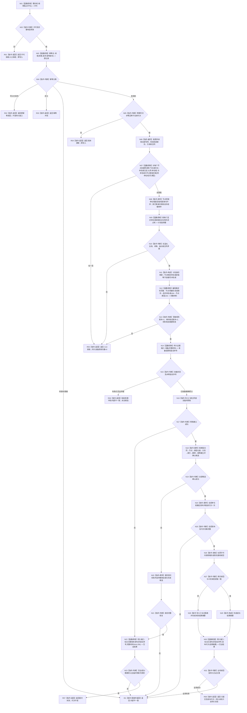

# 执行节点直接类型化结构事务目标函数流程图 v0.2

更新时间：2026-08-03

## 依据

```text
正式规范：4010、4040、4200
修订设计：20260803_WORLD-TREE-P1A2_显式节点命名域与恢复私有解码详细设计_v0.2
基础流程：20260802_执行节点直接类型化结构事务_函数流程图_v0.1.md
```

## 身份与边界

本图完整替代 v0.1 的普通固定事务图。唯一语义变化是节点创建项必须显式携带命名域；执行器验证二元组并按该域分配，不从节点类型推断。

## 函数合同

```text
根函数：节点直接身份结构写入执行器::执行节点直接类型化结构事务
归属模块 / 文件 / 层级：海中鱼巣.核心.执行器.节点直接身份结构写入 / 海中鱼巣/核心/执行器.节点直接身份结构写入.ixx / L1
现有或待新增：WIP 骨架待完成；唯一调用者为节点直接类型化结构数据操作
完整签名：节点直接类型化结构数据操作结果 执行节点直接类型化结构事务(const 节点直接类型化结构数据操作规格& 规格) const
参数：规格只读借用，数据操作拥有至同步返回；执行器不保存引用
返回结果：已提交/幂等读回或入口拒绝、冲突、漂移、许可、资源、内部不一致
被调函数流程图：恢复事务不在本图；恢复见 20260803_执行节点直接恢复事务_函数流程图_v0.1.md
```

## 流程图



## 节点合同

| 节点 | 类型 | 输入 | 输出 / 后继 | 验证 |
| --- | --- | --- | --- | --- |
| N01—N05 | 调用 / 判断 | 规格、许可、幂等记录、代次 | 写前分类 | 幂等先于计划身份；零代次拒绝 |
| N06—N07 | 指令 / 调用 | 原写项、显式命名域和节点类型 | 合法二元组 | 21 合法域全覆盖；表外零准备 |
| N08—N13 | 指令 / 调用 | 合法写集和各仓高水位 | 计划身份、完整编码材料 | 节点映射域不推断；编码含 U64 域 |
| N14—N17 | 调用 / 指令 | 完整材料 | 持久尝试和临时侧账 | 失败时无业务候选 |
| N18—N23 | 指令 / 调用 | 候选、首次失败、同尝试证据 | 确认或明确未发布收口 | 逆序撤销和见证双门禁 |
| N24—N31 | 指令 / 调用 | 全部已确认候选 | 发布代次、原许可读回、发布见证 | 发布后不伪回滚 |
| R01—R08 / I01 | 返回 / 隔离 | 分支材料 | 结构化结果 | 不隐藏持久未知或内部不一致 |

## 关键边界

```text
显式命名域是请求语义，不是 L1 可补默认值。
旧节点类型推断、fallback 和旧格式双读直接删除。
现有仓库命名域验证函数只验证显式二元组，继续复用。
持久准备、候选、撤销、发布、读回和见证顺序与 v0.1 不变。
```

## 验证

1. 每个合法命名域/类型组合通过，表外组合在 N14 前拒绝。
2. 编码黄金材料含命名域，旧材料不兼容接受。
3. 静态扫描不存在 `按节点类型形成/推断命名域` 或默认命名域分支。
