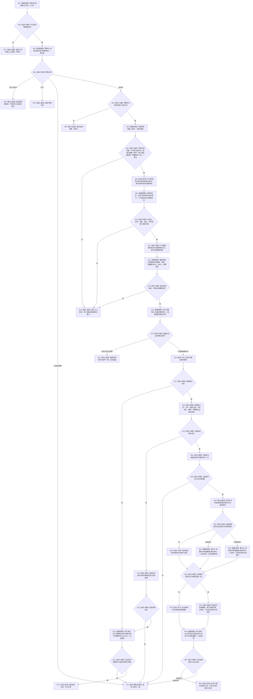

# 执行节点直接类型化结构事务目标函数流程图 v0.3

更新时间：2026-08-03

## 依据

```text
正式规范：4010、4040、4200
复合修订设计：
- 20260803_WORLD-TREE-P1A2_显式节点命名域与恢复私有解码详细设计_v0.2
- 20260803_WORLD-TREE-P1A2_索引发布后读回零版本语义详细设计_v0.3
基础流程：20260803_执行节点直接类型化结构事务_函数流程图_v0.2.md
```

## 身份与边界

本图完整替代 v0.2 的普通固定事务图。显式命名域合同不变；本版进一步冻结 `当前索引/已移除索引` 读回项的 `预期版本=0`、同键写项一一配对及发布后索引结果形成。

## 函数合同

```text
根函数：节点直接身份结构写入执行器::执行节点直接类型化结构事务
归属模块 / 文件 / 层级：海中鱼巣.核心.执行器.节点直接身份结构写入 / 海中鱼巣/核心/执行器.节点直接身份结构写入.ixx / L1
现有或待新增：执行 WIP 待续作；唯一调用者为节点直接类型化结构数据操作
完整签名：节点直接类型化结构数据操作结果 执行节点直接类型化结构事务(const 节点直接类型化结构数据操作规格& 规格) const
参数：规格只读借用，数据操作拥有至同步返回；执行器不保存引用
返回结果：已提交/幂等读回或入口拒绝、冲突、漂移、许可、资源、内部不一致
被调函数流程图：恢复事务不在本图；恢复见 20260803_执行节点直接恢复事务_函数流程图_v0.1.md
```

## 流程图



## 节点合同

| 节点 | 类型 | 参数 / 输入绑定 | 结果 / 输出绑定 | 事实读写 | 后继条件 | 验证 |
| --- | --- | --- | --- | --- | --- | --- |
| N01—N05 | 调用 / 判断 | 规格、许可、幂等记录、代次 | 写前分类 | 只读当前事实 | 未找到才继续 | 幂等先于计划身份 |
| N06—N07 | 调用 / 判断 | 请求完整写项与读回规格 | 静态完整 | 零事实写入 | 全部合法 | 索引零版本及一一配对 |
| N08—N13 | 指令 / 调用 | 合法写集、高水位、写前索引 | 计划身份、完整材料 | 只读计划事实 | 材料有效 | 零值进入确定性编码 |
| N14—N17 | 调用 / 指令 | 完整材料 | 持久尝试、临时侧账 | 写持久准备证据 | 侧账成功 | 失败无业务候选 |
| N18—N23 | 指令 / 调用 | 候选、首次失败、同尝试证据 | 确认或明确未发布 | 候选不可见 | 确认或安全撤销 | 逆序撤销双门禁 |
| N24—N25 | 指令 / 判断 | 已确认候选 | 已发布代次 | 发布事实 | 全部完整 | 部分发布隔离 |
| N26—N30 | 调用 / 指令 | 读回规格、创建/移除材料 | 当前对象和索引读回 | 原许可只读 | 进入一致性判断 | 当前索引命中；移除索引未命中且目标有来源 |
| N31—N35 | 判断 / 构造 / 调用 | 真实读回、结果摘要、尝试序号 | 成功或隔离 | 见证发布结果 | 分类完成 | 发布后不伪回滚 |
| R01—R08 / I01 | 返回 / 隔离 | 分支材料 | 结构化结果 | 不新增事实或隔离 | 终止 | 不隐藏内部不一致 |

## 关键边界

```text
索引读回的预期版本必须为 0，且只表示“不适用”；非零在持久准备前拒绝。
当前索引必须与唯一同键创建项配对；已移除索引必须与唯一同键移除项配对；同键多操作和创建/移除混合直接拒绝。
已移除索引的仓未命中不能单独证明移除；目标取不可变移除项与已确认候选。
索引没有独立版本、墓碑或历史仓；其它对象读回继续使用真实非零版本。
发布后不一致只隔离，不撤销、重写或伪回滚已经发布事实。
```

## 验证

1. 两种索引读回仅接受零版本；任意非零值在 N14 前拒绝。
2. 当前索引创建与已移除索引分别覆盖成功、无配对、多配对、目标不符和发布后不一致。
3. 幂等读回在 N04 直接返回原索引材料，不调用 N29/N30 或持久端口。
4. 本 Markdown 含唯一根函数和一个 Mermaid；不新增或同步 HTML。
