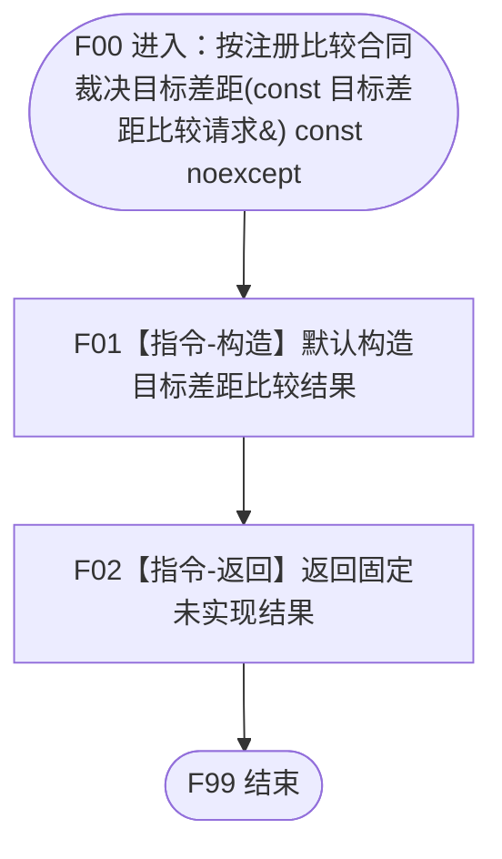

# 特征判断收束服务按注册比较合同裁决目标差距函数流程图 v0.1

日期：2026-08-03

## 1. 函数身份

```text
完整限定身份：海中鱼巣::特征判断收束服务::按注册比较合同裁决目标差距
完整签名：目标差距比较结果 按注册比较合同裁决目标差距(const 目标差距比较请求& 请求) const noexcept
模块：海中鱼巣.领域.服务.特征判断收束
文件：海中鱼巣/领域/服务.特征判断收束.ixx
层级：L3 目标判断收束服务
现有或待新增：待新增；当前正式代码无同名模块、DTO、服务或根函数
可见性：public export 成员函数；唯一重载
所有权：特征判断收束服务拥有目标判断的外层结果，不拥有比较注册、算法或输入事实
```

### 参数与返回合同

| 项 | 类型/方向 | 所有权与生命周期 | 非法值/结果语义 |
| --- | --- | --- | --- |
| `请求` | `const 目标差距比较请求&`，输入 | 调用方拥有；只在同步调用期间借用 | 骨架不命名、不读取，故默认、非法、完整和边界字段均产生同一固定结果 |
| 返回值 | `目标差距比较结果`，输出 | 调用方按值取得并拥有 | 仅 `状态=未实现`、零请求身份、`事实截止代次=0`、`比较结果=nullopt`；无成功、逻辑空、拒绝或内部错误变体 |

保存的 `特征比较业务服务&` 由装配宿主拥有，寿命覆盖本服务；它不是根函数参数，且骨架函数体不读取、不调用。

## 2. 骨架函数体

```cpp
目标差距比较结果 特征判断收束服务::按注册比较合同裁决目标差距(
    const 目标差距比较请求&) const noexcept {
    return {};
}
```

参数故意不命名。默认构造结果必须精确为：`状态=未实现`、零请求身份、`事实截止代次=0`、`比较结果=nullopt`。
服务对象虽然保存 `特征比较业务服务&` 非拥有引用，但本骨架根函数不读取该成员，COMPARE-F 调用数为0。

## 3. 单函数流程图



## 4. 逐节点施工合同

| 节点 | 类型 | 参数/输入绑定 | 调用 | 输出/结果绑定 | 异常 | 事实变化 | 验证 |
| --- | --- | --- | --- | --- | --- | --- | --- |
| F01 | 本函数内构造 | 请求读取0 | 0 | `{}` -> 局部返回对象语义 | 不抛 | 0 | 默认成员值逐字段匹配 |
| F02 | 本函数内返回 | 默认结果 -> 返回值 | 0 | 未实现/零身份/零代次/空比较结果 | `noexcept` | 0 | 参数引用0、项目调用0、权威导出不变 |

调用方收到 `未实现` 后必须立即停止，不得继续形成需求、任务、方法、结算或其它成功后继。

## 5. 禁止边

```text
根函数 -X-> 特征比较业务服务::比较特征
根函数 -X-> 世界树、状态、特征或需求服务
根函数 -X-> 仓库、数据操作、许可、事务、会话或锁
根函数 -X-> SQL、文件、材料、缓存、日志、时钟或线程队列
根函数 -X-> 请求字段读取、请求回显或默认成功
```

真实实现必须由独立后继设计重新展开，不得把本骨架图解释为真实算法流程。
