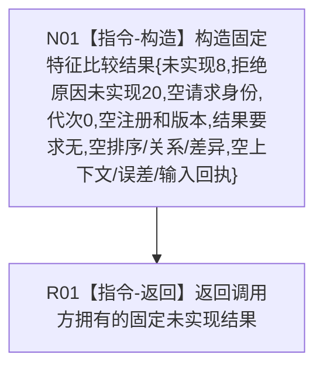

# 特征比较业务服务比较特征目标函数流程图 v0.1

更新时间：2026-08-03

## 依据

```text
规范/4180_子规范_特征值域差异算子与比较算法注册.md v0.2
规范/4201_子规范_世界树合同骨架与未实现结果.md v0.3
规范/详细设计/20260803_WORLD-TREE-COMPARE-F_特征比较最终合同骨架详细设计_v0.1.md
```

## 身份与边界

本图只冻结 COMPARE-F 的最终根函数骨架；不描述注册读取或算法执行。

## 函数合同

```text
根函数：特征比较业务服务::比较特征
归属模块/文件/层级：海中鱼巣.领域.服务.特征比较 / 海中鱼巣/领域/服务.特征比较.ixx / L2
现有或待新增：待新增最终合同骨架
完整签名：特征比较结果 比较特征(const 特征比较请求& 请求) const noexcept
参数：请求为同步const借用；骨架不读取、不保存，任意形状走同一未实现分支
返回：调用方拥有固定结果；状态8、拒绝原因20、请求身份空、代次/注册/版本/输入回执为0或空、已形成结果=无、排序/关系/差异为空、实际上下文和误差量化为空
被调函数：无；骨架项目内调用边为0
```

## 流程图



## 节点合同

| 节点 | 类型 | 输入 | 输出 | 事实读写 | 验证 |
| --- | --- | --- | --- | --- | --- |
| N01 | 本函数内具体构造 | 不读取请求 | 固定无分配prvalue | 无 | `static_assert(noexcept(...))` |
| R01 | 本函数内返回 | 固定prvalue | 调用方拥有值 | 无 | 任意输入逐字段相同 |

未实现不能转换为未注册、空成功、等价、资源失败重试或旧算法回退。P1B要求的具名关系与差异材料只能由后继真实实现一次返回。
