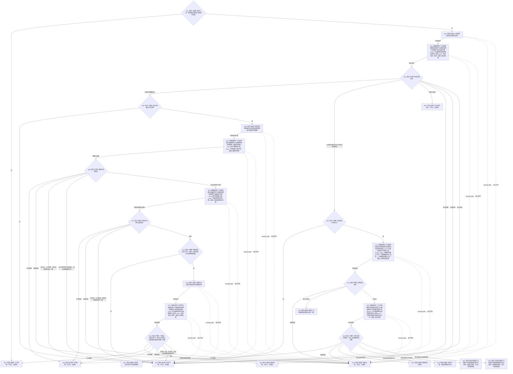

# 确保现实世界已引导函数流程图 v0.2

更新时间：2026-08-03

## 依据

```text
4200 v0.8；4201 v0.2；业务节点到能力与目标函数映射.md“世界事实维护”；WORLD-TREE-P1业务流程图B01/B02；P1A3F详细设计v0.1未替换段+v0.2；P1A2Q详细设计v0.1；P1A3详细设计v0.2 §4.1/§5
```

## 身份与边界

目标单函数施工图；只冻结 P1A3F 骨架的真实行为原位替换。它提供世界根与初始场景子能力，不创建唯一自我，也不单独闭合完整世界事实维护返回材料。

## 函数合同

```text
根函数：节点直接世界引导服务::确保现实世界已引导
归属模块 / 文件 / 层级：海中鱼巣.领域.服务.节点直接世界引导 / 领域/服务.节点直接世界引导.ixx / L2
现有或待新增：P1A3F 骨架原位替换为真实行为
完整签名：节点直接世界引导结果 节点直接世界引导服务::确保现实世界已引导(const 节点直接世界引导请求& 请求) const
参数：请求 -> const借用，仅本次同步调用；合同版本、规则版本、安装实例身份不完整为非法；不保存引用
返回结果：调用方拥有值；已恢复/已创建/幂等读回才携带非零代次和完整世界根/初始场景/直接关系读回；其它状态不携带伪事实
被调函数流程图：读取世界结构 -> 流程图/20260803_读取世界结构_函数流程图_v0.2.md；读取当前索引 -> 流程图/20260803_节点直接结构查询服务读取当前索引_函数流程图_v0.1.md
```

## 流程图



## 节点合同

| 节点 | 类型 | 参数 / 输入绑定 | 结果 / 输出绑定 | 事实读写 | 后继条件 | 验证 |
| --- | --- | --- | --- | --- | --- | --- |
| N01—N04 | 判断、构造、函数调用 | `请求 -> 恢复请求`；`恢复请求 -> 恢复安装实例.请求` | 恢复结果 | 读取持久恢复输入并可能原子发布隔离恢复事实 | 按全部恢复状态分流 | 身份/版本非法、全部恢复状态 |
| N05—N14 | 判断、构造、函数调用 | 安装实例 -> 两个固定索引键；键 -> `读取当前索引.键`；根见证 -> 结构请求 | 两个精确索引结果、世界结构结果 | 同一恢复后内存代次只读 | 许可/资源单独映射；其它矛盾内部不一致；完整到R07 | 未找到、错键、错类型、代次不等、多项不变量、结构不符 |
| N16—N20 | 判断与函数调用 | `请求,1 -> 形成首次现实世界事务`；事务 -> `提交.请求` | 事务形成结果、提交结果 | 治理代次1后单次 L1 最后发布及原独占许可通用读回 | 只有已形成进入提交；成功结果经逐项映射直接到 R11/R12，不发起事务后普通快照 | 固定写项顺序、双摘要、代次2、节点/值/关系/索引通用读回 |
| R01—R12 | 本函数内返回 | 对应分支材料 | 合同允许的具名结果 | 除已发生的恢复/提交外零补写 | 函数结束 | 状态、代次、载荷和日志边界 |

## 关键边界

```text
不得从 SQL、显示名或扫描猜根；恢复成功只给出事实截止，根与初始场景必须经 P1A2Q 两次精确键读取取得。
已恢复治理空域不是最终成功，只允许继续首次引导；本函数不创建唯一自我。
首次提交成功后只使用 P1A2 在原独占许可内形成的通用读回；禁止事务释放后调用普通快照证明原提交。
```
