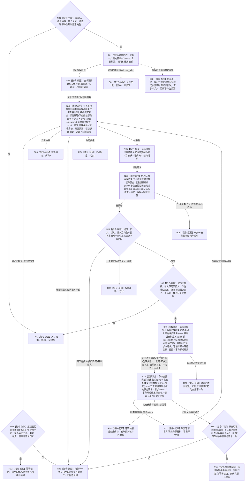

# 移动世界树成员函数流程图 v0.2

更新时间：2026-08-03

## 依据

```text
4200 v0.8；业务节点到能力与目标函数映射.md“世界事实维护”；WORLD-TREE-P1业务流程图M01/W01/W02；P1A3详细设计v0.2 §3.2.3/§3.3/§4.5/§5
```

## 身份与边界

目标单函数施工图；一图唯一根函数。本函数只在同一世界内失效一条当前父/归属边并创建一条新边，不删除成员或改写资格、特征、状态和动态。

## 函数合同

```text
根函数：节点直接场景业务服务::移动世界树成员
归属模块 / 文件 / 层级：海中鱼巣.领域.服务.节点直接场景 / 海中鱼巣/领域/服务.节点直接场景.ixx / L2
现有或待新增：P1A3F v0.2 骨架原位替换为真实行为
完整签名：节点直接场景写入结果 节点直接场景业务服务::移动世界树成员(const 移动世界树成员请求& 请求) const
参数：请求为const借用，只在同步调用内存续；请求头、成员种类、成员/旧父/旧关系/新父见证和移动幂等身份必须完整
返回结果：调用方拥有的值；只有已提交/幂等读回携带非零代次、持久状态和旧失效+新当前关系读回
被调函数流程图：读取世界结构 -> 流程图/20260803_读取世界结构_函数流程图_v0.2.md
```

## 流程图



## 节点合同

| 节点 | 类型 | 参数 / 输入绑定 | 结果 / 输出绑定 | 事实读写 | 后继条件 | 验证 |
| --- | --- | --- | --- | --- | --- | --- |
| N01/T01/N02 | 本函数内判断/异常边界/构造 | 公开请求全字段 | 入口分类、意图摘要、重算标志 | 零写入 | 完整到N03；异常到E01/E02 | 字段敏感性、命名域/规则版本、两类异常 |
| N03—N04 | 函数调用+本函数内判断 | 幂等身份/意图摘要 | 探测及原读回映射 | 只读幂等账 | 同义直接R02；未找到到N05 | 同义优先于当前图变化 |
| N05—N06 | 本函数内构造+函数调用 | `请求.头->结构请求.头`；`结构请求->读取世界结构.请求` | 写前世界 | 只读世界结构 | 已读取到N07 | 不直接传入请求头 |
| N07—N08 | 本函数内判断 | 写前世界和全见证 | 移动准入 | 零写入 | 唯一当前且规则成立到N09 | 根/自身/后代/跨世界/多父/环/悬空 |
| N09 | 函数调用 | `本根函数请求->请求`；`写前世界->写前世界` | 事务形成结果 | 只形成局部请求 | 已形成到N10 | 只失效旧边+创建新边，读回恰两关系 |
| N10 | 函数调用 | `事务值->提交.请求` | 提交结果 | 单次L1发布和原许可读回 | 漂移重算或结果分流 | 旧关系失效先于新关系当前发布 |
| N11 | 本函数内赋值 | 首次漂移局部材料 | 已重算=true | 只丢弃局部副本 | 回N03 | 至多一次 |
| N12 | 本函数内判断 | 原许可通用读回 | 移动专属读回材料 | 零补写 | 完整到R10 | 旧失效/新当前各恰一 |
| R01—R10/E01—E02 | 本函数内返回 | 具名分支材料 | 合同允许的场景写入结果 | 零补写 | 函数结束 | 非成功不伪造移动读回；异常不越界 |

## 关键边界

```text
同义幂等必须在读取已变化的当前图之前返回。
移动只失效一条旧关系并创建一条新关系；不删除成员、资格、索引、特征、状态或动态。
提交版本漂移最多从幂等探测开始完整重算一次；std::bad_alloc映射资源失败，其它异常映射内部不一致。
```
