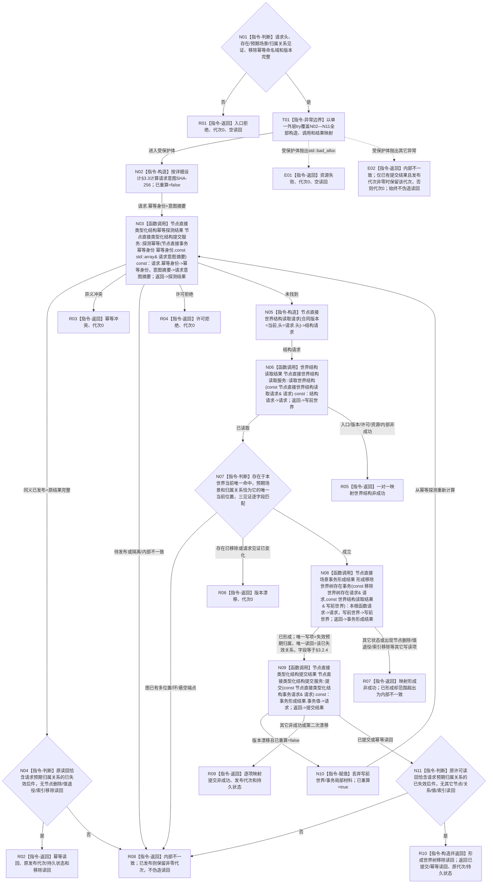

# 移除世界树存在函数流程图 v0.2

更新时间：2026-08-03

## 依据

```text
4200 v0.8；业务节点到能力与目标函数映射.md“世界事实维护”；WORLD-TREE-P1业务流程图M02/W01/W02；P1A3详细设计v0.2 §3.2.4/§3.3/§4.6/§5
```

## 身份与边界

目标单函数施工图；一图唯一根函数。本函数的“移除”只是使存在的当前场景归属关系失效；存在本体、资格、业务索引、特征、状态、动态和历史仍保留。

## 函数合同

```text
根函数：节点直接场景业务服务::移除世界树存在
归属模块 / 文件 / 层级：海中鱼巣.领域.服务.节点直接场景 / 海中鱼巣/领域/服务.节点直接场景.ixx / L2
现有或待新增：P1A3F v0.2 骨架原位替换为真实行为
完整签名：节点直接场景写入结果 节点直接场景业务服务::移除世界树存在(const 移除世界树存在请求& 请求) const
参数：请求为const借用，只在同步调用内存续；请求头、存在、预期场景、预期归属关系和移除幂等身份必须完整
返回结果：调用方拥有的值；只有已提交/幂等读回携带非零代次、持久状态和一条已失效归属关系读回
被调函数流程图：读取世界结构 -> 流程图/20260803_读取世界结构_函数流程图_v0.2.md
```

## 流程图



## 节点合同

| 节点 | 类型 | 参数 / 输入绑定 | 结果 / 输出绑定 | 事实读写 | 后继条件 | 验证 |
| --- | --- | --- | --- | --- | --- | --- |
| N01/T01/N02 | 本函数内判断/异常边界/构造 | 公开请求全字段 | 入口分类、意图摘要、重算标志 | 零写入 | 完整到N03；异常到E01/E02 | 字段敏感性、命名域/版本、两类异常 |
| N03—N04 | 函数调用+本函数内判断 | 幂等身份/意图摘要 | 探测及原读回映射 | 只读幂等账 | 同义直接R02；未找到到N05 | 同义优先、原读回无额外退役/删除 |
| N05—N06 | 本函数内构造+函数调用 | `请求.头->结构请求.头`；`结构请求->读取世界结构.请求` | 写前世界 | 只读世界结构 | 已读取到N07 | 不直接传请求头 |
| N07 | 本函数内判断 | 写前世界和三见证 | 移除准入 | 零写入 | 唯一归属成立到N08 | 已移除、异键二次移除、多位置、悬空 |
| N08 | 函数调用 | `本根函数请求->请求`；`写前世界->写前世界` | 事务形成结果 | 只形成局部请求 | 已形成到N09 | 唯一关系失效写项/读回 |
| N09 | 函数调用 | `事务值->提交.请求` | 提交结果 | 单次L1发布和原许可读回 | 漂移重算或结果分流 | 其它本体/资格/索引不变 |
| N10 | 本函数内赋值 | 首次漂移局部材料 | 已重算=true | 只丢弃局部副本 | 回N03 | 至多一次 |
| N11 | 本函数内判断 | 原许可通用读回 | 移除专属读回材料 | 零补写 | 完整到R10 | 已失效关系恰一、无其它读回 |
| R01—R10/E01—E02 | 本函数内返回 | 具名分支材料 | 合同允许的场景写入结果 | 零补写 | 函数结束 | 非成功不伪造移除读回；异常不越界 |

## 关键边界

```text
移除只使当前归属退出；存在、资格、业务索引、特征、状态、动态和历史关系全部保留。
同义幂等先于当前图读取；异键对已移除对象的新请求映射版本漂移。
提交版本漂移最多完整重算一次；std::bad_alloc映射资源失败，其它异常映射内部不一致。
```
