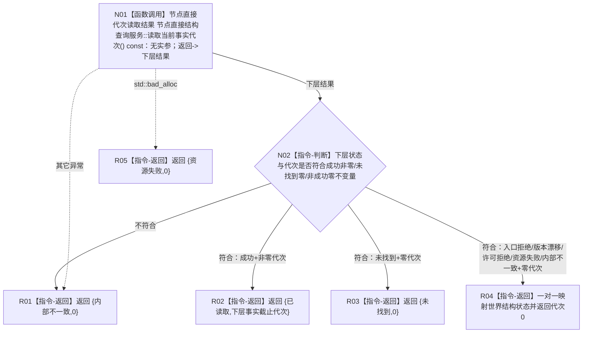

# 节点直接世界结构读取服务读取当前事实代次函数流程图 v0.2

更新时间：2026-08-03

## 依据

```text
4200 v0.8 §3/§5/§10；4201 v0.2；业务节点到能力与目标函数映射.md“世界事实维护”；WORLD-TREE-P1业务流程图Q01/Q02；P1A3F详细设计v0.1未替换段+v0.2；P1A3详细设计v0.2 §4.2.1/§5；P1A2节点直接结构查询服务公开合同
```

## 身份与边界

目标单函数施工图；一图唯一根函数。本函数只把 L1 当前发布代次映射为世界结构专属结果，不读取世界对象，不写事实。

## 函数合同

```text
根函数：节点直接世界结构读取服务::读取当前事实代次
归属模块 / 文件 / 层级：海中鱼巣.领域.服务.节点直接世界结构 / 海中鱼巣/领域/服务.节点直接世界结构.ixx / L2
现有或待新增：P1A3F v0.2 骨架原位替换为真实行为
完整签名：节点直接世界事实代次读取结果 节点直接世界结构读取服务::读取当前事实代次() const
参数：无参数；const调用；服务只借用装配宿主长生命周期拥有的节点直接结构查询服务引用
返回结果：调用方拥有的节点直接世界事实代次读取结果；只有已读取携带非零代次，其它状态代次为0
被调函数流程图：无独立目标图；被调 L1 函数为已发布简单查询提供者
```

## 流程图



## 节点合同

| 节点 | 类型 | 参数 / 输入绑定 | 结果 / 输出绑定 | 事实读写 | 后继条件 | 验证 |
| --- | --- | --- | --- | --- | --- | --- |
| N01 | 函数调用 | 无实参→无形参 | `节点直接代次读取结果`→`下层结果` | 只读当前内存已发布代次 | 调用完成到 N02；异常到 R05/R01 | 下层每个状态、异常不越界 |
| N02 | 本函数内判断 | 下层状态、事实截止代次 | 不变量分类 | 零写入 | 四类出边 | 成功零代次、未找到非零、非成功非零均内部不一致 |
| R01—R05 | 本函数内返回 | 具名分支材料 | 合同允许的值式结果 | 零写入 | 函数结束 | 只有 R02 非零代次；其它代次0 |

## 关键边界

```text
不使用 SQL、恢复材料、日志或缓存补判代次。
不重试，不保存读取许可，不对外暴露 L1 请求或仓库。
仅本函数实际返回已读取且非零代次，后继快照才可把它用于同代次双读见证。
```
