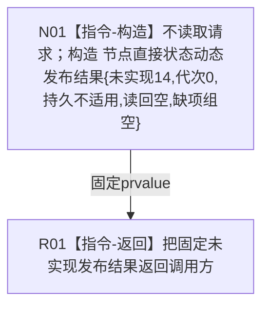

# 节点直接动态业务服务发布状态并整理动态函数流程图 v0.1

更新时间：2026-08-03

## 依据

```text
规范/4200_子规范_世界树业务服务与同代次完整事实快照.md v0.9
规范/4201_子规范_世界树合同骨架与未实现结果.md v0.4
规范/详细设计/20260803_WORLD-TREE-P1B-F_状态动态最终合同骨架详细设计_v0.1.md §4—§7
```

## 身份与边界

正式目标单函数施工图；只冻结 P1B-F 统一发布入口的最终 ABI 骨架，不查询、比较、写入或发布状态动态。

## 函数合同

```text
根函数：节点直接动态业务服务::发布状态并整理动态
归属模块 / 文件 / 层级：海中鱼巣.领域.服务.节点直接动态 / 海中鱼巣/领域/服务.节点直接动态.ixx / L2领域服务
现有或待新增：待新增最终合同骨架；后继 P1B-W 原位替换函数体
完整签名：节点直接状态动态发布结果 节点直接动态业务服务::发布状态并整理动态(const 世界树状态动态请求& 请求) const noexcept
参数：请求为调用方拥有的同步 const 借用；骨架不读取、不保存；任意版本、身份和幂等值均同路
返回结果：调用方拥有值；固定 状态=未实现(14)、发布代次=0、持久状态=不适用、读回=nullopt、缺项组空
被调函数流程图：无；项目内调用边为0
```

## 流程图



## 节点合同

| 节点 | 类型 | 参数 / 输入绑定 | 结果 / 输出绑定 | 事实读写 | 后继条件 | 验证 |
| --- | --- | --- | --- | --- | --- | --- |
| N01 | 本函数内具体构造 | `请求` 不解引用、无字段绑定 | 固定 prvalue | 零读取、零候选、零提交 | 构造完成 | `static_assert(noexcept(...))`；任意输入逐字段相同 |
| R01 | 本函数内返回 | 固定 prvalue | 调用方拥有完整值 | 无 | 函数结束 | 六个保存引用调用计数均为0；发布代次0且读回空 |

## 关键边界

```text
不得调用查询_、特征_、比较_、状态_、数据操作_或提交_；不得探测幂等、访问SQL/材料、写日志或时钟。未实现不得映射为首状态成功、等价成功、比较未注册、不可比或资源失败重试。
```
