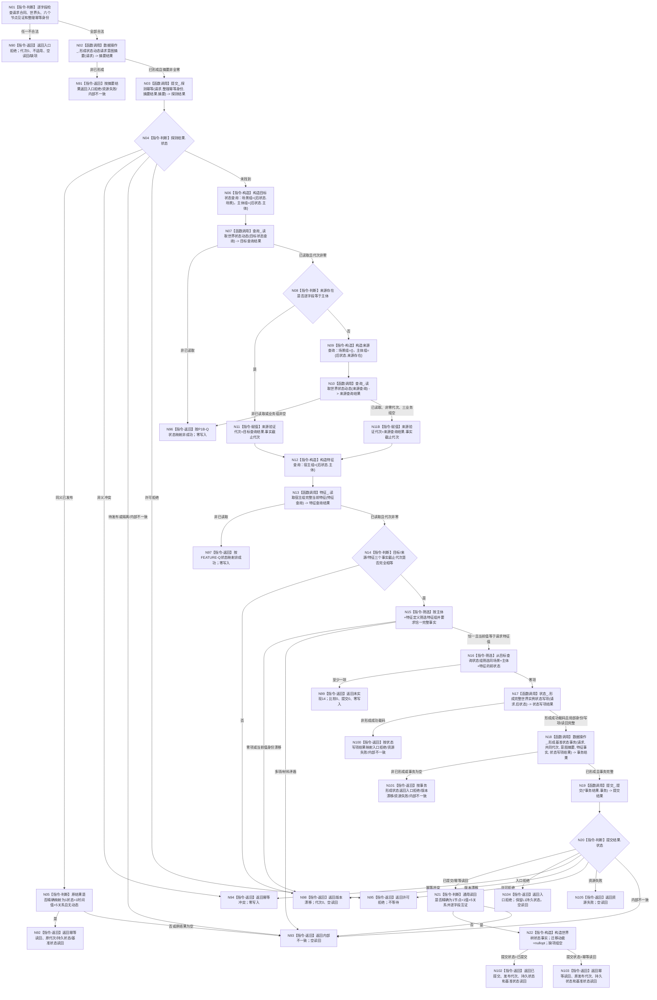

# 节点直接动态业务服务发布首个基准状态函数流程图 v0.1

更新时间：2026-08-03

## 依据

```text
代码基线：main == origin/main == ae777e65bdbde44a17af648d00745b6f37760318
规范/4200_子规范_世界树业务服务与同代次完整事实快照.md §6—§7
规范/4210_子规范_动态信息分层获取与聚合_20260720.md §2—§2.1
规范/详细设计/20260803_WORLD-TREE-P1B-F_状态动态最终合同骨架详细设计_v0.1.md §4—§6
规范/详细设计/20260803_WORLD-TREE-P1B-Q_真实状态动态查询详细设计_v0.1.md
规范/详细设计/20260803_WORLD-TREE-P1B-W0_首个基准状态原子发布详细设计_v0.1.md
```

## 身份与边界

本图是一图一函数的正式目标施工图。唯一根函数是待在 P1B-F 最终类和原签名内替换骨架函数体的 `节点直接动态业务服务::发布状态并整理动态`。

本图只开放首个基准状态真实成功分支；前状态非空固定返回未实现14。图中没有比较调用、动态写项或重试循环。

本图当前为待激活目标施工图。`WORLD-TREE-P1B-L1M`“节点直接混合原子写集提供者”必须先让 N19 的8项写集与7项读回在现行 `提交` 入口中取得单事务成功形状；当前执行器没有该混合分支，空骨架不能解除门禁。

## 函数合同

```text
根函数：节点直接动态业务服务::发布状态并整理动态
归属模块 / 文件 / 层级：海中鱼巣.领域.服务.节点直接动态 / 海中鱼巣/领域/服务.节点直接动态.ixx / L2动态事实所有者
现有或待新增：现有最终签名；原位替换 P1B-F 固定未实现函数体
完整签名：
节点直接状态动态发布结果 发布状态并整理动态(
    const 世界树状态动态请求& 请求) const noexcept;

参数：
- 请求：const 世界树状态动态请求&，输入、只读借用；调用方拥有并保证覆盖同步调用；函数不得保存引用。
- 非法值：合同版本不等于1；世界头版本不匹配；世界根/场景/主体/特征/特征值/来源存在见证不完整或类型错误；整理幂等身份命名域不等于0x5754534400000001或键值为0。

返回结果：
- 类型：节点直接状态动态发布结果，由调用方按值拥有。
- 已提交：发布代次非零，读回含完整后状态且迁移动能为空，缺项组空。
- 幂等读回：同义已发布的原发布代次、当前持久状态和同一基准状态读回。
- 逻辑内返回：入口拒绝、幂等冲突、版本漂移、许可拒绝、未实现14。
- 资源/内部错误：资源失败或内部不一致；不携带伪成功读回。
- noexcept：所有异常在本根或被调服务边界内分类，不得越过函数边界。

成员依赖及生命周期：
- 查询_、特征_、比较_、状态_、数据操作_、提交_ 均为装配宿主持有且长于本服务的非空引用。
- 本叶比较_只保留最终构造合同，调用数固定0。

被调函数流程图：
- P1B-Q 查询根由其现行详细设计和目标函数图负责。
- FEATURE-Q 查询根由 P1BF/FEATURE-Q 设计负责。
- 状态写项、摘要和事务形成函数的完整合同见本包详细设计 §5—§7；本包权限不新增其独立图。
```

## 流程图



## 节点合同

| 节点组 | 类型 | 输入绑定 | 输出绑定 | 事实读写 | 验证 |
| --- | --- | --- | --- | --- | --- |
| N01 | 本函数内判断 | `请求`全部公开字段 | 合法/入口拒绝 | 只读参数 | 边界值、错类型、错命名域 |
| N02 | 函数调用 | `请求 -> 请求` | `摘要结果` | 无机器事实 | 摘要标准向量、异常分类 |
| N03 | 函数调用 | 幂等身份、32字节摘要 | `探测结果` | 只读幂等账 | 六状态、SQL调用0 |
| N05 | 本函数内判断 | `探测结果.原结果` | 基准状态专属读回 | 只读值式结果 | 错数量、错角色、动态非空 |
| N06—N11B | 构造/函数调用 | 场景、主体、来源存在 | 两次以内 P1B-Q 值式结果 | 只读内存事实 | 同源1次、异源2次 |
| N12—N15 | 构造/函数调用/筛选 | 主体、特征、特征值 | 当前特征事实 | 只读内存事实 | FEATURE-Q恰1次、代次相等 |
| N16 | 本函数内筛选 | 状态组、场景/主体/特征 | 匹配前状态组 | 只读局部值 | 非空固定未实现 |
| N17 | 函数调用 | `请求.后状态` | 状态写项结果 | 只形成值式写项 | 8项/7项、局部身份 |
| N18 | 函数调用 | 请求、共同代次、摘要、特征事实、状态写项 | L1事务请求 | 只形成值式事务 | 执行摘要、预期代次 |
| N19 | 函数调用 | 完整事务请求 | L1提交结果 | 唯一写入边界 | 一次提交、原子撤销发布 |
| N20—N22 | 判断/构造 | L1值式结果 | P1B专属结果 | 不新增写入 | 八状态及读回矩阵 |

## 关键边界

```text
- 本函数不得调用比较_；AST成员调用数必须为0。
- 本函数不得查询SQL、材料、日志文本、缓存、时钟或旧状态动态服务。
- 同义幂等必须在任何状态/特征查询前返回原结果。
- 已有前状态只返回未实现14，不选择最大状态、不比较、不提交。
- 本函数不重试版本漂移，不sleep，不等待许可。
- 成功后不调用普通查询补证原提交；只消费L1原许可内通用读回。
- 形成函数的“形成成功载码”只允许本根继续施工，不构成机器事实已提交证明。
```
