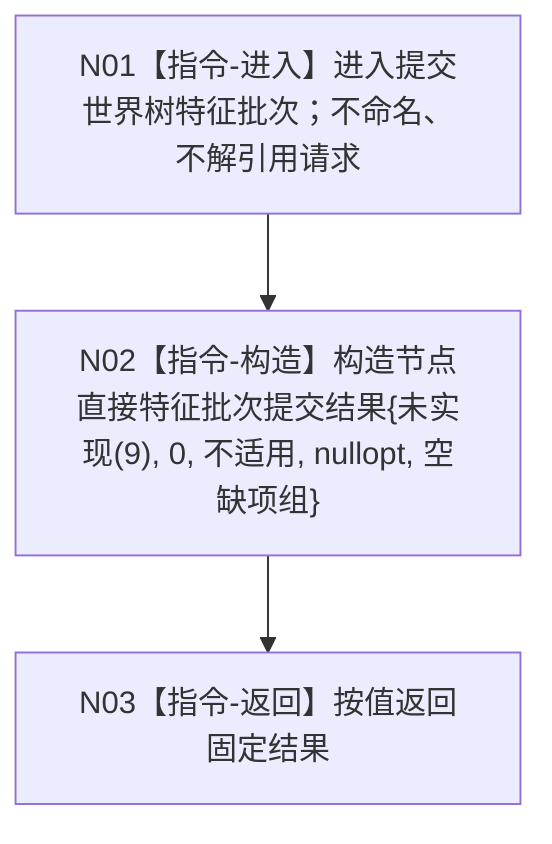

# 节点直接特征写入服务::提交世界树特征批次 函数流程图 v0.1

日期：2026-08-03

## 依据

```text
规范/4201_子规范_世界树合同骨架与未实现结果.md
规范/详细设计/20260802_WORLD-TREE-P1_函数功能确认_v0.1.md
流程图/20260803_WORLD-TREE-FEATURE-W-F_特征写入最终合同骨架业务流程图_v0.1.md
```

## 身份与边界

正式目标单函数施工图；当前函数待新增。只描述固定未实现骨架，不描述后继真实写业务。

## 函数合同

```text
根函数：节点直接特征写入服务::提交世界树特征批次
归属模块 / 文件 / 层级：海中鱼巣.领域.服务.节点直接特征写入 / 海中鱼巣/领域/服务.节点直接特征写入.ixx / L2
现有或待新增：待新增
完整签名：节点直接特征批次提交结果 提交世界树特征批次(const 世界树特征批次请求& 请求) const noexcept
参数：请求；const引用输入；调用方拥有；同步借用且不保存；任意字段组合在骨架中均不读取。
返回结果：调用方按值拥有；固定为未实现(9)、发布代次0、持久不适用、读回空、缺项空。
非法值：骨架不裁决字段合法性；非法、默认、完整和边界请求得到相同固定结果。
被调函数流程图：无；项目内函数调用数固定为0。
```

## 流程图



## 节点合同

| 节点 | 类型 | 参数 / 输入绑定 | 结果 / 输出绑定 | 事实读写 | 后继条件 | 验证 |
| --- | --- | --- | --- | --- | --- | --- |
| N01 | 本函数内具体指令 | `请求`存在但不读取 | 无 | 零读零写 | 无条件 | AST 参数引用0、成员访问0 |
| N02 | 本函数内具体指令 | 无业务输入 | 固定 prvalue | 零读零写 | 构造完成 | `static_assert(noexcept(...))` |
| N03 | 本函数内具体指令 | 固定 prvalue | `节点直接特征批次提交结果` | 零读零写 | 函数结束 | 全字段精确断言 |

## 所有权、异常与并发

```text
服务持有的查询、批次数据操作和提交引用均不被读取。
请求不保存；结果不含引用、指针、许可、锁、事务视图、仓库或SQL对象。
函数 noexcept；固定prvalue构造必须经编译期无抛断言，不使用catch-all。
不取得锁，不调用时钟，不形成诊断，不存在幂等或并发竞争分支。
```

## 双向引用

- 业务图 B03：`流程图/20260803_WORLD-TREE-FEATURE-W-F_特征写入最终合同骨架业务流程图_v0.1.md`
- 详细设计根函数章节：`规范/详细设计/20260803_WORLD-TREE-FEATURE-W-F_特征写入最终合同骨架详细设计_v0.1.md`
