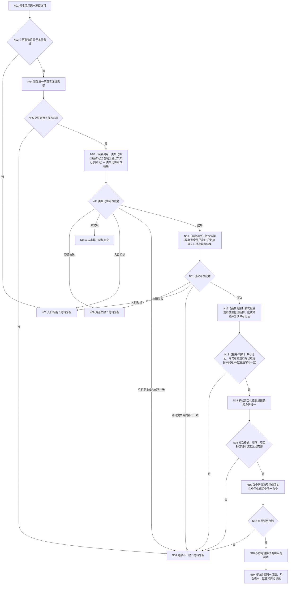

# 节点直接特征批次数据操作::复制同代次类型化值与批次记录 函数流程图 v0.1

重做设计正式基线：`78418dc55002840a4c7efba25409e71d1dfa7ee5`

目标签名：

```cpp
节点直接特征同代次冻结读取结果
节点直接特征批次数据操作::复制同代次类型化值与批次记录(
    const 节点直接统一冻结许可& 许可) const;
```

`节点直接统一冻结许可/见证` 已由 F0 v0.3 结果 `c55870c1` 放入执行器模块，`节点直接类型化值冻结只读访问器` 已放入 `海中鱼巣.核心.冻结.节点直接类型化值`；F0所有运行根固定未实现。当前仍缺R1真实行为。本函数不得自行取得第二许可，也不得把F0未实现映射为成功。

## 身份与边界

```text
根函数：节点直接特征批次数据操作::复制同代次类型化值与批次记录
归属模块 / 文件 / 层级：海中鱼巣.领域.数据操作.节点直接特征批次 / 海中鱼巣/领域/数据操作.节点直接特征批次.ixx / L1领域数据操作
现有或待新增：待新增；仅在MC-PW与CORE-FREEZE-DP-R1真实结果后可执行本叶
参数：许可 / const 节点直接统一冻结许可& / 只读借用 / 仅本次调用期有效
返回结果：节点直接特征同代次冻结读取结果；成功只有一个完整optional，非成功材料必空
被调函数流程图：取得统一冻结许可由协调方负责，本函数不二次取得
```



## 节点合同

| 节点 | 输入事实 | 输出事实 | 禁止替代 |
| --- | --- | --- | --- |
| N02 | 4040许可自身有效性与所属域证明 | 准入分类 | 指针地址、调用方域编号 |
| N07 | 类型化值仓真实已发布记录 | 自有副本、真实版本和数量 | SQL、缓存、最大记录版本 |
| N10 | 本域批次仓真实已发布记录 | 自有副本、真实版本和数量 | 旧默认域账、最大批次号 |
| N12—N13 | 同一许可的前后见证、两仓轻量结构观察与已取得副本 | 同代次自洽证明 | 两次普通许可、重复全仓复制或事后比较最大编号 |
| N16 | `类型化值读回` 完整身份、版本和来源 | 批次项目引用互证 | 原始值复制、第四来源关系 |

## 返回不变量

- `成功`：`材料` 必有值；两组可以同时为空；见证和两仓版本均来自真实提供者且非零；数量逐项等于向量大小。
- 任一非成功：`材料 == nullopt`，不得返回任一仓的部分副本。
- 许可有效后子仓许可竞争属于内部不一致，不降级为普通等待。
- 上游明确 `未实现` 精确映射为领域 `未实现`，不得伪装成入口拒绝、成功或合法空仓。
- 锁序唯一为“统一冻结许可 → 类型化值记录仓共享锁 → 本域批次记录仓共享锁”；持锁期间零I/O、零日志、零上层回调。
- R1尚未裁决运行期域身份、类型化值结构版本和损坏隔离责任；任一项缺失时本函数只能保持待实现，不得用调用方字段、当前代次、向量大小或最大编号补造。
